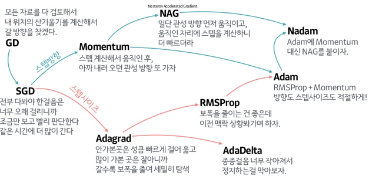

#AI
***
##용어
***
- 인공지능(AI) : 지능적인 인간의 행동을 모방하는 기계의 능력.
- 기호주의 AI : 규칙기반 AI
- 연결주의 AI : 신경망기반 AI | 머신러닝(베이지안,HMM,SVM등 | 신경망기반 AI - 딥러닝)
- 통계적 AI : 머신러닝(베이지안,HMM(히든 마르코프 모델),SVM등 | 신경망기반 AI - 딥러닝)
- 심볼릭 AI(symbolic AI) : 프로그래머들이 명시적인 규칙을 충분히 많이 만들면 일반지능(인간수준 인공지능)을 만들 수 있다는 접근 방법. 전문가 시스템과도 연관되어 있음.
- 머신러닝(Machine Learning) : 인공지능의 한 분야, 알고리즘을 이용해 데이터를 분석하고, 그를 통해 학습하며, 그 내용을 기반으로 판단이나 예측을 함. 지도학습과 비지도 학습이 포함되어 있음.
- 딥러닝(Deep Learning) : 인공 신경망에서 발전. 몇 층의 인공 신경망을 이용. 데이터 군집화나 추상화를 시도함(여러 비선형 변환기법의 조합을 통함).
- Mixed(16-bit)precision : 모델 학습시 FP16, FP32 부동소수점 유형을 상황에 따라 유연하게 사용해 학습을 더 빠르게 실행하고 메모리를 적게 사용하는 방법. 정확도의 손실은 없으며, 오히려 향상되는 경우도 있음.
  Forwad/Backward Propagation은 모두 FP16으로 연산하고, weight를 업데이트 할 때에는 다시 FP32로 변환하여 계산함. 메모리가 절반으로 줄어들기에, 배치사이즈를 늘리거나 더 큰 모델의 학습이 가능함.
  단, FP16은 매우 낮은수를 표현할 수 없어 모두 0이 되는데, 이를 방지하기 위해 특정값(under/overflow가 발생하지 않는)을 곱해 손실과 기울기를 계산하고 가중치를 업데이트 함. 

- 머신러닝(모델제작)과정 : 크게 데이터 수집 > 데이터 점검,탐색(분석) > 전처리,정제 > 모델링,훈련 > 평가 > 배포 총 6단계로 나뉜다.
- 파이프라인 : 한 데이터 처리 단계의 출력이 다음단계의 입력으로 이어지는 구조로, 인공지능 모델의 구조를 가리킬 때 주로 사용됨.
- 학습환경 : 학습을 수행하기 위해서는 프레임워크에 맞는 환경을 설치하고, 필요한 리소스(CPU, GPU)등을 프로비저닝(IT 인프라 설정 프로세스, 사용가능하게 데이터와 리소스에 대한 액세스를 관리하는데 필요한 단계)한 뒤 학습을 진행해야 하며,
  학습이 완료되면 서빙을 위해 모델을 export하고, 서빙을 위한 API서버를 설한 뒤에, 모델을 배포해 서빙해야 함. 서빙시에는 학습시 데이터와 서빙요청에 들어온 데이터가 큰 차이 없는지, 
  서빙요청이 들어온 데이터가 이전 데이터와 큰 차이가 나는지 등의 체크를 한 뒤 크게 차이가 난다면 알림을 보내 모델을 다시 학습하도록 해야 함. 이런 인프라를 managed service형태로 제공해주는 서비스가 존재. 

- 일반화 : 모델이 처음보는 데이터를 정확하게 예측할 수 있다면, 그것을 훈련세트에서 테스트 세트로 일반화 되었다고 함.
- 과대적합 : 모델이 훈련세트에 너무 가깝게 밎게되어 일반화 되기 어려울때 일어나는 것. 이를 막기위해 모든 특성이 출력에 주는 영향을 최소한으로 만들게(규제)한다.
- 과소적합 : 모델이 너무 간단해 데이터의 면면과 다양성을 잡아내지도 못하고, 훈련세트에도 맞지 않는것. 
  테스트 세트의 성능이 좋았더라도 테스트 세트와 점수가 비슷하다면 과소적합일 가능성이 있어, 모델의 성능을 더욱 올릴 수 있다.
- 역전파 : 순전파(평범하게 가설을 이용해 예측값 도출)연산 > 오차(손실, 비용)계산 > 기울기 계산(손실 미분) 의 과정을 거쳐 나온 값을 통해 파라미터를 갱신하는 과정. 
  출력층에서부터 이전층으로 이동하며(역전파 1단계 > 2단계)해당 단계의 파라미터들을 갱신. 
  손실을 구한 후 [d손실/d파라미터\]를 계산(체인 룰 이용, 계산이 가능하게 변경), 이를 optimizer를 이용해(식에 적용해)계산.

- open-ended : 끝(제약)이 없는, 정정/추가등의 조정이 가능한 인공지능.
- hand-crefted feature : 수제 특징. 머신러닝에서 전문가에 의해 고안된 아이디어를 바탕으로 직접 설계, 추출해 학습에 사용하는 특징(feature). 머신러닝의 학습진행이 이에따라 천차만별함. 
- end-to-end : 종단간. 끝과 끝만 보고 중간은 기계가 알아서 학습(hand-crafted 특징 없음). 입력에서 출력까지 파이프라인 네트워크(전체 네트워크를 이루는 부분적 네트워크)없이 한번에 처리함. 
  신경망에 너무 많은 계층의 노드가 있거나 메모리 부족시 사용할 수 없고, 문제가 복잡하면(데이터가 나눠진 파이프라인에 더 적합하게 쓰일 수 있어서) 파이프라인 네트워크로 나눠 해결하는게 더 효율적일 때도 있음.
- 동기/비동기 : 동시에 일어남/동시에 일어나지 않음. 
- interactive : 상호작용이 가능한 것.

- 프로비저닝 :  IT 인프라를 설정하는 프로세스. 사용자와 시스템에서 사용할 수 있도록, 데이터와 리소스에 대한 액세스를 관리하는 데 필요한 단계이이기도 함. 
  설정과는 다른 작업이나 둘 다 배포 프로세스 단계에 포함되며, 프로비저닝이 완료되어야 설정단계를 진행할 수 있음.
- 서버 프로비저닝 : 필요 리소스를 기반으로 네트워크에서 사용될 서버를 설정하는 프로세스. 새 시스템 생성 후 가동상태로 함드는데 필요한 모든 작업은 물론, 해당시스템에 대해 원하는 상태를 정의하는 작업도 포함됨.
  데이터센터에 물리적 하드웨어 설치, 소프트웨어 설치 및 설정, 운영체제 및 애플리케이션 포함, 미들웨어와 네트워크 및 스토리지 연결로 이뤄짐.
- 사용자 프로비저닝 : 액세스와 인증 권한을 모니터링하는 아이텐티티 관리 유형에 속함. 직원, 공급업체, 계약자 등의 사용자 오브젝트와 사용자 속성을 통해 정의됨. 이메일, DB 엑세스, 네트워크 엑세스가 포함될 수 있음.
  RBAC(롤 기반 액세스 제어, 대표적 예)는 일반적으로 권한, 롤, 그룹, 사용자로 구성되며 사용자는 하나 이상의 그룹에 할당되고, 그룹에는 롤이 할당되며, 롤은 권한으로 구성되는 식. IT와 HR 사이에서 관리되는 겅우가 많음.
- 네트워크 프로비저닝 : 사용자, 서버, 컨테이너, IoT기기가 액세스할 네트워크를 설정하는 작업이 포함될 수 있음. 다양한 항목유형이 네트워크 소비자 일 수 있음.
  필요 장비와 배선을 비롯해 사용자에게 통신서비스를 제공하는 것을 지칭하는 방식. 흔히 통신업계에서 사용되며, 사용자를 위한 무선 환경의 서비스 활성화를 포함할 수 도 있음.
- 서비스 프로비저닝 : 서비스 설정과 이와 관련된 데이터 관리가 포함됨. 통신업계에서 고객을 위한 서비스나 클라우드 인프라를 설정하는데 사용됨. 사용자가 IT직원의 도움 없이도 셀프서비스 포털을 통해 서비스를 사용할 수 있게 함.
- 자동화 : 과거 IT인프라 프로비저닝은 물리적 서버의 설정부터 하드웨어를 원하는 상태로 설정하는 것까지 보통 수동으로 이뤄졌으나 오늘날에는 
  소프트웨어에 정의되어 있는 경우가 많고, 가상화와 컨테이너 덕분에 프로비저닝 프로세스 속도를 높으면서도 하드웨어 프로비저닝과 관리를 빈번하게 진행할 필요가 없어졌고, 자동화를 통해 처리할 수 도 있게 되었음.

##### 이미지
- 베이어패턴 : 청,적색 픽셀에 비해 두배의 녹색 픽셀이 있는 이미지 패턴. 인간의 눈이 녹색광에 더 민감하여 생겨났음. 누락된 두 색은 인접 픽셀의 색으로 보완하는 demosaicing 방법을 사용함.
- RGB이미지 변환과정 : 베이어 패턴에서 2x2만 보는 pixel doubling interpolation 혹은 3x3까지 보는 bilinear interpolation를 사용해 변환. 
  변환된 RGB 픽셀 배열은 일반적으로 디스크 저장 전에 JPG/PNG 형식으로 압축되며, 대부분의 이미지 형식은 image header 와 data 부분으로 나뉨.

##### 텐서
- 텐서의 종류 : 기본적으로 행렬. scalar - 요소 하나만 가지고 있는 0차원(랭크 0)의 텐서. Vector - 1차원(벡터도 요소 수에 따라 차원이 있음, 이건 텐서의 차원), 
  matrix - 2차원, 그 이후부터는 N-tensor 이다.
- 이미지는 (이미지 수, 행, 렬, rgb)의 4차원 텐서로(흑백은 3차원), 영상은(프레임,이미지,행,렬,rgb)의 5차원 텐서로 이뤄진다. 

##정확도 계산(metrics)
***
- 외부평가 : 모델을 외부의 task에 투입해 해당 업무의 성능을 비교, 판단하는 평가.
- 내부평가 : 모델 내에서 자신의 성능을 수치화해 결과를 내놓음. 조금 더 부정확할 수는 있어도 빠르게 식으로 계산되는 더 간단한 평가방법.

- Accuracy(정확도) : 모든 예측이 실제로 맞은 비율. 
- Precision(정밀도) : True 라고 예측한 것중 실제로 True 인 비율. 양성 예측도(PPV)라고도 함. 거짓 양성을 줄여야 할 떄 사용. 
- Recall(재현율) : 모든 true 중 true 로 예측한 것의 비율. 민감도, 적중률, 진짜 양성 비율(TPR)이라고도 함. 모든 양성을 식별, 즉 거짓 음성을 줄여야 할 때 사용.
- F1-score : 정밀도와 재현율의 조화평균(역수의 평균의 역수, 곱/합)*2. 정밀도와 재현율이 서로 상충하고 둘 중 하나만으로는 전체 그림을 볼 수 없기 때문에 사용한다. 
  F1-measure 라고도 한다. 기본 임계값에 대한 점수이다.
- RMSE : 평균제곱근오차(Root MSE). √(MSE). 회귀모델에 사용.
- MAE : 평균절대오차(Mean Absolute error). 손실의 절댓값의 평균. 회귀모델에 사용. 

- ROUGE : 요약(summarization)에서의 성능평가를 위한 지표. 생성한 서머리와 레퍼런스를 
  precision(서머리의 단어중 정답에 등장한 단어 비율)과 recall(서머리의 단어중 실제로 등장한 단어 비율)을 이용해 스코어링(f1 Measure).
- ROUGE-1 : 레퍼런스와 모델 서머리간 겹치는 unigram 수를 봄.
- ROUGE-2 : 레퍼런스와 모델 서머리간 겹치는 bigram 수를 봄.
- ROUGE-S : window size가 주어졌을때, 사이즈 내에 위치하는 단어쌍을 묶어 중복되는 정도를 봄.
- ROUGE-L : LCS(Longest common subsequence)를 사용해 최장길이로 매칭되는 문자열 측정.
 
- Perplexity(PPL) : 언어모델평가를 위한 내부 평가 지표. 헷갈리는 정도. 단어의 수로 정규화된 테스트데이터에 대한 확률의 역수. `^N√(1/P(w1, w2, ..., wN))`. n그램 적용시 w개수가 달라짐. 
  분기계수(선택가능한 경우의 수)임. PPL의 낮음은 데이터 상에서 높은 정확도를 보인다는 말이지 직접 느끼기에 좋은 모델을 뜻하지 않음. 비교시엔 양이 많고 도메인에 맞는 동일 데이터를 사용해야 신뢰적.

- BLUE(BiLingual Evaluation Understudy) : 기계번역의 평가지표. 기계의 출력과 인간 번역간의 대응관계로 간주됨. 항상 0~1이며, 1에 가까울 수록 더 유사한 텍스트를 나타냄. 참조변역이 많을수록 점수가 높아짐.
  각 문장에 대한 점수는 양질의 참조 번역셋과 비교(기본적으로 n-gram이 겹치는 정도, 거기에 다양한 처리)해 계산되고, 해당 점수를 전체 corpus에 대해 평균화해 번역의 전반적인 품질을 추정함(명료성/문법적 정확성은 고려되지 않음).
- METEOR(Metric for Evaluation of Translation with Explicit ORdering) : 기계번역의 수학적 평가지표. 유니그램 정밀도와 재현율의 조화평균을 기반으로(재현율의 가중치가 훨씬 더 높음), 표준단어일치/형태소분석/동의어일치등의 기능이 있음.
  BLUE의 몇가지 문제점의 해결(BLUE는 corpus수준, METEOR는 segment수준에서 상관관계 생성)을 위해 설계됨. 기본 단위는 문장으로, 후보 번역과 참조 번역을 정렬(유니그램간 매핑집합)한 뒤 10PR/(R+9P)(재현율이 정밀도보다 9배 가중)의 식으로 계산.

- macro 평균 : 클래스 크기에 상관 없이 모든 클래스를 같은 비중으로 다룬다.
- weighted 평균 : 클래스별 샘플 수로 가중치를 둬 f1 점수의 평균을 계산.
- micro 평균 : 모든 클래스의 거짓 양성(FP), 거짓 음성(FN), 진짜 양성(TP)의 수를 세어 정밀도, 재현율, f1점수를 이걸로 계산한다.

#### 벡터간 거리(유사도)측정법
- 유클리디안 거리(Euclidean Distance) : 피타고라스의 정리를 이용, 두 벡터간 직선 거리를 측정. sqrt(pow(sum((qi-pi)), 2)).
- 맨해튼 거리(Manhattan Distance) : 정사각형으로 나뉜 곳(격자)에서 두 점사이의 거리를 측정. 택시거리(Taxicab distance)라고도 함. sum(abs(pi-qi)).
- 민코프스키 거리(Minkowski Distance) : 위의 두가지 거리를 일반화 한 것. pow(sum(pow(abs(xi-yi), p)), 1/p).
  p=1이면 맨해튼거리와 동일(pow전부 소멸)하며, L1규제(norm)라고도 한다. p=2면 유클리드 거리와 동일(제곱 후 제곱근)하며, L2규제라고도 한다.
  p=∞면 체비셰프거리와 동일하며, Lmax norm이라고도 함.
- 체비셰프 거리(Chebyshev Distance) : 가로,세로,대각선으로 이동할 수 있는 물체의 거리. 맨해튼 거리에서 대각선으로도 이동할 수 있다고 보면 됨(대각선도 1). max(abs(xi-yi)).
- 코사인 거리(Cosine Similarity) : 두 벡터가 이루는 각도(각의 코사인값)를 통해 유사도를 측정. 벡터의 크기를 고려하고 싶지 않을때 사용. AB/abs(A)abs(B) = sum(aibi)/√sum(ai²)√sum(bi²)

#### 모델 평가
- 교차검증 : 데이터를 여러번 반복해서 나누고 여려 모델을 학습한다. 일반화 성능을 재기 위한 안정적이고 뛰어난 통계적 평가 방법. 
  각 샘플이 한번씩 들어가 점수를 높이려면 모든 샘플에 대해 잘 일반화 되어야 하며, 모델이 훈련 데이터에 얼마나 민감한지 파악 가능하다는 정보를 얻을 수 있고, 
  데이터를 효과적으로 사용할 수 있다는 장점을 갖지만, 연산 비용이 늘어난다는 단점이 있다.
- 교차 검증은 물론 필요하지만, 이것이나 테스트 데이터셋을 모델이나 모델의 매개변수 선택에 사용해서는 안된다.
- K-fold Test : 전체 데이터를 다양한 방법으로 쪼개 훈련,테스트,검증의 과정을 여러번(K번) 반복하며 테스트가 편향되어 있지 않고 설명력을 가지게 하려 시행.
- k-겹 교차검증 : 보통 회귀일 경우 사용. 데이터를 k 개로 폴드(비슷한 크기의 부분집합으로 나눔)한다. 보통 5나 10을 주로 사용하고, 
  총 k 개의 모델을 만들어 각 모델은 자기 순서의 폴드를 테스트 세트로, 다른 모델은 트레인 세트로 사용해 훈련을 진행한다.  
- 계층별 k-겹 교차검증 : 보통 분류일 경우 사용. 데이터가 계층별로 나눠져 있을 때 위의 방법에는 문제가 있어 대신 사용하는 방법. 
  분류기의 일반화 성능 측정 시 더 안정적이라 이것을 사용하는게 좋다.
- LOOCV(leave-one-out cross-validation) : 폴드 하나에 샘플 하나만 들어있는 k-겹 교차검증. 데이터 셋이 크면 시간이 걸리지만 작은 데이터 셋에선 종종 더 좋은 효과를 낸다.
- 임의 분할 교차 검증 : train_size 만큼 훈련세트를 만들고, 그것과 중복되지 않은 포인트로 test_size 만큼 테스트 세트를 만든다. 반복 횟수를 독립적으로 조절해야 할 때, 
  전체 데이터의 일부만 사용하고 싶을 때(훈련과 실험의 합을 전체와 다르게 해 가능), 대규모 데이터 셋으로 작업할 떄(부분 샘플링 방식) 유용하다.
- 그룹별 교차 검증 : 훈련세트와 테스트 세트를 만들 때 분리되지 않아야 할 그룹을 지정하여 같이 넘길 수 있는 교차 검증 방법. 이를 위해 model_selection.GroupKFold 메서드를 제공함.
- 반복 교차 검증 : 데이터셋이 그리 크지 않은 경우 안정된 점수를 얻기 위해 교차검증을 반복해 여러번 수행하는 것. 
- 중첩 교차 검증 : 바깥쪽 루프에서 데이터를 훈련과 테스트로 나누고, 각 훈련세트에 대해 그리드 서치를 실행한 뒤, 
  밖에서 테스트 세트에 대해 각각 측정해 특정 데이터 셋에서 모델이 얼마나 잘 일반화 되는지 평가하는데 유용하게 사용할 수 있다. 예측 모델의 제작에는 거의 사용하지 않는다.

- 분류 평가 지표 : 거짓 양성과 거짓 음성이 있는데, 보통 둘의 중요도가 비슷한 경우는 거의 없어 모델 평가시 이를 주의해야 한다.
- 오차 행렬 : 이진 분류 평가를 나타낼 때 가장 많이 사용하는 방법이지만 다중 분류애서도 사용할 수 있다. 클래스*클래스의 크기로, 
  \[\[클1 예측 수, 클2 예측 수](다 합치면 클1 요소 개수), \[클1 예측 수, 클2 예측 수]\(클2)] 식으로 나와, 대각 행렬(i\*i)이 클래스별 정답의 개수가 된다. 
- 불확실성 고려 : 대부분의 분류기는 decision_function 이나 predict_proba 라는 메서드를 제공하는데, 예측은 이것의 출력의 임계값을 검증(0, 0.5(0~1로 고정) 가 기본)하는 것으로, 
  이를 조정하면 더 넓은 범위의 데이터 포인트를 그 클래스로 넣을 수 있다. 이렇게 분류기의 필요 조건을 지정하는것을 운영 포인트 지정이라고 하며, 
  임계값 조정은 따로 데이터셋을 만들어(혹은 교차검증) 수행해야 한다.
- 정밀도-재현율 곡선 : 새 모델을 만들 때 운영포인트가 명확하지 않아 문제를 더 잘 이해하기 위해 모든 임계값을 조사해 보거나 정밀도, 재현율의 장단점을 한번에 살펴보기위해 사용. 
- 평균 정밀도 : 전체 곡선에 담긴 정보를 요약하는 방법중의 하나로, 곡선의 아랫부분 면적이다. 모든 임계값에 대한 평균을 뜻한다.
- ROC 곡선 : 여러 임계값에서 분류기의 특성을 분석하는데 사용. 정밀도와 재현율 대신 TPR(진짜 양성 비율, 재현율)에 대한 FPR(거짓 양성 비율)을 나타낸다. 
  곡선 아래 면적(AUC)으로 요약해 사용할 수 있고, 이는 불균형한 데이터 셋에서 정확도보다 훨씬 좋은 지표이다.
- 회귀도 이진 분류와 비슷하게(과대예측 대비 과소 예측을 분석한다던가) 할 수 있지만 대부분 score 에서 사용하는 R^2 만으로 충분하다.

- 오프라인 평가 : 사전에 수집한 테스트 세트를 기초로 알고리즘이 만든 예측을 평가하는 방법. 알고리즘을 평가하는 첫 단계.
- 온라인 테스트 : 전체 시스템에 알고리즘이 적용된 이후 평가하는 것. 
- A/B 테스트 : 알고리즘을 변경하면 생기는 사용자의 행동을 크게 바꾸거나 예상치 못한 결과를 얻는 등의 돌발상황 방지를 위한 일종의 블라인드 테스트. 
  사용자 일부가 자신도 모르게 각 알고리즘을 사용하게 되고, 그 결과로 두 알고리즘 중 하나를 선택하는 방법. 

## 전처리
- 데이터의 스케일에 매우 민감한 알고리즘들은 그에 맞게 데이터의 특성값을 조정해야 하며, 특성마다 스케일을 조정해 데이터를 변경함.
- 데이터 벡터화 : 입력 데이터를 텐서로 변경하는 것.
- 원 핫 인코딩 : 해당 정보는 1, 니머지는 0으로 표기하는 방법. 영양없는 정보는 0을 대입해 행렬 곱셈 연산등에서 빠른 연산속도를 얻는다.  
  
- 정규화 : 각 입력데이터의 범위나 크기가 다를경우 네트워크 학습이 어려워, 특정 범위 이내로 만드는 것. 일반적으로 평균이 0이고 표준 편차가 1이 되는 0과 1 사이의 값으로 변환. 
- 정규 분포 : 모든 데이터를 (데이터-평균)/표준편차 로 정규화 해 평균이 0이고 표준 편차가 1이 되는 0과 1 사이의 값으로 변환한 분포.
- 균등 분포 : 모든 데이터를 같은 확률(비율)로 모아 0~1 사이에 분포시킴.
 
- StandardScaler : 각 특성의 평균을 0, 표준편차 1로 변경해 모든 특성이 값은 크기를 가지게 함. 최솟값과 최댓값의 크기를 제한하지는 않음. (데이터-평균)/표준편차.  
- RobustScaler : 특성들이 같은 스케일을 갖게 하지만 평균과 분산 대신 중간값과 사분위 값을 사용해 이상치(전체 데이터와 아주 동떨어진 데이터)에 영향을 받지 않게 함.
- MinMaxScaler : 모든 특성이 정확하게 0과 1 사이에 위치하도록 데이터 변경. 
- QuantileTransformer : 여러개의 분위(Quantile)를 이용해 데이터 균등 분포. 이상치에 민감하지 않으며 젠체 데이터를 0과 1 사이에 위치시킴.`` 
- Normalizer : 특성 벡터의 유클리디안 길이가 1이 되도록 데이터를 조정. 각 데이터가 다른 비율로 스케일 조정. 길이는 상관 없이 데이터의 방향(각도)만 중요할 떄 많이 사용됨.

- 주성분 분석 (PCA): 특성들이 통계적으로 상관관계가 없도록 데이터셋을 회전시키는 기술. 분산이 가장 큰 방향(주된 분산의 방향, 주성분)을 찾음. 
  주성분의 일부만 남기는 차원 축소 용도나 특성 추출에도 사용.
- 비음수 행렬 분해 (NMF) : 유용한 특성을 뽑아내기 위한 또다른 비지도 알고리즘. 데이터의 극단 또는 일부분에 상응되는 중첩가능 성분을 찾음. 
  PCA 와 달리 음수가 아닌 성분과 계수값을 찾음. 음수가 아닌 특성을 가진 데이터에만 적용 가능. 패턴을 추출해 섞여있는 
  데이터에서 원본 성분을 구분할 수 있음(소리, 유전자 표현, 텍스트 데이터등에 적합함). PCA 에 비해 해석하기 쉬움.
- 매니 폴드 학습 : 위의 둘보다 월씬 복잡한 매핑을 민들어 더 나은 시각화를 제공함. 탐색적 데이터 분석에는 유용하나 학습한 데이터가 아니면 분해할 수 없기에 지도학습용으로는 사용하지 않음. 
- t-SNE : 매니폴드 학습의 알고리즘. 훈련 데이터는 다른 데이터로 바꿀 수 있지만, 다른 새로운 데이터는 적용할 수 없음. 데이터 사이를 가장 잘 보존하는 2차원 표현을 찾음. 
  각 데이터 포인트를 무작위로 2차원에 배열한 후 원래와 가까운건 더 가깝게, 먼건 더 멀게 만듦.
- 군집(clustering) : 데이터셋을 클러스터로 나눔. 데이터 마이닝 기법의 일환으로, 하드클러스터링(데이터 포인트 하나는 하나의 클러스터에 포함, 보편적)과 
  소프트 클러스터링(포인트 하나가 여러 클러스터 포함가능)이 있다. 비즈니스 목적에 따라 지도활동이 추가되는 경우가 있다. 
  모든 클러스터의 반경이 똑같다고 가정하기에 비교적 간단한 형태를 구분가능. 
- k-평균 군집 : 가장 간단하고 널리 사용되는 군집 알고리즘. 무작위로 클러스터의 중심을 할당한 후, 데이터 포인트를 가장 가까운 클러스터 중심에 할당하고, 
  클러스터의 데이터 포인트의 평균으로 중심을 재지정하는 과정을 중심에 변화가 없을때까지 거친다. 클러스터의 번호에는 아무 의미 없으며, 
  그저 같은 클러스터의 데이터들은 서로 닮았다는 것을 알려줄 뿐임. 활용 범위가 제한적이며, 찾으려는 클러스터의 개수를 지정해야 한다는 문제점이 있다.
- 병합 군집 : 각 포인트를 하나의 클러스터로 지정하고, 종료 조건을 만족할 때 까지 가장 비슷한 두 클러스터를 합침. 계층적 군집을 만듦.
- DBSCAN : 클러스터 개수 지정 필요 x, 복잡형상 구분 가능, 클래스 없는 포인트 구분 가능. 
  특성 공간에서 데이터가 많아 붐비는 지역의 포인트(밀집지역)를 찾고, 그걸로 클러스터를 생성. 밀집지역 의 중심인 포인트를 핵심 샘플이라고 한다.
- 군집 알고리즘 비교, 평가 방법 : 최적(1)일때와 무작위(0)일때 사이의 값을 제공하는, accuracy 가 아닌 adjusted_rand_score(ARI)나 
  normalized_mutual_info_score(NMI), silhouette_score(데이터의 밀집도) 등의 군집용 측정 도구(metrics.cluster 에서 확인 가능) 가 있지만, 
  결국 가장 정확한 방법은 시각화를 해 직접 확인해 보는 것이다.

- 특성 공학 : 특정 앱에 가장 적합한 표현을 찾는 것.
- 구간 분할 : 한 특성을 여러 특성으로 나누는 연속형 데이터에 아주 강력한 선형 모델을 만드는 방법. 연속형 특성을 확장하는 방법. 
  기본적으로 상숫값을 학습하지만, 구간분할된 원래 특성을 다시 추가하면 기울기를 추가할 수 있다.
- 상호작용, 다항식 추가 : 특성을 풍부하게 나타내는 또 하나의 방법. 통계적 모델링과 일반적 머신러닝 앱에서도 많이 적용함.  
  각 구간에서 다른 기울기를 지니게 하기 위해 상호작용 특성(구간 특성\*원본특성)을 추가하거나 x**10까지 고차항(다항식)을 추가하는 등의 방법이다.    

- 일변량 통계 : 특성 자동 선택. 개개의 특성과 타깃 사이에 중요한 통계적 관계가 있는지 파악. 분류에서는 분산분석 이라고 함. 
  각 특성이 독립적으로 평가되어 다른 특성과 깊게 연관된 특성은 선택되지 않음. 특성이 많아서 모델 제작이 어렵거나 확실히 도움이 되지 않는다고 생각할 때 사용하면 좋다. 
- 모델 기반 선택 : 지도학습 모델을 사용해 특성의 중요도를 평가. 한 번에 모든 특성 고려.
- 반복적 선택 : 특성의 수가 각기 다른 모델을 생성. 특성이 하나도 없다가 종료조건까지 추가하거나, 특성을 전부 가지고 있다가 종료조건까지 하나씩 제거(재귀적 특성 제거, RFE)하거나 한다. 

###### 유니코드 정규화
- 유니코드 정규화 형식 설명 : [유니코드 14.0.0](https://www.unicode.org/reports/tr15/)
- 유니코드 정규화 알고리즘 : 모든 결합표시를 지정된 순서로 지정하고 분해 및 구성 규칙을 사용, 각 문자열을 유니코드 정규화 형식 중 하나로 변환. 그 후 변환된 문자열의 이진 비교를 통해 동등성을 결정.

###### 매개변수 튜닝
- 그리드 서치 : 매개변수를 튜닝(중요한 매개변수의 일반화 성능을 최대로 높여주는 값을 찾음)해 일반화 성능을 개선. 매개변수들을 대상으로 가능함 모든 조합을 시도.
  for 문으로도 간단히 사용가능하며, 사용시 훈련, 매개변수 검증, 모델 테스트 셋으로 데이터 셋을 나눠야 한다. 
- 비대칭 매개변수 그리드 탐색 : 모든 매개변수의 조합에 대해 그리드서치를 수행 하지 않아야 하는 경우(특정 매개변수에 특정 값이 들어가면 특정 매개변수를 사용하지 않는다 던가),
  param_grid 에 딕셔너리의 리스트 형태로 넣어주면 사용할 수 있다. 파이프 라인 객체를 그리드 서치에 사용하려면 파라미터들을{'이름__매개변수':[수들의 리스트]} 식으로 작성해야 한다. 

- Pipeline : 분류기 등의 지도학습 모델과 전처리 단계를 연결할 때 사용하는 사이킷런의 파이썬클래스. 여러 처리 단계를 사이킷런 추정기 형태로 묶어준다. 
  스케일 조정시 조정을 위해 테스트 부분 전체를 학습하는데, 이때 교차검증을 위한 테스트 속 검증 폴드마저 한번 학습하기 때문에 테스트 데이터에서 유출되는 정보가 생기며, 
  이를 해결하기 위해 교차검증의 분할이 전처리보다 먼저 이뤄지게 하기 위해 전처리 과정과 모델을 묶어 분할 > 전처리 > 모델 사용 의 과정이 되게 한다.
- 파이프 라인은 보통 그리드 서치를 위해 사용되는데, 그저 연결만 하는 것을 넘어 파이프 라인을 구성하는 단계(어떤 스케일러를 사용할지 등)도 그리드 서치로 탐색할 수 있지만,
  이러면 탐색 범위가 더 넓어지니 주의가 필요하다. 딕셔너리의 리스트 형태로 만들어 사용가능. 
- 대규모 그리드 서치를 할 때에는 종종 동일한 단계가 여러번 수행되는데, 이때는 파이프 라인의 memory 매개 변수를 사용하여 계산 결과를 캐싱할 수 있지만
  캐시는 디스크에 저장되어 관리되기에 디스크에 읽고 쓰기 위한 직렬화가 필요하고, 최악의 경우 사용되는 cpu 만큼의 작업 프로세스가 캐시되기 전 
  동시에 동일한 계산을 중복으로 수행할 수 있다는 문제점이 있다.
- dask-ml 라이브러리의 GridSearchCV 를 쓰면 모든 단점을 피할 수 있다.

###### 텍스트 데이터
- 수치형, 범주형과 구분되는 또 다른 데이터 유형. 총 4종류 중 하나로 표현되며 알고리즘 적용 전에 전처리가 필요하다.
- 범주형 텍스트 데이터 : 고정된 목록으로 구성. 메뉴 중 하나를 고르는 설문조사 등에서 볼 수 있는 데이터.
- 범주에 의미를 연결가능한 문자열 : 말그대로. 텍스트 필드로 응답을 받는 설문조사 등에서 볼 수 있는 데이터.
- 구조화 된 문자열 : 주소나 장소, 이름, 날짜, 전화번호등 일정한 구조를 가지는 문자열.
- 텍스트 데이터 : 자유로운 형태의 절과 문장으로 구성된 데이터. 

- 어간 추출 : 일일히 어미를 찾아 제거하는 규칙기반 방식. 더 좋은 일반화를 위해 각 단어를 단어의 어간으로 표현해 같은 어간을 가진 단어를 구분하기(합치기) 위해 사용한다.
- 표제어 추출 : 알려진 단어의 형태사전을 사용하고 문장에서 단어의 역할을 고려하는 처리 방식. 둘다 단어의 일반 형태를 추출하는 정규화의 한 형태로 볼 수 있음. 
  어간 추출보다 훨씬 복잡한 처리를 거치지만 토큰 정규화시 더 좋은 성능을 냄.

- BOW(bag of wards) : 가장 간단하지만 효과적이고 널리 쓰이는 방법. 토큰화 > 어휘사전 구축(모든 어휘를 모으고 알파벳 순으로 번호를 매김) > 
  인코딩(단어가 얼마나 나오는지 셈, 희소행렬로 만들기 등) 의 과정을 거친다.
- tf-idf : 얼마나 의미있는 특성인지 계산해서 스케일을 조정하는 방식. 다른 문서보다 특정 문서에서 자주 나타나는 단어에 높은 가중치를 주는 방법.
- n-그램 : BOW 를 사용할 때 문맥까지 같이 고려하는 방법으로 옆에 있는 토큰 몇개를 함께 고려한다. 두개는 바이그램, 세개는 트라이 그램이며(혼자있는 토큰은 유니그램) 
  일반적으로 연속된 토큰을 n-그램이라고 한다.  

- 토픽 모델링 : 비지도 학습으로 문서를 하나 또는 그 이상의 토픽에 할당하는 작업.
- LDA(잠재 디리클레 할당, Latent Dirichlet Allocation) : 토픽 모델링시 사용하는 특정한 성분 분해 방법. 자주 자타나는 단어의 그룹을 찾음. 
  SVD(행렬분해)를 자연어처리, 토픽모델링에 적용. 

## ML
***
- AI학습 흐름 : Y = f(Wx * X + b)(순전파, 예측값 생성, 가설(모델적용)) -> 손실 측정(손실함수 이용) -> 가중치, 편향 조정(역전파, optimizer 사용). 위 과정을 epochs만큼 반복.  
  데이터 사이즈가 같을때 정확도를 높이려면 층추가/크기증가/epoch높이기를, 속도는 배치를 줄이면 됨.
- 데이터 분리 : 훈련용, 검증용, 테스트로 데이터셋을 나눠, 훈련데이터로 모델 학습 > 검증데이터로 하이퍼파라미터 조절 > 테스트데이터로 모델 성능 확인 의 과정을 거침.
  ML시 필요한 폴더의 종류는  rawdata, prep_data, model, lastest_acc(최신 모델의 정확도를 저장해 이후 모델과 비교), train(학습프로그램 패키징), stage(학습시 staging)등이 있을 수 있음. 
  검증데이터와 테스트데이터를 나눌만큼 데이터가 충분하지 않다면 k-fold교차검증 등의 방법을 사용하기도 함.   

- ML vs DL : 머신러닝은 전문가에 의해 고안된 아이디어를 바탕으로 직접 설계된 hand-crafted feature등을 추출하고, 이를 기반으로 학습해 문제를 해결하는 반면,
  딥러닝은 학습과정에서 특징을 자체적으로 추출하고 학습까지 함께 수행한다는 차이점이 있음.
- Accuracy VS Loss : accurac도 loss도 절대적인 지표가 될 수 없음. 예를들어, loss가 낮다면 너무 학습이 잘 되서 노이즈마저 학습하는 경우 일 수 있음.

- Discriminative model : 흔히 사용하는 머신러닝의 학습 방법. 적은 데이터로도 작동하고 연산량이 상대적으로 적으나 오버피팅의 위험이 있음.
  두 클래스가 얼마다 다른가에 초점. decision boundery를 그려 속하는 쪽을 선정.  
- Generative model : 머신러닝 모델의 크게 두가지로 분류되는 학습 방법 중 하나. 데이터가 많을수록 학습이 잘 됨. 언어 모델의 학습 방법. 각 클래스의 분포도를 사용.  
  x와 y(각 클래스)가 동시에 일어날 확률을 구해(joint probability) 더 높은 클래스로 선정. 데이터만 많으면 과적합의 걱정이 적고 더 정확한 분류가 가능하나 데이터가 많아야하고, 연산량이 많음.
- 목적함수 : 트레이닝중 최적화하는 함수의 가장 일반적인 용어. 스텝의 마지막에서 지금까지 모델의 출력을 최종형태로(label에 맞게)바꿔주는 역할. argmax{log p(T|S)}등(S2S대화모델의 목적함수).

### 지도학습
- 입출력 데이터기반 예측.
- 분류 : 나올 수 있는 응답이 개별적(국가나 언어등 둘 사이에 무언가가 없음). 레이블이 이산형 범주. 출력층의 노드수는 레이블 개수와 동일해야 함.
> - 이진 분류 : 범주 두개(y/n). 대부분의 선형 분류가 속함. 대표적으로 로지스틱 회귀. y=f(Wx+b)의 식을 사용.
> - 다중분류 : 범주 새개 이상. 이진분류를 다중분류로 확장하기 위해서는 일 대 다 라는 방법을 사용함.
> - 일 대 다 : 각 클래스를 다른 모든것과 비교하도록 훈련시킴.

- 회귀 : 나올 수 있는 응답이 연속적. 레이블이 연속형인 숫자.
> - 선형회귀 : 데이터의 추세가 선형인 회귀. y=Wx+b(독립변수 하나)의 식을 사용.
```python 선형 회귀 구현
learning_late = 0.01  # 학습룰 0.01로 설정
epoch = 300  # 학습 횟수는 300번으로 설정
W = tf.Variable(1.0)
b = tf.Variable(1.0) # 가중치, 편향 선언
X = [1,2,3,4,5]
y = [12,23,34,45,56]  # 학습 데이터 설정

def hypo(x):  # 가설(가중치와 편향)을 적용해 값을 반환하는 함수
  return W*x + b
def mse(y_pred, t):  # 평균 오차 제곱 손실함수
  return tf.reduce_mean(tf.square(y_pred - y) 차이값을 제곱한 뒤 평균을 구함
optimizer = tf.optimizer.SGD(learning_late)  # 옵티마이저는 경사 하강법, 학습률은 0.01로

for i in range(epoch):
  y_pred = hypo(X)  # 식 수행
  cost = mse(y_pred, y)  # 결과의 비용(본래와의 평균 제곱 오차)
  gradients = tf.GradientTape().gradients(zip(gradients, [W, b])  # 비용에 대한 파라미터 미분값 계산
  optimizer.apply_gradients(zip(gradients, [W, b]))  # 파라미터 업데이트
 ```

#### 모델
##### KNN(nearest neighbor)
- 최근접 이웃 : 작은 데이터셋일 경우 기본 모델로 좋고, 설명도 편함.
  
##### linear
- 선형 모델 : 대용량, 고차원 데이터셋에 사용 가능.
- 리지 선형 회귀 모델 : 선형 회귀 모델에 가중치의 합이 최소가 되도록 L2 규제를 추가한다.
- 라소 선형 회귀 모델 : 리지와 비슷하나  L1 규제를 걸어 어떤 값이 0이 될 수 있게 한다.
  
- 로지스틱 회귀 : 이진회귀를 위한 대표적인 선형 알고리즘. 분류모델에 주로 쓰임. 

##### autoregressive
- 자기회귀 모델 : 변수의 과거값의 선형 조합을 이용해 특정 변수를 예측. 변수의 과거값을 이용한 다중회귀모델과 동잏함.

##### naive bayes
- 나이브 베이즈 : 분류 전용. 선형 모델에 비해 훨씬 빠름. 대용량, 고차원 데이터셋에 사용가능. 베이즈의 정리를 이용.
- 베이즈의 정리 : 조건부 확률을 계산하는 방법 중 하나. P(A)가 A가 일어날 확률, P(B|A)가 A가 일어난 후 B가 일어날 확률 이라고 했을 때 P(A|B)=(P(B|A)P(A))/P(B) 의 공식을 따른다. 
- 베이즈의 정리 이용 : P(레이블 | 입력 텍스트)(입력 텍스트가 그 레이블일 확률) = P(w1(본문의 단어) | 레이블) × P(w2 | 레이블) × P(w3 | 레이블) × P(레이블). 
  오직 단어의 빈도수만을 고려.

- Naive Bayes(NB) - 선형 분류기보다 훈련 속도가 빠르지만 일반화 성능이 조금 뒤짐.
- GaussianNB - 연속적인 어떤 데이터에도 적용가능. 각 특성의 표준편차와 평균을 저장. 고차원의 데이터셋에 사용.
- BernoulliNB - 이진데이터에 적용. 각 클래스의 특성 중 0이 아닌것을 셈. 커질수록 모델이 단순해지는 alpha 가 있음.
- MultinomialNB - 카운트(count) 데이터에 적용. 클래스별 특성의 평균을 계산. alpha.

##### dicision tree
- 결정 트리 : 매우 빠르며 데이터 스케일 조정이 필요 없음. 시각화와 설명하기 좋음.
- 랜덤 포레스트 : 결정트리 하나보다 좋은 성능을 냄. 안정적이고 강력하며 데이터 스케일 조정이 필요 없지만 고차원 희소 데이터와는 안 맞음.
- 그래디언트 부스팅 결정 트리 : 랜덤 포레스트보다 성능이 좋고 예측리 빠르며 메모리를 덜 사용하지만 힉습이 느리고 매개변수 튜닝이 많이 필요함.
- 결정트리 :  예/아니오를 반복하며 학습. 각 분열된 영역(리프)가 하나의 타깃값을 가질때 까지 반복. 이때의 리프노드를 순수노드라고 함.  
- 과대적합을 막기 위해 가지치기(사전 - 최대 깊이, 개수 제한, 최소 포인트 개수 제한 | 사후 - 데이터가 적은 노드 삭제)를 해줘야 함.
 
##### ensenble
- 앙상블 : 여러 모델을 연결해 더 강력한 모델을 만드는 기법. 랜덤 포레스트와 그래디언트 부스팅등이 있다.
- 랜덤 포레스트 : 조금씩 다른 여러 결정 트리의 묶음. 다른 방향으로 과대적합된 트리들을 평균냄. 여러개의 데이터중에서 무작위로 만들어낸 데이터의 부트스트랩 샘플을 생성한다. 
  모든 츠리에 대한 예측을 만든 후, 그 예측을 평균하거나(회귀) 예측한 확률을 평균내어(분류) 예측값을 나타낸다. 트리가 많을수록 랜덤값에 영향을 덜 받는다. 
  많은 트리는 메모리와 긴 훈련시간을 부른다. 차원이 높고 희소한 데이터에는 잘 작동하지 않는다.
- 그래디언트 부스팅 회귀트리 : 약한 학습기 사용. 이전 트리의 오차를 보완하는 방법으로 순차적으로 만듦. 무작위성이 없고, 적은 메모리와 예측도 빠름. 
  랜덤포레스트 보다 매개변수의 영향을 더 많이 받는다. 커질수록 보정을 많이해 복잡한 모델을 만드는 러닝 레이트 매개변수를 가지고 있다. 랜덤 포레스트보다 조금 더 불안정하다. 
- 배깅 : Bootstrap aggregating 의 줄임.  랜덤 샘플링으로 훈련세트를 각기 달리 훈련시킨 뒤 확률값을 평균하거나 빈도가 가장 높은 예측결과 예측값이 된다.
- 엑스트라 트리 : 후보 특성을 무작위 분할 후 최적의 분할을 민듦. 랜덤 포래스트와 다른 방식으로 모델에 무작위성을 주입. 
- 에이다 부스트 : 약한 학습기 사용. adaptive Boosting. 이전 모델이 잘못 분류한 샘플의 가중치를 높임. 각 모델은 성능에 따라 가중치가 부여. 깊이 1의 트리 사용.
   
##### SVM
- 서포트 벡터 머신 : 비슷한 의미의 특성으로 이뤄진 중간규모 데이터 셋에 잘 맞음. 데이터 스케일 조정이 필요하고 매개변수 튜닝이 맣이 필요함.
- 커널 기법 : 선형 모델(분류기)을 새로운 특성을 많이 만들지 않고도 학습시키기 위한 수학적 기교.
- 커널 서포트 벡터 머신 : 커널 기법을 이용한 SVM. 데이터의 특성이 몇 개 안 되도 복잡한 결정 결계를 만들 수 있으나 샘플이 많으면 잘 맞지 않는다.

##### NN
- 신경망 : 대용량 데이터 세트에서 복잡한 모델을 만들 수 있음. 매개변수 선택과 대이터 스케일에 민감. 큰 모델은 학습이 오래 걸림.
- tf 에서 딥러닝 모델 생성 : 데이터 생성 > 전처리 > 모델 레이어 제작 > compile > fit > predict 의 순서로 이뤄진다.

##### 머신러닝 모델 구현 (keras)
###### Sequential
- 시퀀셜 : 단순하게 층을 쌓는 방식으로 쉽고 간단하게 사용가능. 다수의 입출력을 가진 모델이나 층간 연결, 덧셈등의 연산을 하는 모델을 구현하기에 부적합. 
- 구현 방법 : model = Sequential() 후 model.add(layer)로 층을 추가해 만들 수 있음. 시퀀셜 모델 제작시 초기 매개변수로 최대 세개까지 층을 추가할 수 있다. 
###### function API
- function : 각 층이 함수형태로 되어 있음. 시퀀셜로는 구현하기 어려운 복잡한 모델 구현 가능. layer()(이전레이어) 로 제작됨.
- 선형 회귀 : output = Dense(1, activation='linear')(inputs) > Model(input, output) 으로 제작 후, compile(optimizer=SGD(), loss='mse', metrics=['mse'])로 컴파일
- 로지스틱 회귀 분류(이진분류): output = Dense(1, activation='sigmoid')(inputs) > Model(inputs, output).  
- 다중입력을 받는 모델 : input 을 여러개 만들고, 각 입력에 대해 모델을 만든 뒤, concatenate([m1.output, m2.output])로 둘의 출력을 연결, 
  Dense(2, activation="relu")(result)식으로 연결값을 입력으로 받는 층 추가 > 출력층 추가 > Model(inputs=[x.input, y.input], outputs=z)로 최종 제작의 과정을 거쳐 만들 수 있음.    
###### Subclassing API
- Subclassing : 모델이 클래스 형태로 되어 있음. 객체지향에 익숙해야 해 코드 사용이 가장 까다로움. pytorch와 비슷한 방식.
- 사용 이유 : 간단한 모델을 구현하기에 적합하고, 함수형 API 로 구현이 불가능한 모델(재귀 네트워크, 트리 RNN 등. 함수형 API 가 모델을 DAG 로 취금하기 때문)도 구현가능한 경우가 있음.
- 구조 : 
```python 
from tensorflow.keras.models import Model
from tensorflow.keras.layers import Input, Dense

class MyModel(Model):  # 모델을 상속하는 모델클래스 생성  
    def __init__(self):
        super(MyModel, self).__init__()             # 자기자신을 인자로 넘기며 __init__()
        self.dense1 = Dense(64, activation='relu')  # 사용할 층 정의
        self.dense2 = Dense(10, activation='softmax')

    def call(self, x):
        x = self.dense1(x)  # 정의한 층을 이용해(input은 입력됨)모델 생성, 최종 층 반환
        x = self.dense2(x)
        return x
    
```

### 비지도학습
출력 없이 오직 입력만 입력된 데이터를 그룹화,분석. 스케일 조정등도 비지도.
레이블이 없기에 뭔가 유용한 것을 학습했는지 평가해야 하며, 그 결과를 확인하기 위해서는 직접 확인하는 것이 유일한 방법일 때가 많다는 과제가 있음.

#### 비지도 변환
- 비지도 변환 : 데이터를 새롭게 표현해 사람이나 다른 머신러닝 알고리즘이 원래 데이터보다 쉽게 해석할 수 있도록 하는 알고리즘. 
  차원축소(특성이 많은 고차원 데이터 셋을 특성의 수를 줄이며 꼭 필요한 특징을 포함한 데이터로 표현 )분야에서 널리 사용. 데이터를 구성하는 단위나 성분을 찾기도 함.
#### 군집 (clustering)
- 클러스터링 : 데이터를 비슷한 것끼리 그룹으로 묶음. 
- 자동 군집 탐지. 데이터 마이닝 기법의 일환. 목표 변수 없이 패턴을 찾아냄. 비지도 기법이지만. 비즈니스의 목적에 띠라(마케팅,CRM,고객segmentation)지도활동이 추기되는 경우기 있음.
- 하드 클러스터링 : 각 레코드를 하나의 클러스터에 연관시킴. 대부분 이걸로 사용.
- 소프트 클러스터링 : 각 레코드를 여러개의 클러스터에 연결시킴.  
- K 평균 클러스터링 알고리즘 : 임의로 K개의 레코드 선택, 각 레코드를 가장 가까운 시드에 배정(군집간 경계 찾음), 군집들의 중심점을 찾음, 군집 생성 완료

## DL
***
### 인공신경망(ANN) 
- 학습이 오래 걸리고 데이터 전처리에 주의해야 한다는 문제점이 있음. 같은 의미를 가진 동질의 데이터에서 잘 작동함.
- 뉴런에서 연산 > 결과가 활성화 함수를 지남 > 손실예측 > 가중치 업데이트 > epoch만큼 반복 의 과정을 거침.

- 입력에 대한 순전파(FF)연산 > 그를 통해 나온 예측과 실제의 오차를 손실함수로 계산 > 그 손실을 미분해 기울기를 구함 > 그로 역전파(BP)를 수행 의 과정을 거침.
- 입력이 여러개인 식의 경우 \[Y = x1\*w1 + x2*w2 + b] 식으로 구성되는데, 이는 \[X={x1,x2}, W={{w1},{w2}} B={{b1}} | Y = XW + B]식으로 행렬간의 연산으로 바꿀 수 있음.

- 퍼셉트론 : 초기의 인공 신경망. 다수의 입력으로 하나의 결과를 내보냄. 단층 퍼셉트론(SLP)과 다층 퍼셉트론(MLP)로 나뉨. 
  w^(t+1) = w+lr(y-y^(pred))x 의 학습(업데이트, 편향은 x=1)알고리즘을 가지고 있음.

- 입력층 : 데이터벡터화 
- 은닉층 : 수많은 뉴런 조합, 가중치에 따라 미분계산
- 출력층 : 결과로의 판단

- 학습 진행시 오차의 합이 최소화 하는 방향으로 모델 생성 > 이때 가장 일반적으로 경사하강법이 사용됨. 
- 경사 하강법 : 접선의 기울기가 최소가 되는 지점을 찾음. 이때 미분 사용. Learn Rate 를 적절한 값으로 설정하지 않으면 Local minima 에 빠지거나 연산이 너무 늦어질 수 있음. 
- 이터레이션 : 한번의 에포크를 끝내기 위해 필요한 배치 수.

- 손실함수 : 실제값과 예측값의 차이 수치화. 출력값이 기대값보다 얼마나 벗어나는지 측정.   
- 옵티마이저 : 손실함수로 산출된 점수에 의해 기중치 값을 조금씩 수정히는 과정을 담당. 이 괴정을 역전파라고 함. 

- 순전파(Forward Propagation) : 입력층에서 출력층 방향으로 연산하는 신경망. 예측값과 실제값의 오차를 계산. FFNN(Feed-Forward Neural Network).
- 역전파(Back Propagation) : 출력층에서 입력층 방향으로 연산. 옵티마이저의 수정(가중치 업데이트)과정. 출력층과 N층 사이의 가중치 업데이트(1단계)와 
  N층과 N-1층 사이의 가중치 업데이트(2단계)로 나뉨. 미분의 연쇄법칙(chain rule)사용.  

- 기울기 소실(gradient vanishing) : 역전파 과정에서 입력층으로 갈 수록 기울기가 0에 가까워져 가중치가 한없이 작아지는 문제.
- 기울기 폭주(gradient exploding) : 반대로 기울기가 커져 가중치가 커지는 바람에 결국 발산되어 한곳으로 모여들지를 못하는 문제. RNN에서 발생.
- Gradient Clipping : 기울기 폭주를 막기 위해 임계값을 넘지 않도록 임계치만큼 크기를 감소시킴. RNN 에서 유용. 
  keras 에서 optimizer.옵티마이저(clipnorm) 매개변수를 이용햐 수행할 수 있음. 
  
- Skewed(찌그러진)gradient : w1방향으로는 길고, w2방향으로는 짧은 구조. 각 가중치가 손실에 미치는 영향이 다를때 발생. 지그재그현상이 일어날 수 밖에 없음.
- 지그재그 현상 : 가중치 업데이트 중 (dL/dw)를 체인룰로 풀 때, sigmoid/ReLU를 사용하는 경우 w업데이트 행렬의 부호가 동일, 원하는 방향으로 가지 못해 지그재그로 목표점을 찾아가는 현상.   
- 플래튜(Plateau)현상 : 파라미터 학습 과정에서 평지가 생겨 조금씩 튀다 더이상 loss가 업데이트 되지 않는 현상. 

- 과적합 방지 : 데이터의 양을 늘리거나, 모델의 복잡도(은닉층, 매개변수 수. 수용력)를 줄이거나, 가중치 규제를 적용하거나, 드롭아웃을 적용하는 방법이 있다.
- 데이터 증강(data augmentation) : 데이터가 적을 경우, 과적합을 막기 위해 데이터를 조금씩 변형하고, 추가하는 방식으로 부풀려 성능을 좋게 만듦. (ex - 이미지:반전/자름/밝기조절 등)
- 가중치 감쇠(Weight decay) : 과적합을 막기 위해 함수의 복잡도를 조정할 수 있게 하는 기법. 인공신경망에서 L2규제의 다른 표현.
- 가중치규제(Regularization) : 과적합을 막기위해 복잡한 모델을 간단하게 하는 방법. L1, L2규제가 포함됨. 
- L1규제(L1노름) : 가중치들의 절댓값 합계를 비용함수에 추가. 모든 가중치의 λ|w|합계를 비용함수에 추가. 손실과 가중치의 합이 동시에 작아지도록 함. λ는 규제의 강도를 정하는 하이퍼 파라미터. 
- L2규제(L2노름) : 가중치들의 제곱합을 비용함수에 추가. 가중치가 0이 될 수 있음. 모든 가중치의 (1/2)λ(w^2)합계를 비용함수에 추가. 가중치 감쇠라고도 함. λ가 크면 규제의 강도가 강함.
- Dropout : 과적합 방지를 막기 위해 모델학습과정에서 값의 일부를 누락시킴. 네트워크 연산경로에 노이즈를 넣는 역할. 
  [자세히](https://ko.d2l.ai/chapter_deep-learning-basics/dropout.html)
  
- 가중치 초기화 : 기울기 소실과 폭주를 막음. 가중치가 어떤 초기값을 가졌느냐에 따라 모델의 훈련 결과가 달라지기도 하기에 시행. 
- 세이비어 초기화 : 균등분포(±√(6/(이전뉴런개수+다음뉴런개수))이내)/정규분포(평균0, 표준편차√(2/(이전뉴런개수+다음뉴런개수))로)이용으로 나뉨. 
  이전층과 다음층의 뉴런 개수를 이용해 초기화 범위와 조건을 지정. sigmoid/tanh 함수의 초기화방법.
- He 초기화 : 균등분포(±√(6/이전뉴런개수)이내)/정규분포(평균0, 표준편차√(2/이전뉴런개수)이내)이용으로 나뉨. 세이비어와 비슷하나 다음 뉴런 개수를 이용하지 않음. ReLU 계열 함수의 초기화방법.
  
- 배치 정규화 : 기울기 소실과 폭주를 막고, 가중치 초기화에 영향을 덜 받게하는 방법. 신경망의 각 층에 들어가는 입력을 배치단위로, 평균과 분산으로 정규화. 활성화 함수를 통과하기 전에 시행.
  [입력의 평균을 0으로 만듦 > 정규화 > 스케일/시프트]의 과정을 거침. 학습시 배치단위의 평균/분산을 받아 이동평균/이동분산을 저장, 이 후 테스트시 구해놓은 평균과 분산으로 정규화를 시행. 
- 배치 정규화 한계 : 미니 배치 크기에 의존적(작으면 잘 동작 X)이고, RNN에 적용하기 어렵(시점마다 다른 통계치를 가짐)다는 단점이 있음.
- 층 정규화 : 각 특성별로 정규화를 하는 배치 정규화와 비슷하나 각 층별로 정규화(평균과 표준편차를 구함). 배치정규화의 두 단점을 모두 개선.

- 내부 공변량 변화 : 학습 과정에서 층별로 입력 데이터 분포가 달라지는 현상. 훈련데이터와 테스트데이터의 분포가 다른경우, 신경망 층간의 입력데이터 분포 변화 모두를 이야기함. 

### 모델 오류
- 손실값이 멈출때 : 손실함수가 이상하거나, 옵티마이저가 잘못되었거나, 학습률이 잘못되었거나, 데이터 혹은 모델 구조 이상 등 다양한 이유가 있을 수 있음.
- 해결방법 : loss func확인, optimizer변경, 학습률 변경, batch_size 늘리기(혹은 한 데이터가 적합한지 확인), 모델 구조 확인(activation func 등)등이 해결책이 될 수 있음. 
- 일반적인 오류 : 텐서의 모양을 조작하는 작업(순열, 모양 변경, 보기, 병합 등) 또는 단일 차원에 적용되는 작업(softmax 등)에서 오류가 나는 경우가 많으며,
  그런 함수가 잘못된 치수 또는 순서로 적용되면 일반적으로 오류가 발생함. 모델 가중치와 데이터의 크기가 매우 다른경우 학습 진행이 없거나 매우 낮을 수 있으며, 극단적이면 수치적 불안정성을 초래할 수 있음(데이터 증대가 잘못되거나 정규화가 생략된 경우).

### 학습률
- 학습률 : 한번의 학습이 얼마나 잘 반영될지 정하는 비율. 너무 크면 발산되며, 너무 작으면 수렴에 걸리는 시간이 증가한다.
#### 학습률 스케쥴링
- lr_scheduling : 학습률을 너무 크게 잡으면 발산할 수 있고, 작게 잡으면 최적점에 수렴하는데 너무 오래걸려, 큰 학습률에서 시작해 점점 낮추면 좋은 솔루션을 빨리 발견 가능해 나오게 되었음.
- 구간별 고정 스케줄링 : 일정 횟수의 에포크동안 일정한 학습률을 사용하고 그 다음 또 다른 횟수의 에프크동안 작은 학습률을 사용하는 방법. 가장 구현하기 쉬움.
- 거듭제곱 기반 스케줄링 : 학습률을 반복에 대한 함수로 지정. 저음에는 빨리, 점점 느리게 감소. | η(t)=η0/(1+t/s)^c (η0 - 초기학습률, t - 반복횟수, c - 거듭제곱수, s - 스텝횟수)
- 지수기반 스케줄링 : 학습률이 스텝마다 10배씩 점차 감소. | η(t)=η0(0.1)^(t/s)
- 성능기반 스케줄링 : 매 N스텝마다 검증 오차를 측정하고 오차가 줄어들지 않으면 λ배 학습률을 감소시킴.
- 1 사이클 스케줄링 : 훈련 절반동안 초기학습룰(η0)을 선형적으로 η1 까지 증가시키고, 나머지 절반동안 선형적으로 η0 까지 감소시킴. 마지막 몇번의 epoch는 학습률을 매우 작게 함. 
  최대 학습률은 고정학습률의 경우에서 최적학습률을 찾는 방법과 동일하게 선택하고, 초기 학습률은 그의 1/10정도로 설정함.
#### 학습률 warm up(wraming up)
- lr warm up : 데이터세트가 매우 편향되어있거나 차별화 된 경우, 일종의 초기 과적합으로 문제가 생길 수 있어, 초기 훈련예제의 우선순위를 줄이기 위해 실행. 초기 훈련에서 lr을 줄임.
- gradual : 워밍업 기간동안 학습률이 선형적으로 증가함. 일반적으로는 한 epoch정도지만, 치우친 정도에 따라 더 길고 짧을 수 있음(주로 셔플링 알고리즘이 훈련세트에 적용시 배치가 얼마나 극단적일 수 있는지 고려). 
- constant : 처음의 몇 스텝동안 기본 lr보다 낮은 lr을 사용함.

### 활성화 함수(activation function)
***
- 활성화 함수 : 입력을 받아 수학적 변환을 수행해 출력을 생성하는 함수.
- 활성화 함수 특징 : 비선형 함수여야함(선형의 경우 은닉층을 연속으로 추가한것과 1회 추가한것의 차이가 없음).
- 선형층(투사층) : 선형함수를 사용한 층. 선형함수를 사용한 층 또한 학습가능한 파라미터가 생긴다는 의미는 가지기에 사용, 은닉층(활성화 함수 사용 층)과 구분하기 위해 사용.

- ReLU(Rectified Linear Unit) : ((X > 0)? X : 0)  |  가장 인기, 특정 양수값에 수렴하지 않아 깊은 신경망에서 좋고, 어떤 연산이 필요하지 않아 속도도 빠르나 
  입력값이 음수면 죽은 렐루(기울기 0)가 된다는 문제가 있음. 따라서 일반적으로는  SELU > ELU > LeakyReLU(그리고 변종들) > ReLU > tanh > sigmoid(다중 분류)순으로 사용함.
  더 빨리 올바른 가중치를 찾도록(SGD가 더 빨리 수렴할 수 있도록)돕고, 연산비용이 저렴하지만 역전파 진행 과정에서 기울기가 큰 값을 전달하면 종종 응답이 없어지는(죽은뉴련)데, 학습률을 신중하게 설정하는걸로 방지할 수 있음.
- Leaky ReLU : 죽은 렐루의 보완을 위한 변형 함수. 'Leaky'는 '새는'. 입력이 음수일 경우 아주 작은 값(hparam, 0.001)을 반환. | max(ax, x). a는 하이퍼 파라미터(아주 작은 값). 빠름. 일부사례에선 다른것보다 우수하나 일관성은 없음.
- RReLU(Randomized leaky ReLU) : a를 무작위로 선택하고 테스트시에는 평균을 사용하는 리키 렐루. 훈련세트의 과대적합의 위험을 줄이는 규제의 역할을 함.
- PReLU(Parametric leaky ReLU) : a가 훈련하는 동안 학습되는(일반 파라미터인) 리키렐루. 대규모 데이터셋에선 렐루보다 고성능을 보이나, 소규모에선 과대적합의 위험이 있음.
- ELU(Exponential Linear Unit) : x가 음수면 특정한 수(α, 보통 1)로 수렴하여 기울기 소실 문제와 deadReLU를 해결함. 타 변종보다 고성능. | ((X >= 0)? X : α(exp(x)-1))
- SELU(Scaled ELU) : 타 활성화 함수보다 뛰어난 성능을 보이나 입력이 반드시 표준화(평 0, 표준편차 1)되야하고, 모든 은닉층의 가중치가 르쿤(lecun_normal)으로 초기화 되야 하고, 
  일렬로 쌓은 층으로 구성되어야 자기정규화 됨. 훈련중 각 층의 출력이 평균0, 표준편차 1을 유지하는 경향이 있어, 기울기소실/폭주를 막아줌. | ((X >= 0)? X : l(e^x - α))
- GELU(Gaussian Error Linear Unit) : 조금 더 유연한 ReLU. 깊으면 잘작동. 빠른 수렴과 음수에도 아주 적은 기울기를 반환할 수 있음. | 0.5x(1 + tanh(√(2/π)*(x + 0.044715(x^3))))  
- Swish : ReLU의 대체를 위해 구글이 고안한 함수. 매우 깊은 신경망에서/모든 배치크기에서 렐루를 능가함. CNN아키텍쳐중 모바일 넷의 학습에 사용됨. |  f(x) = x * 1/1+e^-x
- Sigmoid : 입력을 전부 0~1의 미분가능한 수로 변환. 이진 분류의 출력층에서 주로 사용. |  1/(1+np.exp(-x)) | 항상 양수를 출력해 `입력가중치 합 < 출력 가중치 합`의 가능성이 커(분산이 커짐)기울기소실의 가능성이 높음.
  시그모이드 함수의 출력값이 0 또는 1에 가까워지면(기울기가 0에 가까워지면)시그모이드 함수의 앞 레이어 기울기가 거의 0이 되어, 
  이전 레이어의 학습 파라미터가 0에 가까운 기울기를 갖게되고, 결과적으로 학습되지 않는 죽은 뉴런이 되어버려 현재는 잘 활성화함수로 잘 쓰이지 않음.    
- tanh(Hyperbolic Tangent) : 입력을 -1~1의 미분 가능한 수로 변환. 시그모이드의 대체제. 시그모이드와 함께 출력이 양 극에 가까워 졌을 때 
  Vanishing gradient problem(기울기 소실 문제)을 가지고 있으나 조금 더 나은 편(0 중심이라 반환값의 변화폭이 더 큼). | (2/1+np.exp(-2x)) - 1 | np.exp(-2x) == e^-2x
- softmax : 입력을 전부 0~1사이로 정규화. 출력의 총합이 1. 다중 분류의 출력층에서 주로 사용. 0중심 함수이며, 입력이 0에서 멀어질수록 포화되는 경향이 있다고 함. |  np.exp(x) / np.sum(np.exp(x))
- hierarchical softmax(계층적) : 완전이진트리, root에서 단어 w까지 가는 길에 놓여있는 노드에 딸려 있는 벡터와, 단어leaf w_i와 연관된 벡터인 v_{wi}를 내적하고, 
  sigmoid를 적용해 확률로 만들고, 그 확률들을 곱하면서 leaf까지 내려감. 전체 합이 1이됨. [자세히](https://dalpo0814.tistory.com/7)

### 활성화 도구(Optimizer)
***

- 손실함수에서 나온 손실을 이용해 가중치와 편향을 조정하는 알고리즘(도구). 최적화 알고리즘 이라고도 함. 
  로컬옵티마/플래튜/지그재그(찌그러진gradient)등 다양한 문제의 방지/해결을 위해 신경써야 함.
- 개선된(GD가 아닌)Optimizer에는 크게 모멘텀 방식, 어댑티브 방식으로 나뉨.
- 모멘텀 : 속도를 중시. 현재의 기울기+이전의 기울기를 포함해 누적된 가속도로 업데이트(관성). 찌그러진gradient제외 모든(뭉뚝,로컬,플래튜)문제 해결. 
  글로벌 옵티마도 추월하는 문제점 존재(Momen). Momentum, nag등이 존재. Momentum+RMSProp인 Adam도 존재함.
- 어댑티브 : 방향을 일직선으로 하는것을 중시. 각 가중치의 업데이트량을 보정(비슷하게)함. 지그재그 현상 해결. 
  실행할수록 느려지다(이전에 뛴 누적치로 나눠지는게 중첩)가중치가 0이된다는 문제점 존재(Ada). AdaGrad, RMSProp등이 존재.
  
- GD(Gradient descent) : 경사 하강법. 경사를 따라 내려가면서 가중치 업데이트. 비용함수를 미분해 함수의 기울기를 구한 후 비용이 최소화되는 방향을 찾아냄. 
- BGD(Batch Gradient Desent) : 배치 경사 하강법. 가장 기본적 경사 하강법. 오차를 구할 때 전체 데이터를 고려함. 
  한 학습당 시간이 오래 걸리고 메모리를 크게 요구하나 글로벌 미니멈을 찾을 수 있음.
- SGD(Stochastic gradient decent) : 확률적 경사 하강법. 매개변수 중 랜덤으로 선택한 하나의 데이터에 대해 계산. 변경 폭이 불안정하고, 정확도가 더 낮을 수 있으나 속도가 빠름.
- MBGD(Mini-Batch Gradient Descent) : 미니 배치 경사 하강법. 정해진 양에 대해서만 계산해 매개변수의 값을 조정. 미니배치 손실 계산 > 경사하강법 > 반복. 
  배치크기는 2의 제곱수를 사용하며, CPU/GPU메모리가 2배수이기 때문에 데이터 송수신의 효율을 높일 수 있기 때문임.
- Momentum : SGD + Momentum(이전 batch 학습결과 반영, 보통 이전:현재 = 9:1 정도). 관성을 응용. 로컬 미니멈을 글로벌 미니멈으로 인식해 계산이 끝났을 상황에서도 탈출하는 효과를 얻게 됨.
- AdaGrad : SGD + notation. 각 매개변수에 서로 다른 학습률 적용. 큰 변동 가중치 = 학습률 감소, 저변동 가중치 = 학습률 증가. 무한히 학습시 학습이 아예 안될 수 있음.
- RMSProp : AdaGrad 보완. 가중치보다 기울기가 크게 반영되도록 하고, 하이퍼 파라미터 p를 추가해 h가 무한히 커지지 않게 함. 
- Adam : RMSProp + Momentum. 방향과 학습률 두가지를 모두 잡기 위함. 각각 v와 h가 0으로 초기화 되면 학습 초반 W가 0으로 biased 되었는데, 이를 해결.
- AdamW : Adam의 Weight decay가 잘못되었다고 지적하며 등장. adam의 경우 실제로 빼는게 아닌 wd*w로 감쇠를 구현하는데, 이는 모멘텀이 추가되거나 adam등 복잡한 optim에서 잘 작동하지 못했기에 wd - wd계수 로 구현함.
- NAG(Nesterov Accelerated Gradient, Nesterov Momentum) : Momentum을 진행한 상태에서 기울기를 계산해 더함. 모멘텀방식의 추월현상이 줄어듦.
  (현 기울기 + 이전 기울기 - 이전 기울기 누적치)의 변형공식이 있음. Momentum에 비해 성능이 크게 향상되진 않음.
- NAdam : Adam+NAG. NAG를 조금 변형한 후 Adam과 합침.

- Second Order optimization : first-order optimization(SGD)와 그 변형으로 이뤄진 위의 것들과는 다른 방식의 optimization. 
  단순한 이것의 사용을 위해서 Hessian Matrix란 2차행렬을 계산한 후 역행렬을 구해야 하는데, 이 과정의 계산량이 상대적으로 많아 특정 분야를 제외하곤 잘 쓰이지 않음.
  Newton's Method(뉴턴방식)를 기반으로 BFGS/L-BFGS(Hessian Matrix를 근사/추정하며 계산), Hessian-Free Optimization(헤시안 행렬을 직접 계산 x)등의 변형이 있음.
- L-BFGS : Limited BFGS. 준 뉴턴 방식(quasi-Newton methods)의 알고리즘 중 가장 흔히 쓰이는 방법. 많은 변수를 가진 최적화 문제에 적합. 
  제한된 메모리 내 에서 f(x)(스칼라 함수, 비선형 미분가능)를 제한 조건이 없는 실수 벡터 x에 대해서 최소화 시키는 것.

### 손실함수(loss)
***
- 예측모형 : 실제 분포인 q를 모르고 모델링을 해 q분포를 예측하고자 하는 것. 불확실성을 제어하고자 하는 목적이 있음.
- 손실함수의 사용 : 텐서 계산 > y값 산출 > 손실함수에 이용 > 손실 산출    의 구조로 이어짐.

- MSE(평균제곱오차) : `1/n n∑(i=1)((pred_i - y_i)^2)`. 회귀 함수에서 사용되는 loss함수. 오차의 제곱을 평균으로 나눔. 예측값과 실제값의 차이의 면적 평균과 같으며, 특이점이 있으면 수치가 많이 늘어남.
- MAE(평균절대오차) : `1/n n∑(i=1)(|pred_i - y_i|)`. 회귀 함수에서 사용되는 loss함수. 오차의 절댓값을 평균으로 나눔.

- entropy : 불확실성에 대한 척도(예측하기 힘들면 높음). 어떤 일이 일어날 확률이 1이라면 entropy는 0이되며, 같은 확률로 일어날 수 있는 사건이 n개 있다면 log(n)이 됨.
  `H(q) = - C∑(c=1)(q(y_c) * log(q(y_c)))`의 식으로 계산할 수 있음(C=범주개수, q=사건의 확률질량함수). 정답이 정해져 있으면(희소벡터면) H(q) = 0이 됨.
- cross-entropy : `H_p(q) = − C∑(c=1)(q(y_c) * log(p(y_c)))`. 예측모델링을 통해 실제 분포(q)를 예측하는 p분포를 만들었을때, cross-entropy는 앞의 식으로 정의됨.  
  이때 q와 p가 모두 식에 들어가 cross-entropy로 명명됨. 훈련과정에선 실제 분포 q를 알 수 있기에 훈련데이터를 사용한 예측에서 실제값과 예측값의 차이를 계산하는데 사용될 수 있음.
  `-1/n(n∑(i=1) C∑(c=1) (L_ic * log(P_ic)))`의 식으로 계산가능(n=데이터개수, C=범주개수, L=실제값(주로 0또는1), P=실제값에 대한 확률). 항상 cross-entropy > entropy.
- KL(Kullback-Leibler)Divergence : 서로 다른 두 분포의 차이(dissimilarity)를 측정하는데 쓰이는 measure. 이는 entropy 와 cross-entropy 개념에 대입하면 두 entropy 의 차이로 계산될 수 있음.
  `− C∑(c=1)(q(y_c)[log(p(y_c))−log(q(y_c)))] == H_p(q) - H(q)`의 식으로 정의됨(p와 q가 이산분포일때 정의이며, 연속분포라면 ∑ 대신 integral이 들어감). 실제 훈련에선 cross-entropy = KL(q||p) (H(q)=0).
  KL Divergence를 0에 가깝게 하는(예측 분포인 p를 실제분포 q에 가깝게 하는)것이 예측모형이 하고자 하는 것이며, H(q)는 고정이기에 H_p(q)를 최소화 시키는 것이 예측 모형을 최적화 시키는 것이라고 할 수 있음.

- binary_crossentropy : 이진 분류의 손실 함수.
- categorical_crossentropy : 다중 분류 모델의 손실 함수. one-hot-encoding 된 결과로 입력을 해 주어야 하며, 3개의 클래스 별로 확률값이 나오게 된다. 
- sparse_categorical_crossentropy : 다중 분류 모델의 손실 함수. one-hot-encoding 을 할 필요 없이 정수형태(클래스 번호)로 결과값을 입력해주면 된다. 
  이런게 아닌 일반 모델에서 평범한 정수 인코딩(1,2,3 식)은 레이블 간 유사도를 전달하기에 회귀로 출 수 있는 분류 문제가 아닌 한 문제가 발생한다.
- log_loss : 다중 클래스 분류모델의 평가방법. 정답을 더 높은 확률로 예측할수록 좋은 모델이라 평가. 음의 로그함수(log * -1, 1일때 0이고, 0에 가까워질수록 급격히 커짐)를 사용하며, 값이 낮을수록 좋은 모델.
  각 문제의 정답확률에 대해 음의 로그값의 평균을 사용함(`1/n * n∑(i=1)(-log(max(p_i))))`, n=문제개수, p_i=i번 문제의 예측확률벡터).
- NLL loss : negative log likelihood loss. 주로 C클래스의 분류 task(다중분류)에서 유용함. 전달된 입력에는 로그 확률이 포함되어야 하므로, 이전 층의 마지막을 LogSoftmax로 끝내야 함. | sum(- w_yn * x_ny_n) (* 1/sum(w_yn) if 'mean')

### 하이퍼 파라미터(Hyper Parameter)
***
- 개발자(모델러)가 직접 설정하는, 모델의 학습에 영향을 미치는 수치.
- Learning rate         : 학습률. 옵티마이저를 이용한 가중치/편향 갱신시 어느크기로 수치를 변동할 지 설정.
- Dropout rate          : 과적합 방지를 위해 연산 과정에서 일부 값을 누락시킬 비율을 설정.
- Gradient cliping      : 기울기 폭주를 막기 위해 임계값을 넘지 않도록 감소시킬 크기를 설정. 주로 RNN등에서 사용.
- Momentum              : 이전 batch의 학습 결과를 반영할 정도를 설정.
- Weight initialization : 가중치의 초기값을 설정. 주로 랜덤값을 이용.
- Weight decay          : 가중치 감쇄를 위해 얼마나 감쇄(조정)할지 설정.
- data augmentation     : 데이터를 증강시켜 모델의 성능을 더 좋게 하기위해 얼마나/어떻게 증강시킬지 설정.
- Layer size            : 층의 크기(모델의 깊이). 모델을 얼마나 깊게/크게 만들 것 인지 설정.
- Batch size            : 전체 데이터를 어느 크기(batch)로 나눌지 설정.

#### ANN 성능 튜닝
- 미니 배치 : 모든 경우의 수를 계산하는(Full batch) 방법이 아닌 작은 양의 데이터를 분절해 최적값을 찾아나가는 방식.
- 가중치 규제 : 과적합 방지. L1(가중치들의 절댓값 합계를 비용 함수에 추가)과 L2(모든 가중치들의 제곱의 합계를 비용함수에 추가)가 있음.
- 드롭아웃 추가 : 과적합 방지. 훈련 중 무작위로 층의 일부 출력특성을 제외시킴. 신경망 모델에 융통성을 부여. 학습시에만 사용하고, 
  예측시엔 사용하지 않는 게 일반적. 서로 다른 신경망들을 앙상블해 사용하는 것 같은 효과를 냄.
- 네트워크 축소 : 모델의 학습 파라미터(가중치,편향)수를 줄임. 또 층을 추가하거나 제거해 다른 구조를 시도.
- 하이퍼 파라미터 튜닝 : 하이퍼 파라미터(층의 유닛수, 옵티마이저 학습률, 배치 등)를 바꿔 훈련을 함.

### 신경망(모델)종류
***
- ANN(Artificial Neural Networks) : 인공신경망. 딥러닝의 기초가 되고 있음. 파라미터의 최적값을 찾기 어렵다는 것과 
  Overfitting(과대적합, 훈련데이터보다 새 데이터에서 성능이 낮아짐) 문제가 있음.
- DNN(Deep Neural Networks) : 은닉층을 2개이상 지닌 학습 방법. 여기서 딥러닝이란 말이 파생. 기본적으로 H(X) = Wx * X + b 의 식을 이용하는데, 
  이때 가중치는 (입력의 열, 출력의 열)의 크기를 갖고, 편향과 출력의 크기는 같다.
- CNN(Convolutional Neural Networks, 합성곱신경망) : 데이터의 특징을 추출하여 특징들의 패턴을 파악. Convolution filter 를 사용하여 인식률을 높임. 
  MaxPooling(해당 conv-행렬-안의 숫자중 가장 큰 숫자만 남김). 딥러닝에서 이미지, 영상데이터등의 처리, 정보 추출, 문장분류, 얼굴인식 등에 사용.  
- RCNN : 이미지 한장 안에 어떤 물체들이 어디에 있는지 찾는 알고리즘. 바운딩 박스를 만들고 -> 사이즈를 똑같이 만든뒤 -> warp된 이미지를 CNN에 넣음 -> 분류 의 과정을 거침. 이후 1단계에서 만든 바운딩박스 좌표와 원래 좌표를 Regression함.
- RNN(Recurrent Neural Networks, 순환신경망) : 반복적이고 순차적인 데이터 학습에 특화. 내부의 순환구조가 있음. 
  시계열 데이터에 과거의 학습 구조를 저장해 현재 학습에 이용해 예측률을 높임. LSTM 과 GRU 가 있음. 음성, 텍스트 성분파악등 에 이용.
- GAN(Generative Adversarial Network,생성적 적대 신경망) : 비지도 학습, 제로섬 게임 틀 안에서 서로 경쟁하는 두개의 신경 네트워크 시스템에 의해 구현. 
  fake 신경암을 추가해 서로 경쟁하여 더 좋은 성능을 내게 함. 

#### CNN
- CNN(Convolution Neural Network) : 합성곱 신경망. 이미지 처리에 탁월한 성능을 보임. 크게 합성곱층(합성곱연산 수행)과 풀링층 으로 구성. 
  이미지의 공간적인 구조 정보를 보존하며 학습. 다층 퍼셉트론보다 훨씬 적은 가중치를 사용(커널크기)하고, 편향은 커널 적용 뒤에 더해짐(커널적용 결과의 모든 원소에 추가).
- 합성곱 연산(CONV) : 이미지의 특징 추출. 커널(필터)라는 일정한 크기의 행렬로 이미지 전체를 훑으며(사용자 지정(stride)칸씩 이동, 좌>우,상>하)
  커널의 값(가중치)과 겹친 데이터를 각각 곱해 모두 더하여 해당 스텝의 출력으로 함. 다차원 텐서에 합성곱 연산을 적용하려면 커널이 입력과 같은 채널(차원)수를 가져야 하며, 
  각 채널의 결과를 모두 더해 하나의 채널을 가지는 특성맵을 만듦.
  결과인 특성맵은 int((입력높이-커널높이)/스트라이드 + 1)의 높이와 int((입력너비-커널너비)/스트라이드 + 1)의 너비를 가짐.
- 패딩 : 합성곱 연산 이후에도 본래 크기와 같은 이미지(행렬)를 얻기 위해 연산전 가장자리에 행과 열을 늘림. 보통 0을 삽입해(제로패딩)패딩.
- 풀링 : 특성맵을 다운샘플링해 특성맵의 크기를 줄임. 특성맵의 가중치 개수를 줄여줌. 일반적으로 최대(max)풀링/평균(average)풀링 두가지중 하나가 사용되며, 합성곱층 이후 추가됨.
  
- 1D CNN : 자연어처리에 사용되는 CNN. 벡터화된 문장을 입력으로 받아, 입력과 커널의 너비를 동일하게 한 뒤 높이를 조절해(y축으로만 이동)합성곱 연산을 수행.

#### GAN
- DCGAN(Deep Convolution) : Convolution 필터만 사용하고 Max Pooling 은 사용하지 않음. 안정성 분제를 조금이나마 해결할 수 있다.
- LSGAN(Least Squares) : 결정 상자에서 멀리 떨어진 데이터는 페널티를 줌.
- SGAN(Semi-Supervised) : 데이터를 구분할 때 fake 클래스도 구분한다. 총 10개의 클래스가 있다면 fake 까지 총 11개의 클래스가 생긴다.
- ACGAN(Auxiliary Classifier) : SGAN 에 Generator 가 학습을 진행할수록 좋은 이미지를 만들어내고 어느 순간부터 데이터가 
  augmentation 기능을 할 수 있다는 특징이 있다. 먼저 R/F 를 구분한 뒤 어떤 클래스인지 구분한다는 특징이 있다. 
- cGAN : 기존 noise Z 만 가지고 무작위로 이미지를 생성했던 GAN 과 달리 특정 레이블 y 가 추가되며 특정 이미지만 고정적으로 생산가능하다. 
- 실제 현실의 이미지는 너무 많은 변수가 있다는 문제점이 있었고, 이로 인해 이 개념을 이용해 복잡한 이미지나 영상까지 변경 가능하게 한 pix2pix 가 탄생했다.
- pix2pix : 데이터 형태와 무관하게 범용적으로 사용 가능, 다른 종류의 손실함수(L1, L2, 유클라디안 > GAN 기반 Loss 학습) 사용 이라는 특징을 가지고 있다.
###### GAN code (clone)
```python 
import tensorflow as tf
import numpy as np
import matplotlib.pyplot as plt

from tensorflow.examples.tutorials.mnist import input_data
mnist = input_data.read_data_sets("./mnist/data/", one_hot=True)
print(mnist.train.images, mnist.train.labels)

# parameter
total_epochs = 100
batch_size = 100
learning_rate = 0.0002
n_hidden = 256
n_input = 28 * 28
n_noise = 128 

X = tf.placeholder(tf.float32, [None, n_input])
Z = tf.placeholder(tf.float32, [None, n_noise])

# make generator
G_W1 = tf.Variable(tf.random_normal([n_noise, n_hidden], stddev=0.01))
G_b1 = tf.Variable(tf.zeros([n_hidden]))
G_W2 = tf.Variable(tf.random_normal([n_hidden, n_input], stddev=0.01))
G_b2 = tf.Variable(tf.zeros([n_input]))

def generator(noise_z):
   hidden = tf.nn.relu(
                   tf.matmul(noise_z, G_W1) + G_b1)
   output = tf.nn.sigmoid(
                   tf.matmul(hidden, G_W2) + G_b2)

   return output

# make discriminator
D_W1 = tf.Variable(tf.random_normal([n_input, n_hidden], stddev=0.01))
D_b1 = tf.Variable(tf.zeros([n_hidden]))
D_W2 = tf.Variable(tf.random_normal([n_hidden, 1], stddev=0.01))
D_b2 = tf.Variable(tf.zeros([1]))

def discriminator(inputs):
   hidden = tf.nn.relu(
                   tf.matmul(inputs, D_W1) + D_b1)
   output = tf.nn.sigmoid(
                   tf.matmul(hidden, D_W2) + D_b2)

   return output

# make random noise
def get_noise(batch_size, n_noise):
   return np.random.normal(size=(batch_size, n_noise))

G = generator(Z)  # make random image with noise
D_gene = discriminator(G)  # get number of classification image's reality 
D_real = discriminator(X)  # with real image

loss_D = -tf.reduce_mean(tf.log(D_real) + tf.log(1 - D_gene))
loss_G = -tf.reduce_mean(tf.log(D_gene)

D_var_list = [D_W1, D_b1, D_W2, D_b2]
G_var_list = [G_W1, G_b1, G_W2, G_b2]

train_D = tf.train.AdamOptimizer(learning_rate).minimize(loss_D, var_list=D_var_list)
train_G = tf.train.AdamOptimizer(learning_rate).minimize(loss_G, var_list=G_var_list)


sess = tf.Session()  # Launch session.
sess.run(tf.global_variables_initializer())  # clear variable 

total_batch = int(mnist.train.num_examples/batch_size) 
loss_val_D, loss_val_G = 0, 0  # set default loss

for epoch in range(total_epoch):
    for i in range(total_batch):
        batch_xs, batch_ys = mnist.train.next_batch(batch_size)
        noise = get_noise(batch_size, n_noise)

        # train each NN (Generator and Discriminator)
        _, loss_val_D = sess.run([train_D, loss_D], feed_dict={X: batch_xs, Z: noise})
        _, loss_val_G = sess.run([train_G, loss_G], feed_dict={Z: noise})

    print('Epoch:', '%04d' % epoch,
          'D loss: {:.4}'.format(loss_val_D),
          'G loss: {:.4}'.format(loss_val_G))

    if epoch % 10 == 0:
        sample_size = 10
        noise = get_noise(sample_size, n_noise)
        samples = sess.run(G, feed_dict={Z: noise})

        fig, ax = plt.subplots(1, sample_size, figsize=(sample_size, 1))

        for i in range(sample_size):
            ax[i].set_axis_off()
            ax[i].imshow(np.reshape(samples[i], (28, 28)))

        plt.savefig('./result/{}.png'.format(str(epoch).zfill(3)), bbox_inches='tight')
        plt.close(fig)

print('최적화 완료')
```

#### foundation model 
- foundation model : 대규모 데이터셋에서 레이블 없는 데이터로 사전훈련된 모델. GPT, Bert, Bart등이 속함. 이후 task에 맞게 파인튜닝되어 사용됨.
  foundation model은 스탠포드 대학에서 사용한 말로, HyperScale AI, 초 거대규모 모델 등 다양한 이름이 있음(하나로 정해지진 않았음).
- transfer learning(전이학습) : 기존에 잘 훈련된 모델을 사용해 유사한 문제를 가지는 새로운 모델을 학습하는 방법. 
  사전학습된 모델 A의 분포와 추가학습할 B모델의 분포가 큰 차이를 보이면 성능이 꽤나 저하됨.
- fine-tuning : 새로운(사전학습된)모델의 학습 효율을 높여 적은 데이터 양으로 이미 학습된 모델의 가중치를 **의미있게 조정** 해 높은 성능을 달성할 수 있도록 하는 것.
- Semi-Supervised Learning(준 지도 학습) : 데이터 부조화에 따른 성능 변이 문제의 해결을 위해, 네트워크의 일부만을 미리 학습시켜 놓는 방법.

#### 오토인코더(AutoEncoder)
- 오토인코더 : 입력을 출력으로 복사하는 신경망. 항상 인코더와 디코더로 되어있고, 입력과 출력의 뉴런수가 동일함. 여러 제약을 주어 바로 복사하지 못하게 방지하며, 데이터의 효율적 표현 방법을 학습함.
- Undercomplete AutoEncoder : 히든레이어의 노드수가 입력층보다 작은 오토인코더. 입력이 저차원으로 표현되어, 오토인코더가 입력데이터에서 가장 중요한 특성을 학습하도록 만듦. 
- Denoising AutoEncoder : 입력에 노이즈를 추가하고, 노이즈가 없는 원본 입력을 제구성하도록 하는 오토 인코더. 입력층 바로 뒤에 가우시안 노이즈를 추가하거나 드롭아웃을 적용함. 중요한 특성을 학습.
- Sparse AutoEncoder : 희소성을 이용하는 오토인코더. 좋은 특성을 추출하도록 만듦. 손실함수에 적절한 항을 추가해 정가운데에서 활성화되는 뉴런수를 감소시킴(전체의 5%만 활성화되게 하면 그걸로 입력을 재구성).
- Variational AutoEncoder(VAE) : 확률적/생성 오토인코더. 학습후에도 출력이 부분적 우연에 의해 결정되며, 샘플링된것과 같은 새 샘플을 생성할 수 있음. 
- Stacked/Deep AutoEncoder : 여러개의 히든레이어를 가지는 오토인코더. 레이어를 추가할수록 더 복잡한 정보를 학습할 수 있음. 인코더와 디코더가 대칭구조를 가짐.

## RL
***
- 강화학습(Reinforcement Learning) : 비지도학습에 속합. 주어진 환경에서 에이전트의 행동을 통해 결과로 보상을 받아 모델을 학습해 나가는 과정.
- multi armed bandit : 여러개의 슬롯머신중 가장 많은 보상을 주는 기계를 찾아가는 강화학습 모델. 
  중간 중간 기계의 보상 설정 값이 변화하는 상황이 발생하며, 강화학습의 이해에 가장 좋은 방법.

## ONNX
- ONNX(Open Neural Network Exchange) : Tensorflow, Pytorch등 서로 다른 DNN프레임워크 환경에서 만들어진 모델들을 서로 호환되게 사용할 수 있도록 만들어진 공유 플랫폼.
  TF에서 어떤 모델을 만들고 해당 모델을 ONNX그래프로 export하면 Pytorch에서도 그 모델을 import해 사용할 수 있음. 순전파시의 함수/호출들에 최적화된 그래프인 trace/script를 생성해 변환함.
- 장점 : Framework Interoperability(상호운용성)(특정 환경에서 생성된 모델을 다른 환경으로 import해 자유롭게 사용가능)과
  SharedOptimization(공유된 최적화)(가속기등 HW제조업체 입장에서 공유포맷이 존재하면 설계시 이를 기준으로 최적화를 하면 되니 효율적)의 장점을 뽑을 수 있음. 일부 트랜스포머 모델의 경우 놀라운 최적화를 제공할 수 있음(CPU처리량 40배 향상가능).
- 단졈 : PyTorch의 경우 JIT compiler가 아직 완벽하지 않다보니 파이썬으로 구현한 모델에 대해서 완벽하게 지원 하지 못함. 현재 tuple/list/Variable 만이 input/output으로 지원되며, 
  dictionary나 string은 일부만 지원된다(dynamic loop up 불가능). 또한 PyTorch와 ONNX의 backend 구현에 차이가 있다보니 모델 구조에 따라서 학습 성능에 문제가 있을 수 있음.

- ONNX exporter : ONNX exporter는 trace-base와 script-base로 나뉘는데, 둘 모두 IR(Intermediate Representation)graph를 만들지만 정보를 기록하는 방식에서 차이가 있음.
- trace : 모델(input)처럼 input을 넘겨주면, 해당 모델클래스의 forward함수가 실행되며 순전파가 한번 수행됨. 이때 함수 내부에서 다양한 텐서연산이나 유저정의함수, 기본 python코드등이 실행될 수 있는데,
  이렇게 forward를 한번 수행하는 동안 execution path에 존재했던 모든 연산을 IR로 기록함. Script에 비해 type추정으로 인한 문제/Python primitive와의 호환성 문제가 적은 편.
- trace 단점 : forward함수 내부에 dynamic control flow가 존재한다면, trace생성을 위한 forward호출시 거쳐가지 않은 control path는 추적되지 않고, 
  만약 모델에 if나 loop등의 contorl flow가 존재한다면 loop unrolling을 통해서 branch가 static하게 고정된다는 단점이 있음.
  또 trace시 함수호출을 위한 example input이 필요한데, 이 input의 shape에 따라 그래프가 정적으로 고정되어 이후 추적된 모델을 통해 훈련/추론을 진행한다면 동일한 shape의 input을 넣어야만 함.
- script : C등의 언어에서 전체 코드를 컴파일해 사용하듯 scripting시에는 순전파시 실행될 코드 전체에 대해 컴파일을 하고, TorchScript 코드인 ScriptModule인스턴스를 생성함. 
  전체 코드를 보고 컴파일하기에 당연히 dynamic control flow를 살릴 수 있고, Trace의 경우처럼 example input이 필요하지도 않음. Trace의 단점인 Python의 dynamic feature를 살리지 못하는 문제의 해결이 가능.
- script 단점 : 지원하지 않는 파이썬코드들이 상당히 많고, type추정/중간에 attribute가 변하는 경우등의 문제가 생김. 

- PyTorch에서 export과정 : torch.onnx.export 함수 호출시 Pytorch의 JIT컴파일러인 TorchScript를 통해 모델의 forward함수에서 실행되는 코드들에 대한 IR을 담고있는 trace/script를 생성.
  생성된 trace/script는 ONNX exporter를 통해 ONNX IR(중간표현)로 변환되고, 여기에서 한번 더 graph optimization이 이뤄져 최종 생성된 ONNX그래프는 .onnx포맷으로 저장됨.

# GCP
- GCP : 구글 클라우드 플랫폼. 관리형 JupyterNoteBook인 AI PlatformNotebook, Kubeflow Pipelines인 AI Platform Pipeline, AI Platform이 속해있어, AI의 학습, 실험, 배포가 가능함.
### Vertex AI
- Vertex AI : 2021년 Google I/O에서 출시한 ML플랫폼. 통합 API, 클라이언트 라이브러리, 사용자 인터페이스, AutoML, AI Platform가 지원되는 GCP의 통합 서비스.
  내부적으로는 K8S 기반으로 Serverless로 운영됨. VertexAI 파이프라인 메뉴에서 package_path.json 파일을 업로드 한 뒤 실행하여 실행상황, metrics, 단계별 결과물 확인(메타데이터 메뉴)등이 가능함.
- ML PipeLine생성 : (SDK기준)TFX를 사용하거나, KFP(큐브플로우 파이프라인)SDK를 사용하는 것으로 나눌 수 있음.

- kfp : Kubeflow Pipeline. `pip install kfp`로 설치가능. 이후 클라우드에서 학습/갱신을 하거나 AI플랫폼 Job에서 학습 진행 후 AI플랫폼 모델환경에 버전을 생성해 배포할 수 있음.
- @kfp.v2.dsl.component : Kubernetes 컨테이너로 수행될 컴포넌트를 정의하는 데코레이터. @component(package_to_install = [설치해야 할 패키지명\], )등의 인자를 쓸 수 있고, 독립실행형 함수의 데코레이터로 사용될 수 있음.
- @kfp.v2.dsl.pipeline : 파이프라인을 연결함. pipeline_root와 name을 지정하면 됨. 중간 결과물을 저장할 bucket을 지정하고, input과 Output을 연결. 
- kfp.v2.compiler.Compiler().compile(pipeline_func, package_path.json) : pipeline을 compile함. 결과물로 json파일이 하나 생기는데, 이를 AI Platform의 create_run_from_job_spec함수로 시작해주면 됨.
- kfp.client() = kfp 클라이언트 인스턴스 생성. 
- client.create_run_from_pipeline_func(pipeline_func, arguments, model) : 특정 모드를 사용해 파이프라인 실행을 제풀함. 모드는 kfp.dsl.PipelineExecutionMode.V2_COMPATIBLE등.

- !gcloud ai-platform models create 이름 옴션 : ai플랫폼에 업로드.
- !gcloud beta ai-platform versions create 옴션 : 모델 버전을 생성.
- !gcloud ai-platform prediction 옵션 : ai플랫폼에 업로드했던 모델 로드 후 예측.

### CloudTPU
- [튜토리얼(PyTorch)](https://cloud.google.com/tpu/docs/run-calculation-pytorch)
- CloudTPU : Google Cloud Platform에서 지원하는 Cloud TPU. TPU vm과 TPU노드 두 종류가 있음. 사용하기 위해선 GCP계정을 만들고 Goole Cloud CLI를 설치한 뒤 gcloud명령어를 구성해야 함.
- 사전 설정 : [여기](https://cloud.google.com/tpu/docs/setup-gcp-account) 에 나와있는 대로 GoogleCloud계정과 CloudTPU프로젝트를 만든 뒤, Compute Engine 및 Cloud TPU API를 활성화해야 사용할 수 있음.
- 해제 : `exit`명령어로 Compute Engine인스턴스 연결을 해제할 수 있고, 이 후 삭제까지 해야 리소스 비용이 계정에 청구되지 않음.

- `gcloud alpha compute tpus tpu-vm create tpu-name` : TPU VM 시작. zone(만들려는 영역), accelerator-type(생성할 Cloud TPU 유형), version(버전)등의 명령어 플래그를 사용할 수 있음.
- `gcloud alpha compute tpus tpu-vm ssh tpu-name` : Cloud TPU VM에 연결. 해당 명령어로 TPU환경의 가상 환경에 접속하게 됨.
- `export XRT_TPU_CONFIG="localservice;0;localhost:51011"` : Torch-XLA 환경을 구성함. 이 후 torch_xla 라이브러리를 이용해 XLA텐서로 타입을 바꾼 코드파일를 cmd에서 실행시켜주면 됨.
- `gcloud alpha compute tpus tpu-vm delete tpu-name` : 클라우드 TPU삭제. exit 명령어로 인스턴스에서 연결을 해제한 뒤에 사용해야 함.

- `gcloud compute instances create tpu-name` : TPU노드 생성을 위한 Compute Engine VM 인스턴스 생성.
- `gcloud compute tpus create tpu-name` : TPU인스턴스 생성.
- `gcloud compute ssh tpu-name --zone-name` : Cloud TPU VM에 연결
- `gcloud compute tpus describe tpu-name --zone=zone-name` : TPU노드의 ip주소를 찾음.
- `conda activate torch-xla-1.11` -> `export TPU_IP_ADDRESS=your-tpu-ip-address` -> `export XRT_TPU_CONFIG="tpu_worker;0;$TPU_IP_ADDRESS:8470"` 
  : Torch_XLA 환경을 구성함.
- `gcloud compute tpus execution-groups delete tpu-name` : 클라우드 TPU삭제. exit 명령어로 인스턴스에서 연결을 해제한 뒤에 사용해야 함.

# distribution
## API
- API(Application Programming Interface) : client와 서버간의 상호작용/계약. 애플리케이션 소프트웨어를 구축하고 통합하기 위한 정의 및 프로토콜 세트. 구현방식을 몰라도 제품/서비스가 서로 커뮤니케이션을 할 수 있어 개발을 간소화, 시간/비용 절약이 가능.
  서비스가 제작된 언어와 전혀 다른 환경에서도 서비스가 잘 작동되게 해줌. 
- RESTful API : URL을 통해 Resource의 위치를, Method를 통해 의도를 전달하는 방식. 각기 다른 Endpoint에 따라 요청을 처리함.
- GraphQL : 하나의 Endpoint에 클라이언트가 다양한 방식으로 요청해 처리함.
- API 제작 프레임워크(web) : Python의 경우 Flask, Django, Falcon, Hug등이 있고, R의 경우 plumber가 있음.

## android
- 추론 : 학습된 모델을 사용하는 프로세스. 기기 내 추론(ML Kit, TF Lite, AutoML)과 클라우드 기반 추론(ML Kit, GCP)으로 나뉨.
- 배포 : 추론시 사용할 수 있도록 ML모델을 패키징 및 업데이트하는 프로세스. 앱에 모델을 포함하거나, 런타임시 모델을 제공(ML Kit맞춤모델, 자체 인프라로 포스팅)하거나, 둘을 조합해 사용함.

## Cortex
- cortex : 머신러닝을 위한 오픈소스 배포 플랫폼. 먼저 AWS계정에 클러스터를 생성(CLI용 cortex설치 -> 클러스터 생성) -> 조정가능한 API빌드(API배치) 를 해줘야 사용할 수 있음.
  배포할 모델은 init(config를 인수로)과 predict(payload를 인수로 받아 예측결과를 리턴({"class":class}식))를 구현하는 식으로 약간 바꾸면 됨.
- 사용제한 : mac 혹은 linux에서만 사용할 수 있고, window에서는 사용할 수 없음. colab에서는 사용가능.
- 배포 프로세스 : 모델에 대한 예측 API를 Python으로 작성, YAML에서 API인프라와 동작을 정의하고, CLI에서 명렬어를 사용해 API를 배포하는 과정을 거침.

- 인증 : cortex CLI와 Python 클라이언트는 기본 credential 공급자 체인을 사용해 클러스터 및 API관리를 위한 credential을 가져오며,
  AWS IAM을 사용해 AWS의 클러스터에 대한 요청을 인증함. 운영자에 대한 클라이언트 요청을 인증하는데 필요한 AWS credential엔 특정 권한이 필요하지 않으나, 클러스터 관리에는 권한이 필요함.
- API 승인 : cortex클러스터를 가동시킬때, policy를 생성해 클러스터 구성파일의 iam_policy_arns리스트에 추가하여 API가 AWS리소스에 엑세스할 수 있도록 인증하는 추가 정책을 제공할 수 있음.
- 클러스터 생성 전제조건 : 컴퓨터에 Docker를 설치 후 실행하고, GPU지원이 포함된 AMI를 구독한 뒤(GPU클러스터용), 프로그래밍 방식의 액세스권한이 있는 IAM사용자를 생성해야 함. 이후 원하는 인스턴스 유형에 대한 제한증가를 요청해야 할 수 도 있음.

- cortex cluster : cortex 클러스터는 AWS계정의 전용 VPC의 EKS(Kubernetes)클러스터에서 실행됨. Kubernetes 클러스터는 작업자 노드그룹에 EC2자동크기조정그룹을 사용함.
  Cortex는 대부분의 EC2인스턴스 유형을 지원하며, GPU 및 Inferentia하드웨어를 워크로드에 노출하는데 필요한 장치드라이버가 설치됨. Kubernetes Cluster Autoscaler를 사용해 컴퓨팅요구사항을 충족하도록 적절한 노드그룹을 확장함.
- 네트워킹 : 기본적으로 설치 중 클러스터에 대해 새 전용 VPC가 생성됨. 트래픽을 클러스터로 라우팅하기 위해 두개의 AWS로드밸런서가 생성됨(API트래픽 전용, Python클라이언트에서 Cortex에 대한 API관리요청 전용).
- 로그 : Cortex클러스터의 모든 로그는 FluentBit을 사용해 CloudWatch로그그룹으로 푸시됨. 클러스터 내 Prometheus설치는 관찰 가능성 및 자동크기조정을 위한 metric수집에 사용됨.
  워크로드 및 인스턴스 사용량과 관련된 지표 및 대시보드는 Grafana를 통해 보고 수정할 수 있음.
- 클러스터에 배포 : 클러스터가 성공적으로 생성되면 CLI/Python클라이언트를 이용해 다양한 유형의 워크로드를 배포할 수 있음. 클라이언트는 AWS자격증명을 사용해 클러스터에 인증함. 
  Cortex는 Pod라는 컨테이너 모음을 원자단위로 사용하며, 확장 및 복제는 포드수준에서 발생함. pod의 오케스트레이션 및 확장은 다양한 유형(실시간/비동기/Batch/Task)의 워크로드에 고유함.
- cortex cluster * : cortex CLI의 명령. AWS credential에 AdministratorAccess가 있는게 좋고, 사용할 수 없다면 명령 실행에 필요한 최소 권한이 있어야 함.
  다른 IAM사용자가 이 명령을 실행하려면 따로 엑세스 권한을 부여해야만 함(eksctl 설치 -> 해당 사용자의 ARN결정(IAM대시보드) -> 환경변수 설정 -> 명령어 실행).

- `bash -c "$(curl -sS https://raw.githubusercontent.com/cortexlabs/cortex/v0.42.0/get-cli.sh)"` : CLI 설치
- `cortex cluster up cluster.yaml` : 클러스터 생성.
- `cortex deploy apis.yaml` : API 배치
- `creating API_NAME api` : cortex 배치
- `cortex get API_NAME` : API 배포
- `cortex deploy -e aws` : API 배치
- 


# Questions
## numpy
1. numpy는 왜 인기가 많을까요? : 대용량 데이터 배열을 효율적으로(빠름, 메모리 적게)사용. 
   - 내부 데이터를 다른 파이썬객체와 구분된 연속된 메모리블록에 저장, 내부 알고리즘이 전부 C로 작성되 타입검사/오버헤드 없이 메모리 직접 조작가능.
   - 내장 파이썬 연속자료형보다 훨씬 적은 메모리 사용, 반복문 없이 전체 배열에 대한 복잡한 계산 실행. 다양한 데이터형을 자유롭게 사용가능, 과학기술수치계산 지원.
    
2. numpy와 GPU의 관계는 어떻게 되나요? : gpu는 넘파이를 지원하지 않음.
   - numpy 머신러닝 코드가 GPU버전으로 업그레이드 될 수 없음(지원하지 않음).
   - pytorch, tensorflow는 numpy와 호환되는 자료형을 지원하면서 동시에 GPU도 지원하니, GPU사용시엔 그걸 사용하면 된다.

3. reshape 가능한 조건이 어떻게 될까요? : 전체 요소의 개수가 일정해야 함.
   - (5,4)의 배열의 경우 (10,2)나 (2,5,2)로 나뉠 수 있음.
   - (-1, 2)처럼 지정하면, 행은 남은 요소에 맞게, 열은 2로 설정하겠다는 뜻임.  
   
4. dtype 변경시에 어떤 일들이 일어날까요? : 내부 자료가 해당 자료형에 맞게 변화하는 등 다양한 변화가 있음.
   - 내부 자료가 변화(실수>정수 시 소수점이 전부 짤린다던가), 필요 bit수 변화. 부동소수점 데이터 형으로 변환시 오버플로우를 막아주는 효과도 있음.
   - numpy의 자료형은 Boolean, Integer, Unsigned Integer, Float, Complex, Sting이 있음.
   - python 기본 자료형에 비해 사용가능한 함수와 속성이 훨씬 많음. 

5. numpy에서 deep copy는 뭔가요? : 전혀 다른 메모리 공간에 값만 같은 배열을 복사하는 것.
   - numpy 에는 세가지 복사가 있는데, 평범한 대입, ViewCopy, DeepCopy 임.
   - 평범한 대입 : 대입한 변수의 값을 바꾸면 본래 배열에도 영향이 가는, 그저 이름만 다른 변수를 하나 생성하는 것(메모리 공간 공유).
   - View Copy : ndarray.view() 로 복사 시. 복사한 배열의 크기등을 바꾸는건 본래의 배열과 상관이 없지만, 데이터를 바꾸면 원래 배열의 데이터값도 바뀜.
   - Deep Copy : ndarray.copy() 로 복사 시. 최상단의 설명과 동읾함.
   
6. numpy 같은 syntax는 어떻게 구현할 수 있나요? : C의 (2차원)배열/List, (다중)반복문등을 써서 만들 수 있음.
   - numpy(Numerical(수치)Python)는 C에서 구현된 파이썬 라이브러리. 고성능의 수치계산을 위해 제작.
   - array라는 단위로 데이터를 관리, 이에 대해 연산. 따라서 데이터 타입을 가진 행렬을 통해 데이터를 관리하고, 그에 대해 연산하면 구현 가능하지 않을까 함.
   
7. numpy 데이터를 보관하는 방법은 어떤게 있을까요? : np.save(), .savez(), .savez_compressed(), .saveText() 등의 함수를 사용해 가능.
   - .save() : 배열 한개를 numpy 포맷의 binary파일로 저장(.npy)
   - .savez() : 여러개의 배열을 1개의 압축되지 않은 (.npz) 포맷 파일로 저장.
   - .savez_compressed() : 여러개의 배열을 1개의 압축된 (.npz) 포맷 파일로 저장.
   - .savetext() : 여러개의 배열을 텍스트 파일로 저장(.txt)
   - 보관되는 색 데이터는 BGR방식으로, 제작 당시 유행했었기에 BGR 방식을 채용했음.

## boostcamp 
### 통계학, 수학
- 고유값/고유벡터란? 중요한 이유는? : 
- 샘플링/리샘플링이란? 리샘플링의 장점은? : 샘플링-아날로그신호를 디지털신호로 바꾸는 것.
- 확률모형/확률변수란? : 
- 누적분포함수/확률밀도함수란? : 
- 조건부확률이란? : 어떤 사건A가 일어났을때(일어났다는 조건하에)다른 사건 B가 일어날 확률(P(B|A)).
- 공분산/상관계수란? (수식과 함께) : 
- 신뢰구간의 정의는? :
- p-value란? :
- R square란? : 
- 평균,중앙값이 각각 이용되는 케이스는? : 
- 중심극한정리란? 유용한 이유는? : 
- 엔트로피(entropy)/InforamtionGain은 무엇인가? :
- 모수적 방법론, 비모수적 방법론이 쓰이는 경우는? : 
- "likelihood"와 "probability"의 차이는? : 
- 통계에서의 bootstrap이란? : 
- 모수가 매우적은 케이스에서 예측모델을 수립하는 방법은? : 
- 베이지안/프리퀀티스트 간의 입장차이는? : 
- 검정력(statistical power)이란? : 
- missing value가 있다면 채워야 하나? 그 아유는? : 
- 아웃라이어의 판단기준은? : 
- 필요한 표본의 크기 계산 방법은? : 
- 편향을 통제하는 방법은? : 
- 로그함수가 유용한 경우는? : 
- 베르누이/이항/카테고리/다항/가우시안정규/t/카이제곱/F/베타/감마 분포란? 분포간의 연관성은? : 
- 같은 지역에 사는 세 친구가 각 2/3으로 진실을, 1/3로 거짓을 말할때, 모두 비가 내리고있다고 했다면 실제로 비가 내릴 확률은? :
### 머신러닝
- 알고있는 metrics에 대해 설명?(ex-RMSE,MAE,recall,precision) :
  accuracy : 정확도. 전체 데이터중 맞힌 비율. (TP+TN)/(TP+FP+TN+FN). 
  precision : 정밀도. P로 예측한 것 중 진짜 P인 비율. FP을 줄여야 할 때(P의 예측이 정확해야 할 때)사용. TP/(TP+FP).
  recall : 재현율. 전체 P중 예측한 P의 비율. FN를 줄여야 할 때(모든 P를 맞혀야 할 때)사용. TP/(TP+FN). 
  F-1 measure(score) : 정밀도와 재현율의 조화평균(곱/합). 데이터의 편향이 심할때 사용.
  RMES : 평균제곱근오차. √(MSE). 회귀모델에서 사용.
  MAE : 평균절댓값오차. 손실의 절댓값의 평균. 회귀모델에서 사용.

- 정규화를 하는 이유와 방법은? : 각 입력의 범위와 크기가 다를경우 학습이 어려워 사용.
  정규분포 : (데이터-평균)/표준편차 로 정규화. 평균이 0, 표준편차가 1인 0~1의 값이 됨.
  균등분포 : 모든 데이터를 같은 확률(비율)로 정규화. 0~1의 값이 됨.킴.
  일반화 : 각 특성벡터의 유클리디안 거리가 1이 되도록 조정. 길이는 상관 없이 데이터의 각도(방향)이 중요할 때 사용.
  
- Local minima/Global minima 란? : 
  Local : 에러를 최소화해 최적의 파라미터를 찾는 과정에서 나타나는 지역적인 홀(에러가 잠깐 다시 늘어났다 다시 줄어드는 구간).
  Global : 전역적인 해. 전 학습 과정에서 에러가 최소인 구간.
  극복방법 : 실제 딥러닝에서는 로컬 minima에 빠질 확률이 거의 없음(모든 파라미터가 로컬 옵티마(미니마)에 빠져야 하기 때문).

- 차원의 저주란? : 학습을 위해 차원이 증가함에 따라 모델의 성능이 저하되는 현상. 개별차원 내 학습데이터가 줄어들어 발생. 차원을 줄이거나 데이터를 많이 해 해결가능.
- 차원축소기법의 종류는? : 
  피처 선택(Feature Selection) : 특정 피터에 종속성이 강한 불필요피처를 아예 제거하고, 데이터의 특징을 잘 나타내는 주요 피처만 선택하는 방법.
  피처 추출(Feature extraction) : 기존 피처(특성)를 저차원의 중요 피처로 압축해 추출하는 방법. 기존 피처와는 완전히 다른 값이 됨. 
  PCA(Principal Component Analysis) : 주성분 분석. 여러 변수간 상관관계를 이용(가장높은 분산(한 변수간 변동)을 가지는 데이터의 축을 찾음), 주성분을 추출해 차원을 축소. 스케일 변환이 중요.
  LDA(Linear Discriminant Analysis) : 선형 판별 분석. PCA에서 확장된 차원축소기법. 지도학습에서 적용하는 차원 축소 기법이자, 입력데이터의 클래스를 최대한 분리할 수 있는 축을 찾는 기법.
  SVD(Singular Value Decomposion) : 특이값 분해. 정사각 행렬이 아닌 m*n형태의 다양한 행렬을 분해하며, 이때 두개의 직교행렬(특이벡터)과 하나의 대각 행렬로 분해됨.
  LSA(Latent Sematic Analysis) : 잠재 의미 분석. 단어-문서행렬등 입력데이터에 SVD를 수행해 차원수를 줄여, 계산효율성을 키움과 동시에 숨어있는 의미를 이끌어내는 방법.
  NMF(Non-negative Matrix Factorization) : 비음수 행렬분해. 전체 원소가 양수인 행렬V를 음수를 포함하지 않는 행렬 W(특성에 대한 적합도\*특성)와 H(특성\*특성에 대한 중요도)의 곱으로 분해하는 알고리즘. 대략적인 해를 구함.
  
- PCA가 차원축소기법/데이터압축기법/노이즈제거기법 인 이유는? : 
  차원축소 : PCA의 기본적 개념은 차원이 큰 벡터에서 선형독립(직교)하는 고유 벡터(주성분)만을 남겨두고 차원을 축소하는 것. 각 차원의 분산을 최대로 갖는, 분포를 설명할 수 있는 대표축을 뽑음.
  데이터압축 : 차원축소과정에서 상관성이 높은 독립변수들을 N개의 선형 조합으로 만들며 변수의 개수를 요약, 압축함. 압축된 각 독립변수들은 선형독립(직교)하며 낮은 상관성을 보임.
  노이즈제거 : 높은 주성분들만 선택하며 정보설명력이 낮은(노이즈로 구성된)칼럼은 배제함.

- LSA,LDA,SVD의 뜻은? 서로간의 관계는? : 전부 차원축소기법임.
  LSA : 잠재 의미 분석. 단어-문서행렬등 입력데이터에 SVD를 수행해 차원수를 줄여, 계산효율성을 키움과 동시에 숨어있는 의미를 이끌어내는 방법.
  LDA : 선형판별 분석. PCA의 변형으로, 지도학습에서 클래스를 최대한 나누는 축을 찾는 차원축소기법.
  SVD : 특이값 분해. 특정 행렬을 두개의 직교행렬과 하나의 대각 행렬(U, Σ, V^T)로 나누는 차원축소기법.
  
- Markov Chain이란? : (?)
- 텍스트더미에서 주제를 추출할 때, 당신이 선택할 접근방식은? : 
- SVM이 차원을 확장시키는 방식으로 동작하는 이유는? 좋은 이유는? : 
- 나이브베이즈 기법의 장점은? : 
- 회귀/분류에 각각 알맞은 metric은? : 
- Association Rule의 Support, Confidence, Lift란? : 
- 최적화 기법중 Newton's Method와 GradientDesent는 무엇인가? : 
- 머신러닝적 접근방법과 통계적 접근방법의 차이에 관한 견해는? : 
- 인공신경망(딥러닝 이전, 정통적인)의 문제점은? : 
- 지금 나오고있는 딥러닝 계열 혁신의 근간은? : 발전한 하드웨어, 모으기 쉬워진 데이터셋, 증가한 인공지능에 대한 관심 | 트랜스포머, 퓨샷러닝등
- ROC커브란? : 
- 서버 100대를 가지고 있다고 할 때, 인공신경망보다 랜덤포레스트를 써야 하는 이유는? : 
- K평균 알고리즘의 대표적 의미론적 단점은(계산량 제외)? : 
- L1, L2 정규화란? : 
- CrossValidation이란? : 
- XGBoost란? 이 모델이 유명한 이유는? : 
- 앙상블 방법의 종류는? : 
- featuer vector란? : 
- 좋은모델이란? : 
- 50개의 작은 의사결정트리는 큰 의사결정트리보다 좋은가? 그 이유는? : 
- 스팸필터에 로지스틱 회귀를 많이 사용하는 이유는? : 
- OLS(ordinary least squer) regression의 공식은? : 
### 딥러닝
- 딥러닝이란? 딥러닝과 머신러닝의 차이는? : 
- Cost funtion, Activation function이란? : 
- Tensorflow, Pytorch의 특징과 차이점은? : 
- Data Normaliztion이란? 필요한 이유는? : 
- Activation function의 종류는? : 
- 과적합에 대처하는 방법은? : 
- 하이퍼 파라미터란? : 
- 가중치 초기화 방법은? 주로 사용하는 것은? : 
- 볼츠만머신이란? :
- tf,PyTorch 사용시 디버깅 노하우는? :
- NN의 가장 큰 단점은? OneShotLearning은? :
- sigmoid보다 ReLU가 사용되는 이유는(비선형의 의미와 필요성, ReLU가 곡선함수를 근사하는 방법/문제점, 편향의 존재이유)? : 
- GradientDescent란(사용이유, 가로/세로축의 의미, 때때로 Loss증가이유, 역전파를 쉽게 설명하면)? : 
- Local minima를 딥러닝이 피하는 방법은? 찾은해가 GlobalMinimum인지 알아보는 방법은? : 
- Training/Test세트를 나누는 이유는(검증세트의 존재이유, Test세트 오염의 뜻, 정규화란)? : 
- Batch Normalization/Dropout의 호과는? BN적용학습시 주의점/GAN_Generator에서 BN사용가능? : 
- 옵티마이저(SGD, RMSprop, Adam)에 대해 아는대로 설명한다면? : 
- 간단한 Mnist룰 MLP+CPU, numpy로 만든다면 줄수는? 작성까지의 시간은? 역전파과정의 줄수는? CNN으로 바꾼다면? : 
- 간단한 Mnist를 TF,PyTorch로 바꾼다면 작성 시간은? CNN아닌 MLP사용 여부, 마지막 레이어, 학습은 BCE, 확인은 MSE를 원한다면 메세지가 갈겁니다.
- 딥러닝 시 GPU를 쓰면 좋은 이유는? :
### 파이썬
- 리스트와 튜플의 차이점은? : 
- 키의 특징은? : 
- 파이썬은 어떤 언어인가? 프로그래밍/스크립팅(scripting)? : 
- 파이썬은 인터프리터 언어이다. 설명한다면? : 
- pep8 이란? : 
- 파이썬에선 어떻게 메모리가 다뤄(managed)지는가? : 
- 파이썬에서 네임스페이스란? : 
- PYTHONPATH란? : 
- 파이썬 모듈이란? built-in 모듈에서 흔하게 사용되는 이름은? : 
- 파이썬에서 지역변수/전역변수란? : 
- 파이썬의 케이스는 예민한가? : 
- 파이썬에서 형변환은 무엇인가? : 
- 윈도우에서 파이썬을 설치하고 path변수를 설정하는 방법은? : 
- 파이썬에서 들여쓰기(indentation)가 요구되는가? : 
- Python Arrays와 List의 차이는? : 
- 파이썬에서 functions 는 무엇인가? : 
- __init__은 무엇인가? : 
- lambda 함수란 무엇인가? : 
- 파이썬에서 self란? : 
- break, continue, pass가 어떻게 동작(work)하는가? : 
- [::-1\]은 무엇(어떻게 작동)을 하는가? : 
- list의 항목을 랜덤으로 하는 방법은? : 
- iterator와 iterable의 차이점은? : 
- 파이썬에서 난수생성방법은? : 
- range와 xrange의 차이점은? : 
- 파이썬에서 주석을 다는 방법은? : 
- pickling/unpickling은 무엇인가? : 
- 파이썬에서 generators란? : 
- 문자열의 첫글자를 대문자화 하는 방법은? : 
- 문자열을 소문자화하는 방법은? : 
- 여러줄에 주석을 다는 방법은? : 
- docstring이란? : 
- 연산자에서 is, not의 목적은? : 
- help(), dir() 함수의 사용법은? : 
- 파이썬이 종료될때 마다 모든 메모리가 할당취소되지 않는 이유는? : 
- 삼항연산자(ternary operators)는 어떻게 사용될 수 있는가? : 
- *args/**kwargs 의 의미는? 이것을 사용하는 이유는? : 
- len()이 하는 것은? : 
- "re"모듈의 split(), sub(), subn()은 무엇인가? : 
- 음수인 인덱스는 무엇이며 왜 사용되는가? : 
- Python packages란? : 
- 파이썬에서 파일은 어떻게 삭제될 수 있는가? : 
- built-in 타입이란 무엇인가? : 
- 넘파이 배열이 파이썬 lists보다 뛰어나게 제공하는 장점은? :
- 파이썬 array에 값을 추가/제거하는 방법은? : 
- 파이썬은 OOps conceots(개념)을 가지고 있는가? : 
- deep copy와 shallow copy의 차이는? : 
- 파이썬에서 멀티쓰레딩이 달성되는 방법은? : 
- 파이썬의 편집(compliation)과 연결(linking)프로세스는 무엇인가? : 
- 파이썬의 라이브러리는 무엇인가?(몇 개의 이름과 같이) : 
- split이 쓰이는 이유는? : 
- 파이썬에서 모듈 import방법은? : 
- 파이썬의 상속을 설명한다면?(예와 함께) : 
- 파이썬에서 클래스 생성 방법은? : 
- monkey patching이란? : 
- 파이썬은 다중상속을 지원하는가? : 
- 파이썬의 다형성(Polymorphism)이란? : 
- 파이썬엔 캡술화(encapsulation)가 정의되어있는가? : 
- 파이썬에서 데이터추상화(data abstraction)를 하는 방법은? : 
- 파이썬은 접근지정자를 생성하는가? : 
- 파이썬에서 빈 클래스를 만드는 방법은? : 
- object()가 하는 것은? : 
- 파이썬에서 map함수란? : 
- 넘파이가 list보다 더 좋은가? : 
- 파이썬 언어의 GIL이란 무엇인가? : 
- CPython과 Python의 차이점은? : 
- 데코레이터란? : 
- object interning이란? : 
- @classmethod, @staticmethod, @property 란? : 
### 자료구조
- 연결리스트 > 단일연결리스트, 이중연결리스트, 원형연결리스트 : 
- 해쉬 테이블(hash table) : 
- 스택 : 
- 큐 > 큐, 원형큐 : 
- 그래프 : 
- 트리 > 이진트리, 포화이진트리, 완전이진트리, 이진탐색트리 : 
- 힙 > 최소 힙, 최대 힙 : 
- red-black 트리 : 
- b+ 트리 : 
### 알고리즘
- 시간/공간 복잡도 : 
- 정렬알고리즘 > 버블/선택/삽입/병합/힙/퀵/Counting/Radix정렬 : 
- Divide and Conquer : 
- 다이나믹 프로그래밍 : 
- Greedy 알고리즘 : 
- 그래프 > Graph Traversal(BFS, DFS), 최단거리(Dijkstra, Floyd-Warshall, Bellman-Fold), 
   Minimum Spanning Tree(Prim, Kruskal), Union-find, Topological(위상)sort : 
### 네트워크
- TCP/IP 각 계층 설명, OSI 7계층과 차이 설명 : 
- Frame, Packet, Segment, Datagram을 비교 : 
- TCP와 UDP의 차이, 헤더를 비교 설명 : 
- TCP의 3-way-handshake와 4-way-handshake를 비교셜명 : 
- TCP의 연결설정과정(3단계)와 연결종료과정(4단계)가 차이나는 이유 :
- 서버에서 FIN플래그 전송전 전송한 패킷이 FIN패킷보다 늦게 도착하게 된다면? :  
- 초기 Sequence Number인 ISN을 0부터 시작하는게 아닌 난수를 생성해 설정하는 이유는? : 
- HTTP, HTTPS와 둘의 차이점에 대해 설명, 동작과정을 비교 : 
- HTTP 요청/응답 헤더의 구조 설명 : 
- HTTP GET과 POST 메서드 비교 설명 : 
- 쿠키(Cookie)와 세션(Session)설명 : 
- CORS란? : 
- DNS란? : 
- REST, RESTful과 차이를 설명 : 
- 소켓(Socket)이란? (자신있는 언어로 소켓생성 예시) : 
- Socket.io와 WebSocket의 차이 : 
- IPv4와 IPv6의 차이 : 
- MAC Address란? : 
- 라우터, 스위치, 허브의 차이 : 
- SMTP란? : 
- 노트북으로 www.google.com 접속시 요청을 보내고 받는 과정 자세히 설명 : 
- 여러 네트워크 topology에 대해 설명 : 
- subnet mask에 대해 설명 : 
- data encapsulation(캡슐화)란? :  
- DHCP란? : 
- routing protocol을 몇가지 설명(link state, distance vector 등) : 
- 이더넷(ethernet)이란? : 
- 클라이언트와 서버의 차이점 : 
- delay, timing(jitter), throughput의 차이 셜명 :
### OS
- 프로세스와 스레드의 차이점 : 
- 멀티프로세스 대신 멀티 스레드를 사용하는 이유 : 
- 캐시의 지역성에 대해 설명 : 
- Thread-safe에 대해 설명(critical section) : 
- 뮤텍스와 세마포어의 차이 : 
- 스케줄러, 단기/중기/장기로 나누는 기준에 대해 설명 : 
- CPU스케줄러(FCFS, SJF, SRTF, Priority Scheduling, RR)에 대해 설명 : 
- 동기와 비동기의 차이 : 
- 메모리 관리 전략의 종류 : 
- 가상메모리에 대해 설명 : 
- 교착상태(Deadlock)의 개념과 조건을 설명 : 
- 사용자 수준 스레드와 커널수준 스레드의 차이 : 
- 외부단편화와 내부단편화에 대해 설명 : 
- Context Switching에 대해 설명, 과정나열 : 
- Swapping에 대해 설명 : 

## DL_Question
- [source](https://m.facebook.com/story.php?story_fbid=1834909203473235&id=100008625183805)
- 1. 요즘 Sigmoid 보다 ReLU를 많이 쓰는데 그 이유는?
- + Non-Linearity라는 말의 의미와 그 필요성은?
- + ReLU로 어떻게 곡선 함수를 근사하나?
- + ReLU의 문제점은?
- + Bias는 왜 있는걸까?
- 2. Gradient Descent에 대해서 쉽게 설명한다면?
- + 왜 꼭 Gradient를 써야 할까?
- + 그 그래프에서 가로축과 세로축 각각은 무엇인가?
- + 실제 상황에서는 그 그래프가 어떻게 그려질까?
- + GD 중에 때때로 Loss가 증가하는 이유는?
- + 중학생이 이해할 수 있게 더 쉽게 설명 한다면?
- + Back Propagation에 대해서 쉽게 설명 한다면?
- 3. Local Minima 문제에도 불구하고 딥러닝이 잘 되는 이유는?
- + GD가 Local Minima 문제를 피하는 방법은?
- + 찾은 해가 Global Minimum인지 아닌지 알 수 있는 방법은?
- 4. CNN에 대해서 아는대로 얘기하라
- + CNN이 MLP보다 좋은 이유는?
- + 어떤 CNN의 파라메터 개수를 계산해 본다면?
- + 주어진 CNN과 똑같은 MLP를 만들 수 있나?
- + 풀링시에 만약 Max를 사용한다면 그 이유는?
- + 시퀀스 데이터에 CNN을 적용하는 것이 가능할까?
- 5. Word2Vec의 원리는?
- + 그 그림에서 왼쪽 파라메터들을 임베딩으로 쓰는 이유는?
- + 그 그림에서 오른쪽 파라메터들의 의미는 무엇일까?
- + 남자와 여자가 가까울까? 남자와 자동차가 가까울까?
- + 번역을 Unsupervised로 할 수 있을까?
- 6. Auto Encoder에 대해서 아는대로 얘기하라
- + MNIST AE를 TF나 Keras등으로 만든다면 몇줄일까?
- + MNIST에 대해서 임베딩 차원을 1로 해도 학습이 될까?
- + 임베딩 차원을 늘렸을 때의 장단점은?
- + AE 학습시 항상 Loss를 0으로 만들수 있을까?
- + VAE는 무엇인가?
- 7. Training 세트와 Test 세트를 분리하는 이유는?
- + Validation 세트가 따로 있는 이유는?
- + Test 세트가 오염되었다는 말의 뜻은?
- + Regularization이란 무엇인가?
- 8. Batch Normalization의 효과는?
- + Dropout의 효과는?
- + BN 적용해서 학습 이후 실제 사용시에 주의할 점은? 코드로는?
- + GAN에서 Generator 쪽에도 BN을 적용해도 될까?
- 9. SGD, RMSprop, Adam에 대해서 아는대로 설명한다면?
- + SGD에서 Stochastic의 의미는?
- + 미니배치를 작게 할때의 장단점은?
- + 모멘텀의 수식을 적어 본다면?
- 10. 간단한 MNIST 분류기를 MLP+CPU 버전으로 numpy로 만든다면 몇줄일까?
- + 어느 정도 돌아가는 녀석을 작성하기까지 몇시간 정도 걸릴까?
- + Back Propagation은 몇줄인가?
- + CNN으로 바꾼다면 얼마나 추가될까?
- 11. 간단한 MNIST 분류기를 TF나 Keras 등으로 작성하는데 몇시간이 필요한가?
- + CNN이 아닌 MLP로 해도 잘 될까?
- + 마지막 레이어 부분에 대해서 설명 한다면?
- + 학습은 BCE loss로 하되 상황을 MSE loss로 보고 싶다면?
- + 만약 한글 (인쇄물) OCR을 만든다면 데이터 수집은 어떻게 할 수 있을까?
- 12. 간단한 MNIST DCGAN을 작성한다면 TF 등으로 몇줄 정도 될까?
- + GAN의 Loss를 적어보면?
- + D를 학습할때 G의 Weight을 고정해야 한다. 방법은?
- + 학습이 잘 안될때 시도해 볼 수 있는 방법들은?
- 13. 딥러닝할 때 GPU를 쓰면 좋은 이유는?
- + 학습 중인데 GPU를 100% 사용하지 않고 있다. 이유는?
- + GPU를 두개 다 쓰고 싶다. 방법은?
- + 학습시 필요한 GPU 메모리는 어떻게 계산하는가?
- 14. TF 또는 Keras 등을 사용할 때 디버깅 노하우는?
- 15. Collaborative Filtering에 대해 설명한다면?
- 16. AutoML이 뭐하는 걸까?

# Computer
- 컴퓨터의 기본구조 : 트랜지스터 수천억개가 연결되어있음.
- 트랜지스터 : NPN, N이 각각 +와-에 연결되어있다, p에 전압을 주면 전류가 흐르게됨. 스위치와 달리 물리적 힘이 필요없다는 특징이 있음.
# license
- MIT/Apache : 코드는 마음대로 해도 되나(상업적 포함), 해당 코드의 제작자/제작기관을 고소하는것은 불가능.
- CC0(Creative Commons Public Licenses) : 원저작물에 대해 저작권자가 그 권리를 포기하거나 기부한 저작물. 누구나 자유롭게 변형, 재배포, 상업적 이용등이 가능함.
- GPL : 코드를 가져다 앱을 만들어도 되나, 이를 공개하고 싶다면 앱/결과물/코드 전부 오픈소스(GPL라이센스)로 공개해야 함.

- 표준저작권법(Standard Copyright Law) : 코드에 대한 저작권을 가져 허락없이 재생산/배포/변형이 불가능함.
- cc-by-nc-sa-4.0(Creative Commons Attribution-NonCommercial-ShareAlike) : 저작자 표시, 비영리, 동일조건 변경 허락.
- Community Data License Agreement : 출처 게시 후 자유사용.
# encoding
- Unicode : 국제적으로 제작한 전세계 언어를 모두 표시할 수 있는 표준 코드. 글자와 코드가 1:1로 매핑되어있는 코드표. 조합형 코드로, 초성 중성 종성의 조합을 통해 모든 한글이 표현가능함.
- UTF-8 : 유니코드를 인코딩(컴퓨터가 이해할 수 있게 바꿔주는 형태)하는 방법. 가변인코딩(글자마다 byte길이가 다름)이며, 최대 6btye까지 표현가능하지만 다른 인코딩과의 호환을 위해 4byte까지만 사용함.
  혼동의 여지가 없는 단일 인코딩 방식. 그 외 다양한 호환성과 엔디안 따질 필요 없음, 파싱에 예외모드 확장문자처리 등등이 불필요, 따라서 처리속도 향상 등의 장점이 있음.
- UTF-16 : 거의 모든 문자에 균일하게 2byte를 사용. 따라서 1Byte로도 표현할 수 있는 문자에 그보다 많은 바이트를 소모해야 하나, 한자나 한글(3byte)에서는 크기를 줄일 수 있음.
  하위인코딩 문제가 존재함. 인코딩에 여러 하위방식이 존재해 읽을때마다 여러 처리(endian의 BOM, UCS-2의 SMP금지 등)를 해줘야 함.
- ASKII : 미국표준정보교환부호. 미국국립표준협회에서 표준화한 정보교환용 7bit부호체계. 영문알파벳을 사용하는 대표적인 문자 인코딩.
- cp949 : 코드페이지 949. 마이크로소프트사가 도입한 코드페이지. EUC-KR의 확장 버전이자 한국어판 window prompt의 기본 인코딩.
- EUC-KR : 한글표현에 사용되는 인코딩 방식. 과거 나라마다 독립적인 인코딩을 가지고 있을 때 생겨났음. 모든 글자가 완성된 형태로 존재하는 완성형 코드. 한국어 표현시 2byte를 사용하나 ASKII코드와 호환이 가능함.
