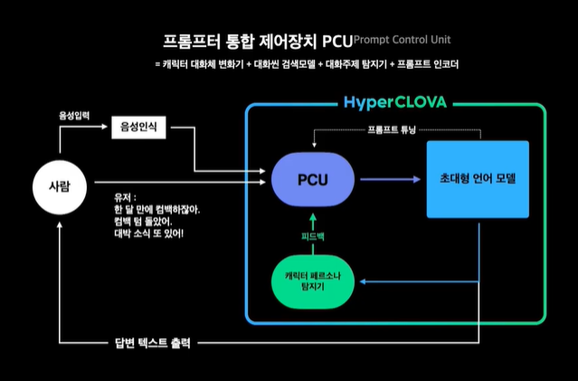

# ChatBot
- 챗봇 : 음성이나 문자를 통한 인간과의 대화를 통해 특정 작업을 수행하도록 제작된 컴퓨터 프로그램. 이를 구현하기 위한 다양한 API가 존재함. Dialogue task. 
- 동작방식 : 자연어처리를 심각하게 적용하는 언어 이해 방식, 입력에서 특정 단어/어구를 검출해 준비된 응담을 출력하는 검색방식, 각본을 미리 만든 뒤 그에 따르는 각본방식이 있음.
- 페르소나 : (다른 사람들 눈에 비치는, 특히 그의 실제 성격과는 다른, 한 개인의) 모습. 챗봇의 성격. 성격을 뜻하는 personality를 써도 되나 persona의 쪽이 더 자주 사용되고 있음.
  `안나는 매사 행복하고 기운이 넘친다. 공감능력이 뛰어나고 긍정적이며 리액션이 좋은 편이다` 등의, 성격과 말투/텐션 등 어떤 식으로 대화하는지 알려줄 수 있는 페르소나를 설정해야 한다.
- 대화시스템(Dialogue Systems) : 사람과 기계가 대화를 나눌 수 있게 하는 AI시스템. 인공지능 어플리케이션에서 필수적인 기능. 목적지향 대화시스템과 대화지향 대화시스템으로 분류됨.
- 대화처리기술 : 사용자의 말을, 명령어 중에서 정확히 이해하는 수준에서 이해하고 공감하며 전문분야수준의 지식으로 사용자 요구를 만족시키는 기술수준까지 포함. 기계가 인간의 대화 능력과 지식을 가져, 
  인간의 역할이 가능하도록 하는 기술을 이로 보기도 함. 세분화된 특정 기술 및 능력에 집중되어 발전해 왔으나, 여러 시스템들이 결합해 인간대화를 처리하도록 하고 있음. 
- Before NN : 신경망 이전 대화시스템에서는 들어온 발화에 대해 사전정의된 탬플릿을 써 반응하거나, 말뭉치에서 적절한 반응을 검색해 뽑아쓰는 방식으로 출력을 내보냈으며, 이후 꾸준히 학습하는 반응을 생성하는 쪽으로 발전했음.

## 목적지향 대화시스템
- 목적지향 대화시스템(goal-oriented dialogue system) : 특정 목적을 위해 구축된, 사용자가 자연어 형태의 음성이나 텍스트 입력을 통해 원하는 작업을 수행할 수 있도록 도와주는 대화시스템. 
  사용자가 시스템과의 대화를 통해 달성하고자 하는 목표가 있고, 시스템과 연결되어있는 대용량 DB가 있어, 거기서 원하는 정보를 찾아 전달해 주는 것을 목적으로 함. 문제해결용 대화시스템과 사실상 동일.
- 구성요소 : 의도분류(사용자의 입력을 받아 의미를 식별. 패턴일치, ML(분류), NN등이 있음), 객체추출(Entity Extractor, 사용자의 쿼리에서 핵심 정보를 추출).

- 문제해결용 대화시스템(Task-Oriented Dialog Systems, 기능지향 대화시스템) : 문제의 해결을 위해 설계된 시스템. 보통 NLU, DM, NLG 3개의 모듈 아키텍쳐로 구성됨. 파이프라인 목적지향.
  최대한 적은 대화로 유저가 원하는 것을 이해하고 해결하는데 초점. 문장의 의도를 알아내는 Intent Classification과 구체적인 요청을 알아내는 Slot Filling으로 구성.  
  고객서비스/추천/질의응답 등(Assistive)과 Co-operative(에이전트 둘이 함께 대화로 task해결), Adversarial(에이전트 둘이 대화를 통해 task에서 경쟁)등이 있음.
- NLU(자연어 이해) : 사용자의 발화를 이해하기 위한 모듈. intent(Search-Weather)와 Slot(location(Seoul), date(2020-05-17)등)을 분석함.
- Dialogue Manager(DM, 대화관리) : 주고받는 대화흐름을 관리. 크게 DialogStateTracker(대화추적관리/대화진행중 데이터유지)와 PolicyManager(시스템 액션결정. NLG/DB로 연결)로 구성.
  대화의 실제 컨텍스트를 관리하며, 피드백 매커니즘(때때로 사용자의 피드백을 받아 실수로부터 배우고 수정함)과 정책학습(전체 만족도의 개선을 위해, 일반적으로 좋은 루트를 만들고 그 흐름을 따름)의 주요 매커니즘이 존재함.
- NLG(자연어 생성) : DM으로부터 데이터를 입력받아 사람이 이해할 수 있는 시스템의 응답을 생성. 각 시스템의 페르소나를 결정할 수 있기에 매우 주의깊게 다뤄져야 함.

- DM분류 : 유한상태 기계기반 방법 - 시스템 주도로 대화를 진행, 정의한 순서대로 발화하며 사용자의 응답이 적합해야 다음으로 넘어감. 쉬운구현/안정적성능/단순목적적합 장점과 일방적/제한된 대화 단점. |
  양식기반 방법 - 양식채우기 방식이라고도 함, 필수 정보를 슬롯으로 정의하고 여러 슬롯의 양식이 채워질 때 까지 대화로 정보를 요구함. 대화순서에서 자유도를 누림. 대화이해정확도 필요. | 두가지로 나뉨. 

- 대화지향 For 목적지향 : 챗봇을 특정 목적을 위해 타 프로그램과 같이 사용하는 경우, 챗봇또한 목적지향의 범주에 들어갈 수 있음(영어 교육을 위한 챗봇+문법교정 시스템 등).

## 대화지향 대화시스템
- 대화지향 대화시스템(Chat-oriented Dialog Systme) : 대화를 위해 제작된 시스템. 유저가 어떠한 주제로 말을 걸어도 알맞은 답변을 해 대화를 이어나감. 자유주제(OpenDomain)대화시스템이라고도 함.
  대화 에이전트라고도 함. 대화시스템에서는 이 Task를 챗봇이라고 칭함. 대화task의 SocialDialogue(흥미를 유발해 긴 대화를 목적으로 하는 ChitChat, 그 외에 테라피/멘탈웰빙등)에 속함.
- 방법 종류 : 규칙/패턴기반 방법(패턴지식+제약규칙+유의어/관련어 규칙사용. 거의 자연어분석/사용자의도 이해 과정이 불필요), 검색기반 방법, 생성기반 방법(통계기반 자동번역/신경망기반 자동번역)이 있음. 
  대용량 데이터셋의 사용이 가능해짐에 따라 최근에는 규칙/패턴기반 방법과 검색기반 방법을 함께 사용하고 있음. 복잡한 구조의 표현을 위해 스크립트 언어를 사용하는 챗봇이 많음.
- 학습 : 과거엔 학습을 위해 방대한 데이터에 직접 annotation해 hand-crafted feature를 선별했지만, 도메인 영역이 작을 수 있고 모델 개발까지 오랜 시간을 걸릴 수 있다는 단점이 있었음.
  이의 해결을 위해 End-to-end 방식(hand-crafted feature에 의존적이지 않으며, 긴 대화 유지에 유용함)을 사용함. 데이터는 대부분 대용량의 대화예문(발화-응답, 텍스트/패턴형식 가능)을 사용.

- 생성 대화 모델(Generative Conversational model) : seq2seq모델을 이용해 유저의 말을 읽고 답변을 한단어씩 생성하는 모델. 많은 연산량이 필요하고, 고품질을 위해 큰 모델과 데이터셋이 필요함.
- 한계+해결법 : 표준적 S2S+어텐션 방법의 고질적 문제들과 해당 문제점을 해결하기 위한 방안들은 아래와 같음. 
  - 일반적이고 지루한 응답 : 목적함수를 문장의 일반화를 방지해주는 MMI(argmax{log(가능도)-log(혼자서 출현할 확률)})로 쓰는 것이 있음.
    MMI는 Maximum Mutual Information의 약자로, 일반 S2S모델의 목적함수에서 다른 조건없이 혼자 출현할 확률(빈도)를 패널티로 줘 자체 확률은 낮고, 조건부에서 확률이 높은 문장을 고평가 하게 됨. 
  - 주제/문맥과 무관한 응답 : 빔서치 등에서 희소단어의 가중치를 높여주고, 샘플링 기반 디코딩알고리즘을 사용할 수 있음.
  - 같은 단어/문장의 반복 : 빔서치등 과정을 추적하는 알고리즘의 경우 반복이 발생하면 동일단어를 block하고, coverage 매커니즘을 사용하거나 반복에 대해 패널티를 주는 목적함수를 사용할 수 있음.
  - 문맥의 결핍(페르소나의 일관성 부족) : 페르소나를 임베딩해 학습시키고 페르소나 정보까지 레이블된 PersonaChat등의 데이터셋을 통해 시스템을 훈련시킬 수 있음.
  - 긴 대화/질문/추가학습 불가등 : 대부분의 모델이 open-ended한 방향으로 발전했고, 프롬프트 기반으로 해 긴 대화나 질문등도 무리없이 가능하게 발전했음.

- 검색 기반 모델(Retrieval-based model) : DB에서 답변을 고르는 모델방식. 생성 대화 모델의 보완을 위해 탄생. DB에서 그럴듯한 N개의 답변 후보를 뽑은 뒤 한개의 답변을 선택함. 이루다의 방식.
  NLU(텍스트로 구성된 메세지를 벡터로 변환, BERT구조)모듈과 답변후보들이 저장된 DB, Re-ranker(최종답변선택을 위한 모델)로 구성됨. DB의 답변들은 실제사람이 쓴것이기에 자연/개인정보 유출 위험.
  사용자 발화는 질의로, 대용량 대화예문의 발화는 가상의 문서로 생각해 유사한 발화가 검색되면 그 발화의 응답을 시스템 응답으로 출력함. 혹시 유사예문이 없다면 임의발화를 쓰거나, 생성모델적용이 가능.

- 모델구조 : 검색, 생성, 검색-정제(retrieve-and-refine)의 모델로 구성, 모든 모델은 트랜스포어 베이스.
- 검색 : 대화기록(컨텍스트)이 입력되면 검색시스템은 다음 대화를 거대한 답변후보(모든 가능한 트레인 셋 답변)에서 점수를 매겨 선정하고, 가장 높은 점수의 하나를 반환함. 논문에선 폴리-인코더 구조를 사용.
  폴리인코더는 각각 가능한 후보 답변에 참조되고 있는 다중 표현을 사용하는 컨텍스트(글로벌 속성)를 인코드 해 싱글 글로벌 벨터표현에 향상된 효과를 보여주는 인코더(어텐션)들(bi-encoders)과,
  계산하기 쉬우나 간단히 입력과 출력을 연결한 것으로 비교되는 트랜스포머들(cross-encoders)로 이뤄지 있고, 다른 검색기반 모델과 비교했을때 최고이며, 우승한 생성모델과 유사한 효과를 보여줌. 두개 사용.
- 생성 : ParlAI version에 기반한 스탠다드 S2S 트랜스포머 아키텍처와 Byte-Level BPE 토큰화를 사용, 세가지 사이즈의 모델을 제시하였음(파라미터 개수 - 90M, 2.7B, 9.4B).
  각각 9.4B 파라미터 - 4(인코더)/32(디코더)/4096(임베딩차원)/32(어텐션 헤드), 2.7B - 2(인코더)/24(디코더)/2560(임베딩차원)/32(어텐션 헤드)를 가지고 있음.
- 검색-정제 : 생성모델에 단조롭고 반복적인 응답만 생성하고, 응답을 환각시키며, 일반적으로 외부 추가지식을 일고 엑세스 할 수 없으며, 임베딩이 완벽하지 않을 수 있단 이슈가 있었는데,
  이를 완화하려는 노력 중 하나가 생성 전에 검색 단계를 나누는 것 이였음. dialogue retrieval과 knowledge retrieval 두 종류의 검색 단계를 사용함.
- Dialogue Retrieval : 대화 기록이 주어지면 검색모델이 먼저 응답을 생성함. 이 응답을 바로 보여주기보다 입력시퀀스에 구분 토큰과 함께 더해짐. 사람의 작성 답변 중 가장 높은 가능도를 가진 답변을 선택함.
- Knowledge Retrieval : 검색된 지식으로 조건부생성을 함. 최초 지식 후보를 생성하기 위해 같은 검색시스템을 사용함. 트랜스포머 검색모델은 후보에 랭킹을 매기고 조건부 생성에 사용될 단일문장을 선택함. 
  추가로 지식이 필요하지 않은 컨텍스트를 위해 검색수행여부를 정하는 트랜스포머기반 분류기를 훈련함. (파인튜닝 task안에서) 지식이 필요한지 아닌지를 판별하는 이진분류로 훈련됨.

### Decoding algorithm
- 디코딩 알고리즘 : 생성대화모델에서 각 step의 예측결과물인 다음 단어에 대한 확률분포벡터로부터 최종 출력 단어를 결정할 때 사용하는 알고리즘. 

- GreedyDecoding : 단순히 각 스텝의 출력 확률분포에서 확률값이 최대인 단어를 선택하는 방식. 매 시점마다 현재만을 기준으로 최선의 결정을 내려, backtracking을 할 수 없어 오류를 포함하기 쉽다는 단점이 있음.
- BeamSearch : 높은 확률값을 갖는 단어들의 후보군을 (k개)만들어 모든 후보군을 동시에 추적함. k가 적으면 GreedyDecoding과 같은 문제점이(1일땐 동일함), 크면 계산비용증가와 일반적인 문장이 생성되기 쉽단 문제점이 있음.
  각 문장이 마지막 토큰을 예측하거나, 최대 디코딩 한계 T(HyperParam)에 도달하면 종료됨. 비용이 많이 들어, 대신 자동회귀분석(이전의 결과를 받아 n+1의 단어들을 예측)을 사용하기도 하며, 무의미한 답변이 생성될 위험이 있음.

- Sampling : 어떤 자료에서 일부 값을 추출하는 것을 의미함. 
- Sampling-base Decoding : 가장 가능성이 높은 것이 아닌, 모델의 예측확률분포로부터 확률샘플링을 통해 결정. 단, 한번 나쁜 선택이 샘플링되면 계속 잘못된 선택이라고 인식해 피드백 루프에 갇힐 수 있다는 단점이 있음.
  기본적으로 step t의 확률분포로부터 이후 단어를 랜덤하게 추출함(GreedyDecoding처럼 하나의 단어를 고려하지만 argmax로 결정하진 않음).
- Top-N Sampling : step t의 확률분포로부터 이후 단어를 랜덤하게 추출할 때, 확률이 높은 n개의 단어만 고려함(축약된 확률 분포를 이용함). n이 크면 다양하고 위험한/작으면 일반적이고 안전한 출력이 생성됨.
  n == 1이면 GreedyDecoding과 동일하고, n == V(vocab_size)면 그냥 샘플링 기반 디코딩과 동일함.

- softmax temperature : ScaledDotProduct attention처럼 softmax전에 입력되는 word score를 작아지거나 커지도록 스케일링해줌(softmax는 0중심 함수이며, 입력이 0에서 멀어질수록 포화되는 경향이 있다고 하기때문).
- SubsequenceBlocking : 문장생성모델(특히 빔서치등 확률적 메서드/샘플링 메서드)은 서브시퀀스를 반복한다고 알려짐. 따라서 생성된 말의 n그램 반복/입력된 말의 반복을 모두 블로킹(n그램 표준 빔 블로킹).

- ResponseLength : 빔으로 생성시 훈련된 사람말의 평균길이와 일치하지 않는 짧은 생성을 생성하는 경향이 있으나, 높은 품질의 더 긴 응답은 매우 짧은 것보다 더 매력적일 수 있음.
  인간 분포를 따르는 게 최적성능의 제공은 아니나, 실패 가능성이 적어 평가개선을 위해 간결하게 사용할 수 있음. 인간의 응답시간이 길어지면 더 많은 정보를 제공하고 덜 둔해질 수 있음.
- MinimumLength : 모델응답의 길이를 제어하는 두개의 간단한 방법 중 하나. 최소생성길이에 대한 엄격한 제약. 최소 시퀀스 길이에 도달할 때 까지 엔드토큰이 생성되지 않도록 함.
- PredictiveLength : 인간간의 대화데이터에 기반한 길이를 예측하는 것. 이를 위해 대음대화의 길이를 저장해 4진분류 분류기를 학습시킴(길이 범위별로). 이는 검색모델과 동일한 구조를 가짐.
  그 후 분류기는 먼저 다음 응답의 길이를 예측하고, 해당하는 예측에 최소생성길이제약을 설정함. 자연스러워 보일때 긴 반응을 보장하며 더 자연스러운 가변 길이로 만듦. 시스템을 더 복잡하게 만든다는 단점존재.

### Breakdown Detection
- breakdown : 시스템이 대화의 흐름에 맞지 않는 발화를 생성했을 때 발생. 크게 멀티 턴으로 인해 시스템이 의도를 잘 못 이해하거나, 대화에서 많은 주제를 다뤄 모든 흐름파악에 어려움을 겪어 발생함.
- Breakdown Detection : 사람과 시스템 사이의 대화에서 문맥의 흐름이 끊겨 사람이 더이상 대화를 이어나갈 수 없을 때(breakdown), 시스템의 발화가 breakdown을 유발하는지 탐색하는 것. 
  자연스러운 대화 유지를 위한 필수 task이며, 시스템이 잘못 발화한 경우에 대한 오류 발견에도 활용가능. End-to-end방식에 대한 연구에도 불구하고, 일일히 문맥흐름을 파악해 감지하기에는 어려움이 있음.
- 초기 연구 : 각 발화에 대한 키워드 추출을 통해 breakdown되기까지 휴리스틱규칙을 이용한 rule-based방법(전통)과 LSTM을 이용해 빈번히 나오는 단어(벡터)를 feature로 구성하는 방법이 있었음(딥러닝). 
  규칙기반(전통적인)방법은 휴리스틱하게 일일히 비교해보며 찾아야 해 시간이 많이 소비되며, 딥러닝기반의 모델도 멀티 턴을 모두 반영하기에는 부족함이 있음.
- Memory attention기반 Temporal Utterance Encoding모델 : 사용자 및 시스템 발화에 대한 문장표현을 수행한 뒤 둘을 연결, LSTM > 지금까지의 메모리를 이용힌 어텐션 가중치를 얻어 예측.

### 캐릭터 대화
- (챗봇)캐릭터 대화의 조건 : 고유의 대화체 + 그것을 유지, 캐릭터 세계관 유지(기본 프로필, 배경, 철학, 특정 질문에 일관된 답변), 유창하게 말하기.
- 퓨샷프롬프트 : 챗봇의 답변생성에 사용될(모델의 입력이 될)몇가지 대화내용이 들어있는 프롬프트. 특정 주제와 관련된 전체 대화문이 몇개(두개정도) 들어감.  
- 기본적인 대화모델의 구성 : 사람의 발화(쿼리텍스트 입력/음성인식) -> | 퓨샷프롬프트 -> 초대형 언어모델(답변 텍스트 출력) | -> 퓨샷 프롬프트/사람에 전달 의 구조를 가짐.  
- 일관적 캐릭터 대화체 : 유저 발화와 생성되는 답변에 의해 캐릭터 대화체가 변할 수 있음 -> 
  답변의 페르소나를 탐지하는 모델을 별도로 훈련시켜 언어모델을 보조하고, 해당 모델의 피드백을 받아 캐릭터 대화체 변환기가 대화체를 변환하게 함.
- 캐릭터 세계관 유지 : 특정한 질문에 대해 일관성있게 답변해야 함 -> 일관성을 유지해야 하는 문답 예제가 포함된 대화장면 여러개를 검색해 입력 프롬프트에 포함해야 함 ->
  프롬프트 길이의 한계로 모든 세계관을 담기 힘듦 -> 별도로 훈련시킨 주제탐지기를 이용해 유저발화에 따라 주제 안에서 일관성을 유지해야 하는 예제를 검색해 프롬프트에 포함시켜 줄 수 있음.
- 프롬프트 인코딩 : 더 효과적인 퓨샷러닝을 위함. 프롬프트를 지시문, 대화주제, 대화장면 파트로 분리한 뒤 각각의 인코더 모델을 초대형 언어모델 앞에 두어 언어모델어 더 효과적으로 프롬프트 패턴을
  인식할 수 있게 함. 이를 위해 각 인코더 모델은 P-Tuning, Prompt-Tuning과 같은 기법으로 별도로 훈련이 되어야 함.
- PCU(Prompt Control Unit) : 캐릭터 대화체 변환기, 대화 씬 검색 모델, 대화주제 탐지기, 프롬프트 인코더가 합쳐진 캐릭터 대화를 위한 제어 장치.
- 

## Virtual Human
- 디지털 휴먼 : 사람의 신체 구조 및 움직임을 데이터화해 분석, 가상공간에서 마치 실제로 존재하는 사람처럼 움직임을 재현하는 디지털 기술로 만들어진, 사람과 동일한 외형을 갖추고 있는 가상 인간.
  단순한 지식 전달 뿐 아니라 현실감 있는 표정 변화와 '사람 감정'으로 감성 대화가 가능하다는 특징이 있음.

### 가상인간
- 이외에도 다양한 가상인간이 존재함.
- 둥투위저우 : 중국에서 등장한 메타버스계의 MCN. 수백명의 가상인간IP 보유.

- 릴 미켈라 : 미국, 1호 가상인간(19세·AI 스타트업 브러드 개발)
- 로지 : 한국 1호 가상인간(22세·사이더스 스튜디오X)
- 루시 : (29세·롯데홈쇼핑)
- 김래아 : (23세·LG전자)
- 한유아 : (19세·스마일게이트)
- 캐논(KANON) : 밀라노 패션위크의 유니콘 패션 어워드에 선 가상인간 모델.

# Language Model
- Language Model : 확률분포 P(yt ∣ y1, ..., y, t−1)를 생성 하는 시스템.
- Language Modeling : 특정 시점까지의 단어들의 시퀀스가 주어졌을 때, 이후 시점의 단어를 예측하는 task. 레이블링이 불필요하다는 장점이 있음. 
- Conditional Language Modeling : 특정 시점까지의 단어들의 시퀀스 뿐 아니라 또다른 입력 x를 받아  P(yt∣y1, ..., yt−1, x)의 분포를 출력하는 task.
  무작위 샘플을 생성해내는데는 유용하지 못하나 주어진 입력값에 대한 텍스트를 생성하는 데에는 유용함.

- Smoothing : N-gram을 쓰는 언어모델에서, 항상 테스트 데이터셋에 모든 경우가 있는게 아니기 때문에, 새로운 데이터에 대해 확률을 계산할 때 해당값에 대한 통계가 없다면 DIV0가 되어 언어모델을 적용할 수 없게 되니, 
  이를 해결하기 위한 방법중 대표적인 방법. count가 0인 matrix의 값에 1을 더해 확률이 0이 되지 않게 만듦.

## Metrics
- 문장생성의 전반적인 품질을 평가할 수 있는 지표는 현재까지 없다고 하며, 전반적인 품질이 아닌 조금 더 구체적인 기준을 설정해 
  특정 관점에서 평가할 수 있는 측도들을 정의하여 그것들을 다 조합하는것으로 챗봇의 퀄리티를 평가할 수 있음.
- Perplexity : 언어모델의 내부 성능평가지표. 평균적으로 아무단어에나 뒤따라 나타날 수 있는/고민하고 있는 단어의 수. 문장의 길이로 정규화된 문장확률의 역수. 
  언어모델의 생성력에 관한 측도로, 생성된 텍스트의 퀄리티에 관한 정보는 평가할 수 없음. 각 단어들의 확률을 전부 곱한 다음 -(1/N(단어개수))승을 해 구할 수 있음.

# REFERENCE
- [1](https://ettrends.etri.re.kr/ettrends/178/0905178006/34-4_55-64.pdf)
- [2](https://jiho-ml.com/weekly-nlp-31/)
- [3](https://www.koreascience.or.kr/article/CFKO201832073078524.pdf)
- [4](https://www.koreascience.or.kr/article/JAKO201734963782120.pdf)
- [5](https://arxiv.org/pdf/2004.13637v2.pdf)
- [6](https://velog.io/@changdaeoh/cs224n-Lec15.-Natural-Language-Generation)
- [7](https://www.youtube.com/watch?v=tf46i2hZ_1w&list=PLq8dHmDf5DDX7HSXPh5pAxcDrAl7PJIoN&index=12)
- [8](https://atcold.github.io/pytorch-Deep-Learning/ko/week12/12-2/)
