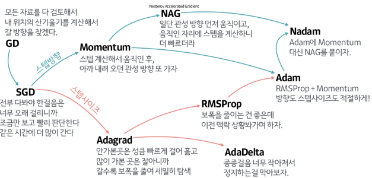

# Computer
- 컴퓨터의 기본구조 : 트랜지스터 수천억개가 연결되어있음.
- 트랜지스터 : NPN, N이 각각 +와-에 연결되어있다, p에 전압을 주면 전류가 흐르게됨. 스위치와 달리 물리적 힘이 필요없다는 특징이 있음.


#AI
- 인공지능 > 지능적인 인간의 행동을 모방하는 기계의 능력.
- 심볼릭 AI(symbolic AI) > 프로그래머들이 명시적인 규칙을 충분히 많이 만들면 일반지능(인간수준 인공지능)을 만들 수 있다는 접근 방법. 전문가 시스템과도 연관되어 있음.
- 머신러닝(Machine Learning) > 인공지능의 한 분야, 알고리즘을 이용해 데이터를 분석하고, 그를 통해 학습하며, 그 내용을 기반으로 판단이나 예측을 함. 지도학습과 비지도 학습이 포함되어 있음.
- 딥러닝(Deep Learning) > 인공 신경망에서 발전. 몇 층의 인공 신경망을 이용. 데이터 군집화나 추상화를 시도함(여러 비선형 변환기법의 조합을 통함). 머신러닝과 달리 데이터 학습량이 늘어도 정확도 향상에 한계가 오는 지점이 없음.
- AI학습 흐름 > Y = f(Wx * X + b)(순전파, 예측값 생성) -> 손실 측정(손실함수 이용) -> 가중치, 편향 조정(역전파, optimizer 사용)  

- 머신러닝은 최적화와 일반화를 잘 조절해야 함. 100%에 가까운 모델을 만들고, 그 후 일반화를 진행. 데이터 사이즈가 같을때 정확도를 높이려면 층을 추가하고, 크기를 키우고, epoch 를 높이면 됨. 

- 모델을 학습할 때에는 데이터 형태확인(data Engineering 으로 데이터를 다듬거나 새 특성을 찾아내기도 함) > 전처리(normalization, one-hot-encoding) > 모델 생성 및 학습으로 이뤄진다.

##용어
***
- 일반화 > 모델이 처음보는 데이터를 정확하게 예측할 수 있다면, 그것을 훈련세트에서 테스트 세트로 일반화 되었다고 함.
- 과대적합 > 모델이 훈련세트에 너무 가깝게 밎게되어 일반화 되기 어려울때 일어나는 것. 이를 막기위해 모든 특성이 출력에 주는 영향을 최소한으로 만들게(규제)한다.
- 과소적합 > 모델이 너무 간단해 데이터의 면면과 다양성을 잡아내지도 못하고, 훈련세트에도 맞지 않는것. 테스트 세트의 성능이 좋았더라도 테스트 세트와 점수가 비슷하다면 과소적합일 가능성이 있어, 모델의 성능을 더욱 올릴 수 있다.
- 편미분 > 변수가 여러개 있을 때, 어떤 변수를 미분힐지 명시하는 것.


##정확도 계산(metrics)
***
- Accuracy(정확도) : 모든 예측이 실제로 맞은 비율. 
- Precision(정밀도) : True 라고 예측한 것중 실제로 True 인 비율. 푼 문제 중 맞은 비율 같은 느낌. 양성 예측도(PPV)라고도 함. 거짓 양성을 줄여야 할 떄 사용. 
- Recall(재현율) : 모든 true 중 true 로 예측한 것의 비율. 전체 문제 중 맞은 비율같은 느낌. 민감도, 적중률, 진짜 양성 비율(TPR)이라고도 함. 모든 양성을 식별, 즉 거짓 음성을 줄여야 할 때 사용.
- F1-score : 정밀도와 재현율의 조화평균(역수의 평균의 역수, 곱/합)*2. 정밀도와 재현율이 서로 상충하고 둘 중 하나만으로는 전체 그림을 볼 수 없기 때문에 사용한다. F1-measure 라고도 한다. 기본 임계값에 대한 점수이다.

- macro 평균 : 클래스 크기에 상관 없이 모든 클래스를 같은 비중으로 다룬다.
- weighted 평균 : 클래스별 샘플 수로 가중치를 둬 f1 점수의 평균을 계산.
- micro 평균 : 모든 클래스의 거짓 양성(FP), 거짓 음성(FN), 진짜 양성(TP)의 수를 세어 정밀도, 재현율, f1점수를 이걸로 계산한다. 

#### 모델 평가
- 교차검증 : 데이터를 여러번 반복해서 나누고 여려 모델을 학습한다. 일반화 성능을 재기 위한 안정적이고 뛰어난 통계적 평가 방법. 각 샘플이 한번씩 들어가 점수를 높이려면 모든 샘플에 대해 잘 일반화 되어야 하며, 모델이 훈련 데이터에 얼마나 민감한지 파악 가능하다는 정보를 얻을 수 있고, 데이터를 효과적으로 사용할 수 있다는 장점을 갖지만, 연산 비용이 늘어난다는 단점이 있다.
- 교차 검증은 물론 필요하지만, 이것이나 테스트 데이터셋을 모델이나 모델의 매개변수 선택에 사용해서는 안된다.
- k-겹 교차검증 : 보통 회귀일 경우 사용. 데이터를 k 개로 폴드(비슷한 크기의 부분집합으로 나눔)한다. 보통 5나 10을 주로 사용하고, 총 k 개의 모델을 만들어 각 모델은 자기 순서의 폴드를 테스트 세트로, 다른 모델은 트레인 세트로 사용해 훈련을 진행한다.  
- 계층별 k-겹 교차검증 : 보통 분류일 경우 사용. 데이터가 계층별로 나눠져 있을 때 위의 방법에는 문제가 있어 대신 사용하는 방법. 분류기의 일반화 성능 측정 시 더 안정적이라 이것을 사용하는게 좋다.
- LOOCV(leave-one-out cross-validation) : 폴드 하나에 샘플 하나만 들어있는 k-겹 교차검증. 데이터 셋이 크면 시간이 걸리지만 작은 데이터 셋에선 종종 더 좋은 효과를 낸다.
- 임의 분할 교차 검증 : train_size 만큼 훈련세트를 만들고, 그것과 중복되지 않은 포인트로 test_size 만큼 테스트 세트를 만든다. 반복 횟수를 독립적으로 조절해야 할 때, 전체 데이터의 일부만 사용하고 싶을 때(훈련과 실험의 합을 전체와 다르게 해 가능), 대규모 데이터 셋으로 작업할 떄(부분 샘플링 방식) 유용하다.
- 그룹별 교차 검증 : 훈련세트와 테스트 세트를 만들 때 분리되지 않아야 할 그룹을 지정하여 같이 넘길 수 있는 교차 검증 방법. 이를 위해 model_selection.GroupKFold 메서드를 제공함.
- 반복 교차 검증 : 데이터셋이 그리 크지 않은 경우 안정된 점수를 얻기 위해 교차검증을 반복해 여러번 수행하는 것. 
- 중첩 교차 검증 : 바깥쪽 루프에서 데이터를 훈련과 테스트로 나누고, 각 훈련세트에 대해 그리드 서치를 실행한 뒤, 밖에서 테스트 세트에 대해 각각 측정해 특정 데이터 셋에서 모델이 얼마나 잘 일반화 되는지 평가하는데 유용하게 사용할 수 있다. 예측 모델의 제작에는 거의 사용하지 않는다.

- 분류 평가 지표 : 거짓 양성과 거짓 음성이 있는데, 보통 둘의 중요도가 비슷한 경우는 거의 없어 모델 평가시 이를 주의해야 한다.
- 오차 행렬 : 이진 분류 평가를 나타낼 때 가장 많이 사용하는 방법이지만 다중 분류애서도 사용할 수 있다. 클래스*클래스의 크기로, [[클1 예측 수, 클2 예측 수](다 합치면 클1 요소 개수), [클1 예측 수, 클2 예측 수]\(클2)] 식으로 나와, 대각 행렬(i\*i)이 클래스별 정답의 개수가 된다. 
- 불확실성 고려 : 대부분의 분류기는 decision_function 이나 predict_proba 라는 메서드를 제공하는데, 예측은 이것의 출력의 임계값을 검증(0, 0.5(0~1로 고정) 가 기본)하는 것으로, 이를 조정하면 더 넓은 범위의 데이터 포인트를 그 클래스로 넣을 수 있다. 이렇게 분류기의 필요 조건을 지정하는것을 운영 포인트 지정이라고 하며, 임계값 조정은 따로 데이터셋을 만들어(혹은 교차검증) 수행해야 한다.
- 정밀도-재현율 곡선 : 새 모델을 만들 때 운영포인트가 명확하지 않아 문제를 더 잘 이해하기 위해 모든 임계값을 조사해 보거나 정밀도, 재현율의 장단점을 한번에 살펴보기위해 사용. 
- 평균 정밀도 : 전체 곡선에 담긴 정보를 요약하는 방법중의 하나로, 곡선의 아랫부분 면적이다. 모든 임계값에 대한 평균을 뜻한다.
- ROC 곡선 : 여러 임계값에서 분류기의 특성을 분석하는데 사용. 정밀도와 재현율 대신 TPR(진짜 양성 비율, 재현율)에 대한 FPR(거짓 양성 비율)을 나타낸다. 곡선 아래 면적(AUC)으로 요약해 사용할 수 있고, 이는 불균형한 데이터 셋에서 정확도보다 훨씬 좋은 지표이다.
- 회귀도 이진 분류와 비슷하게(과대예측 대비 과소 예측을 분석한다던가) 할 수 있지만 대부분 score 에서 사용하는 R^2 만으로 충분하다.

- 오프라인 평가 : 사전에 수집한 테스트 세트를 기초로 알고리즘이 만든 예측을 평가하는 방법. 알고리즘을 평가하는 첫 단계.
- 온라인 테스트 : 전체 시스템에 알고리즘이 적용된 이후 평가하는 것. 
- A/B 테스트 : 알고리즘을 변경하면 생기는 사용자의 행동을 크게 바꾸거나 예상치 못한 결과를 얻는 등의 돌발상황 방지를 위한 일종의 블라인드 테스트. 사용자 일부가 자신도 모르게 각 알고리즘을 사용하게 되고, 그 결과로 두 알고리즘 중 하나를 선택하는 방법. 

## 전처리
- 데이터의 스케일에 매우 민감한 알고리즘들은 그에 맞게 데이터의 특성값을 조정해야 하며, 특성마다 스케일을 조정해 데이터를 변경함.
- 데이터 벡터화 : 입력 데이터를 텐서로 변경하는 것.
- 원 핫 인코딩 : 해당 정보는 1, 니머지는 0으로 표기하는 방법. 영양없는 정보는 0을 대입해 행렬 곱셈 연산등에서 빠른 연산속도를 얻는다.  
  
- 정규화 : 각 입력데이터의 범위나 크기가 다를경우 네트워크 학습이 어려워, 특정 범위 이내로 만드는 것. 일반적으로 평균이 0이고 표준 편차가 1이 되는 0과 1 사이의 값으로 변환. 
- 정규 분포 : 모든 데이터를 (데이터-평균)/표준편차 로 정규화 해 평균이 0이고 표준 편차가 1이 되는 0과 1 사이의 값으로 변환한 분포.
- 균등 분포 : 모든 데이터를 같은 확률(비율)로 모아 0~1 사이에 분포시킴.
 
- StandardScaler : 각 특성의 평균을 0, 분산을 1로 변경해 모든 특성이 값은 크기를 가지게 함. 최솟값솨 최댓값의 크기를 제한하지는 않음. (데이터-평균)/표준편차.  
- RobustScaler : 특성들이 같은 스케일을 갖게 하지만 평균과 분산 대신 중간값과 사분위 값을 사용해 이상치(전체 데이터와 아주 동떨어진 데이터)에 영향을 받지 않게 함.
- MinMaxScaler : 모든 특성이 정확하게 0과 1 사이에 위치하도록 데이터 변경. 
- QuantileTransformer : 여러개의 분위(Quantile)를 이용해 데이터 균등 분포. 이상치에 민감하지 않으며 젠체 데이터를 0과 1 사이에 위치시킴.`` 
- Normalizer : 특성 벡터의 유클리디안 길이가 1이 되도록 데이터를 조정. 각 데이터가 다른 비율로 스케일 조정. 길이는 상관 없이 데이터의 방향(각도)만 중요할 떄 많이 사용됨.

- 주성분 분석 (PCA): 특성들이 통계적으로 상관관계가 없도록 데이터셋을 회전시키는 기술. 분산이 가장 큰 방향(주된 분산의 방향, 주성분)을 찾음. 주성분의 일부만 남기는 차원 축소 용도나 특성 추출에도 사용.
- 비음수 행렬 분해 (NMF) : 유용한 특성을 뽑아내기 위한 또다른 비지도 알고리즘. 데이터의 극단 또는 일부분에 상응되는 중첩가능 성분을 찾음. PCA 와 달리 음수가 아닌 성분과 계수값을 찾음. 음수가 아닌 특성을 가진 데이터에만 적용 가능. 패턴을 추출해 섞여있는 데이터에서 원본 성분을 구분할 수 있음(소리, 유전자 표현, 텍스트 데이터등에 적합함). PCA 에 비해 해석하기 쉬움.
- 매니 폴드 학습 : 위의 둘보다 월씬 복잡한 매핑을 민들어 더 나은 시각화를 제공함. 탐색적 데이터 분석에는 유용하나 학습한 데이터가 아니면 분해할 수 없기에 지도학습용으로는 사용하지 않음. 
- t-SNE : 매니폴드 학습의 알고리즘. 훈련 데이터는 다른 데이터로 바꿀 수 있지만, 다른 새로운 데이터는 적용할 수 없음. 데이터 사이를 가장 잘 보존하는 2차원 표현을 찾음. 각 데이터 포인트를 무작위로 2차원에 배열한 후 원래와 가까운건 더 가깝게, 먼건 더 멀게 만듦.
- 군집(clustering) : 데이터셋을 클러스터로 나눔. 데이터 마이닝 기법의 일환으로, 하드클러스터링(데이터 포인트 하나는 하나의 클러스터에 포함, 보편적)과 소프트 클러스터링(포인트 하나가 여러 클러스터 포함가능)이 있다. 비즈니스 목적에 따라 지도활동이 추가되는 경우가 있다. 모든 클러스터의 반경이 똑같다고 가정하기에 비교적 간단한 형태를 구분가능. 
- k-평균 군집 : 가장 간단하고 널리 사용되는 군집 알고리즘. 무작위로 클러스터의 중심을 할당한 후, 데이터 포인트를 가장 가까운 클러스터 중심에 할당하고, 클러스터의 데이터 포인트의 평균으로 중심을 재지정하는 과정을 중심에 변화가 없을때까지 거친다. 클러스터의 번호에는 아무 의미 없으며, 그저 같은 클러스터의 데이터들은 서로 닮았다는 것을 알려줄 뿐임. 활용 범위가 제한적이며, 찾으려는 클러스터의 개수를 지정해야 한다는 문제점이 있다.
- 병합 군집 : 각 포인트를 하나의 클러스터로 지정하고, 종료 조건을 만족할 때 까지 가장 비슷한 두 클러스터를 합침. 계층적 군집을 만듦.
- DBSCAN : 클러스터 개수 지정 필요 x, 복잡형상 구분 가능, 클래스 없는 포인트 구분 가능. 특성 공간에서 데이터가 많아 붐비는 지역의 포인트(밀집지역)를 찾고, 그걸로 클러스터를 생성. 밀집지역 의 중심인 포인트를 핵심 샘플이라고 한다.
- 군집 알고리즘 비교, 평가 방법 : 최적(1)일때와 무작위(0)일때 사이의 값을 제공하는, accuracy 가 아닌 adjusted_rand_score(ARI) 나 normalized_mutual_info_score(NMI), silhouette_score(데이터의 밀집도) 등의 군집용 측정 도구(metrics.cluster 에서 확인 가능) 가 있지만, 결국 가장 정확한 방법은 시각화를 해 직접 확인해 보는 것이다.

- 특성 공학 : 특정 앱에 가장 적합한 표현을 찾는 것.
- 구간 분할 : 한 특성을 여러 특성으로 나누는 연속형 데이터에 아주 강력한 선형 모델을 만드는 방법. 연속형 특성을 확장하는 방법. 기본적으로 상숫값을 학습하지만, 구간분할된 원래 특성을 다시 추가하면 기울기를 추가할 수 있다.
- 상호작용, 다항식 추가 : 특성을 풍부하게 나타내는 또 하나의 방법. 통계적 모델링과 일반적 머신러닝 앱에서도 많이 적용함.  각 구간에서 다른 기울기를 지니게 하기 위해 상호작용 특성(구간 특성\*원본특성)을 추가하거나 x**10까지 고차항(다항식)을 추가하는 등의 방법이다.    

- 일변량 통계 : 특성 자동 선택. 개개의 특성과 타깃 사이에 중요한 통계적 관계가 있는지 파악. 분류에서는 분산분석 이라고 함. 각 특성이 독립적으로 평가되어 다른 특성과 깊게 연관된 특성은 선택되지 않음. 특성이 많아서 모델 제작이 어렵거나 확실히 도움이 되지 않는다고 생각할 때 사용하면 좋다. 
- 모델 기반 선택 : 지도학습 모델을 사용해 특성의 중요도를 평가. 한 번에 모든 특성 고려.
- 반복적 선택 : 특성의 수가 각기 다른 모델을 생성. 특성이 하나도 없다가 종료조건까지 추가하거나, 특성을 전부 가지고 있다가 종료조건까지 하나씩 제거(재귀적 특성 제거, RFE)하거나 한다. 

###### 매개변수 튜닝
- 그리드 서치 : 매개변수를 튜닝(중요한 매개변수의 일반화 성능을 최대로 높여주는 값을 찾음)해 일반화 성능을 개선. 매개변수들을 대상으로 가능함 모든 조합을 시도. for 문으로도 간단히 사용가능하며, 사용시 훈련, 매개변수 검증, 모델 테스트 셋으로 데이터 셋을 나눠야 한다. 
- 비대칭 매개변수 그리드 탐색 : 모든 매개변수의 조합에 대해 그리드서치를 수행 하지 않아야 하는 경우(특정 매개변수에 특정 값이 들어가면 특정 매개변수를 사용하지 않는다 던가), param_grid 에 딕셔너리의 리스트 형태로 넣어주면 사용할 수 있다. 파이프 라인 객체를 그리드 서치에 사용하려면 파라미터들을{'이름__매개변수':[수들의 리스트]} 식으로 작성해야 한다. 

- Pipeline : 분류기 등의 지도학습 모델과 전처리 단계를 연결할 때 사용하는 사이킷런의 파이썬클래스. 여러 처리 단계를 사이킷런 추정기 형태로 묶어준다. 스케일 조정시 조정을 위해 테스트 부분 전체를 학습하는데, 이때 교차검증을 위한 테스트 속 검증 폴드마저 한번 학습하기 때문에 테스트 데이터에서 유출되는 정보가 생기며, 이를 해결하기 위해 교차검증의 분할이 전처리보다 먼저 이뤄지게 하기 위해 전처리 과정과 모델을 묶어 분할 > 전처리 > 모델 사용 의 과정이 되게 한다..
- 파이프 라인은 보통 그리드 서치를 위해 사용되는데, 그저 연결만 하는 것을 넘어 파이프 라인을 구성하는 단계(어떤 스케일러를 사용할지 등)도 그리드 서치로 탐색할 수 있지만, 이러면 탐색 범위가 더 넓어지니 주의가 필요하다. 딕셔너리의 리스트 형태로 만들어 사용가능. 
- 대규모 그리드 서치를 할 때에는 종종 동일한 단계가 여러번 수행되는데, 이때는 파이프 라인의 memory 매개 변수를 사용하여 계산 결과를 캐싱할 수 있지만 캐시는 디스크에 저장되어 관리되기에 디스크에 읽고 쓰기 위한 직렬화가 필요하고, 최악의 경우 사용되는 cpu 만큼의 작업 프로세스가 캐시되기 전 동시에 동일한 계산을 중복으로 수행할 수 있다는 문제점이 있다.
- dask-ml 라이브러리의 GridSearchCV 를 쓰면 모든 단점을 피할 수 있다.

###### 텍스트 데이터
- 수치형, 범주형과 구분되는 또 다른 데이터 유형. 총 4종류 중 하나로 표현되며 알고리즘 적용 전에 전처리가 필요하다.
- 범주형 텍스트 데이터 : 고정된 목록으로 구성. 메뉴 중 하나를 고르는 설문조사 등에서 볼 수 있는 데이터.
- 범주에 의미를 연결가능한 문자열 : 말그대로. 텍스트 필드로 응답을 받는 설문조사 등에서 볼 수 있는 데이터.
- 구조화 된 문자열 : 주소나 장소, 이름, 날짜, 전화번호등 일정한 구조를 가지는 문자열.
- 텍스트 데이터 : 자유로운 형태의 절과 문장으로 구성된 데이터. 

- 어간 추출 : 일일히 어미를 찾아 제거하는 규칙기반 방식. 더 좋은 일반화를 위해 각 단어를 단어의 어간으로 표현해 같은 어간을 가진 단어를 구분하기(합치기) 위해 사용한다.
- 표제어 추출 : 알려진 단어의 형태사전을 사용하고 문장에서 단어의 역할을 고려하는 처리 방식. 둘다 단어의 일반 형태를 추출하는 정규화의 한 형태로 볼 수 있음. 어간 추출보다 훨씬 복잡한 처리를 거치지만 토큰 정규화시 더 좋은 성능을 냄.

- BOW(bag of wards) : 가장 간단하지만 효과적이고 널리 쓰이는 방법. 토큰화 > 어휘사전 구축(모든 어휘를 모으고 알파벳 순으로 번호를 매김) > 인코딩(단어가 얼마나 나오는지 셈, 희소행렬로 만들기 등) 의 과정을 거친다.
- tf-idf : 얼마나 의미있는 특성인지 계산해서 스케일을 조정하는 방식. 다른 문서보다 특정 문서에서 자주 나타나는 단어에 높은 가중치를 주는 방법.
- n-그램 : BOW 를 사용할 때 문맥까지 같이 고려하는 방법으로 옆에 있는 토큰 몇개를 함께 고려한다. 두개는 바이그램, 세개는 트라이 그램이며(혼자있는 토큰은 유니그램) 일반적으로 연속된 토큰을 n-그램이라고 한다.  

- 토픽 모델링 : 비지도 학습으로 분서를 하나 또는 그 이상의 토픽에 할당하는 작업.
- LDA(잠재 디리클레 할당) : 토픽 모델링시 사용하는 특정한 성분 분해 방법. 자주 자타나는 단어의 그룹을 찾음. 

##ML
***
### 지도학습
입출력 데이터기반 예측

####분류
- 나올 수 있는 응답이 개별적(국가나 언어등 둘 사이에 무언가가 없음). 레이블이 이산형 범주. 출력층의 노드수는 레이블 개수와 동일해야 함.

- 이진 분류 - 범주 두개(y/n). 대부분의 선형 분류가 속함(로지스틱 제외).
- 다중분류 - 범주 새개 이상. 이진분류를 다중분류로 확장하기 위해서는 일 대 다 라는 방법을 사용함.
- 일 대 다 - 각 클래스를 다른 모든것과 비교하도록 훈련시킴.
 
- F1-Measure - 데이터가 불균형할 때, 정확도 만으로는 성능 측정이 어려워 통계적으로 보정해주는 방법. 다수보다 소수집단의 정답 여부를 더 크게 반영.
- K-fold Test - 전체 데이터를 다양한 방법으로 쪼개 훈련,테스트,검증의 과정을 여러번(K번) 반복하며 테스트가 편향되어 있지 않고 설명력을 가지게 하려 시행. 

- AutoEncoder - 입력데이터와 출력 데이터를 같게 하고 중간에 레이어를 넣어 원복하게 만드는 구조. 입력 데이터에 대한 일종의 패턴을 찾아냄. 훈련 데이터가 적을 때 사용.
```python  # auto encoder clone
import tensorflow as tf
import tensorflow.keras.layers as layers
import tensorflow.keras.models as models

n_inputs = x_train.shape[1]
n_outputs = 2
n_latent = 50

inputs = tf.keras.layers.Input(shape=(n_inputs, ))
x = tf.keras.layers.Dense(100, activation='tanh')(inputs)
latent = tf.keras.layers.Dense(n_latent, activation='tanh')(x)

# Encoder
encoder = tf.keras.models.Model(inputs, latent, name='encoder')
encoder.summary()

latent_inputs = tf.keras.layers.Input(shape=(n_latent, ))
x = tf.keras.layers.Dense(100, activation='tanh')(latent_inputs)
outputs = tf.keras.layers.Dense(n_inputs, activation='sigmoid')(x)

# Decoder
decoder = tf.keras.models.Model(latent_inputs, outputs, name='decoder')
decoder.summary()
```

####회귀
- 나올 수 있는 응답이 연속적. 레이블이 연속형인 숫자.
```python 선형 회귀 구현
learning_late = 0.01  # 학습룰 0.01로 설정
epoch = 300  # 학습 횟수는 300번으로 설정
W = tf.Variable(1.0)
b = tf.Variable(1.0) # 가중치, 편향 선언

def hypo(x):  # 가설(가중치와 편향)을 적용해 값을 반환하는 함수
  return W*x + b

def mse(y_pred, t):  # 평균 오차 제곱 손실함수
  return tf.reduce_mean(tf.square(y_pred - y) 차이값을 제곱한 뒤 평균을 구함

optimizer = tf.optimizer.SGD(learning_late)  # 옵티마이저는 경사 하강법, 학습률은 0.01로

X = [1,2,3,4,5]
y = [12,23,34,45,56]  # 학습 데이터 설정

for i in range(epoch+1):
  y_pred = hypo(X)  # 식 수행
  cost = mse(y_pred, y)  # 결과의 비용(본래와의 평균 제곱 오차)
  gradients = tf.GradientTape().gradients(zip(gradients, [W, b])  # 비용에 대한 파라미터 미분값 계산
  optimizer.apply_gradients(zip(gradients, [W, b]))  # 파라미터 업데이트
  # epoch 에 따른 출력문을 넣어줘도 괜찮음.

hypo(테스트 데이터) 로 훈련된 모델 사용가능.
 ```


#### 모델
##### KNN (nearest neighbor)
- 최근접 이웃 : 작은 데이터셋일 경우 기본 모델로 좋고, 설명도 편함.
  
##### linear
- 선형 모델 : 대용량, 고차원 데이터셋에 사용 가능.
- 리지 선형 회귀 모델 : 선형 회귀 모델에 가중치의 합이 최소가 되도록 L2 규제를 추가한다.
- 라소 선형 회귀 모델 : 리지와 비슷하나  L1 규제를 걸어 어떤 값이 0이 될 수 있게 한다.

###### naive bayes
- 나이브 베이즈 : 분류 전용. 선형 모델에 비해 훨씬 빠름. 대용량, 고차원 데이터셋에 사용가능. 베이즈의 정리를 이용.
- 베이즈의 정리 : 조건부 확률을 계산하는 방법 중 하나. P(A)가 A가 일어날 확률, P(B|A)가 A가 일어난 후 B가 일어날 확률 이라고 했을 때 P(A|B)=(P(B|A)P(A))/P(B) 의 공식을 따른다 
- 베이즈의 정리 이용 : P(레이블 | 입력 텍스트)(입력 텍스트가 그 레이블일 확률) = P(w1(본문의 단어) | 레이블) × P(w2 | 레이블) × P(w3 | 레이블) × P(레이블). 오직 단어의 빈도수만을 고려.

- Naive Bayes(NB) - 선형 분류기보다 훈련 속도가 빠르지만 일반화 성능이 조금 뒤짐.
- GaussianNB - 연속적인 어떤 데이터에도 적용가능. 각 특성의 표준편차와 평균을 저장. 고차원의 데이터셋에 사용.
- BernoulliNB - 이진데이터에 적용. 각 클래스의 특성 중 0이 아닌것을 셈. 커질수록 모델이 단순해지는 alpha 가 있음.
- MultinomialNB - 카운트(count) 데이터에 적용. 클래스별 특성의 평균을 계산. alpha.

##### dicision tree
- 결정 트리 : 매우 빠르며 데이터 스케일 조정이 필요 없음. 시각화와 설명하기 좋음.
- 랜덤 포레스트 : 결정트리 하나보다 좋은 성능을 냄. 안정적이고 강력하며 데이터 스케일 조정이 필요 없지만 고차원 희소 데이터와는 안 맞음.
- 그래디언트 부스팅 결정 트리 : 랜덤 포레스트보다 성능이 좋고 예측리 빠르며 메모리를 덜 사용하지만 힉습이 느리고 매개변수 튜닝이 많이 필요함.
- 결정트리 :  예/아니오를 반복하며 학습. 각 분열된 영역(리프)가 하나의 타깃값을 가질때 까지 반복. 이때의 리프노드를 순수노드라고 함.  
- 과대적합을 막기 위해 가지치기(사전 - 최대 깊이, 개수 제한, 최소 포인트 개수 제한 | 사후 - 데이터가 적은 노드 삭제)를 해줘야 함.
 
##### ensenble
- 앙상블 : 여러 모델을 연결해 더 강력한 모델을 만드는 기법. 랜덤 포레스트와 그래디언트 부스팅등이 있다.
- 랜덤 포레스트 : 조금씩 다른 여러 결정 트리의 묶음. 다른 방향으로 과대적합된 트리들을 평균냄. 여러개의 데이터중에서 무작위로 만들어낸 데이터의 부트스트랩 샘플을 생성한다. 모든 츠리에 대한 예측을 만든 후, 그 예측을 평균하거나(회귀) 예측한 확률을 평균내어(분류) 예측값을 나타낸다. 트리가 많을수록 랜덤값에 영향을 덜 받는다. 많은 트리는 메모리와 긴 훈련시간을 부른다. 차원이 높고 희소한 데이터에는 잘 작동하지 않는다.
- 그래디언트 부스팅 회귀트리 : 약한 학습기 사용. 이전 트리의 오차를 보완하는 방법으로 순차적으로 만듦. 무작위성이 없고, 적은 메모리와 예측도 빠름. 랜덤포레스트 보다 매개변수의 영향을 더 많이 받는다. 커질수록 보정을 많이해 복잡한 모델을 만드는 러닝 레이트 매개변수를 가지고 있다. 랜덤 포레스트보다 조금 더 불안정하다. 
- 배깅 : Bootstrap aggregating 의 줄임.  랜덤 샘플링으로 훈련세트를 각기 달리 훈련시킨 뒤 확률값을 평균하거나 빈도가 가장 높은 예측결과 예측값이 된다.
- 엑스트라 트리 : 후보 특성을 무작위 분할 후 최적의 분할을 민듦. 랜덤 포래스트와 다른 방식으로 모델에 무작위성을 주입. 
- 에이다 부스트 : 약한 학습기 사용. adaptive Boosting. 이전 모델이 잘못 분류한 샘플의 가중치를 높임. 각 모델은 성능에 따라 가중치가 부여. 깊이 1의 트리 사용.
   
##### SVM
- 서포트 벡터 머신 : 비슷한 의미의 특성으로 이뤄진 중간규모 데이터 셋에 잘 맞음. 데이터 스케일 조정이 필요하고 매개변수 튜닝이 맣이 필요함.
- 커널 기법 : 선형 모델(분류기)을 새로운 특성을 많이 만들지 않고도 학습시키기 위한 수학적 기교.
- 커널 서포트 벡터 머신 : 커널 기법을 이용한 SVM. 데이터의 특성이 몇 개 안 되도 복잡한 결정 결계를 만들 수 있으나 샘플이 많으면 잘 맞지 않는다.
 
##### NN
- 신경망 : 대용량 데이터 세트에서 복잡한 모델을 만들 수 있음. 매개변수 선택과 대이터 스케일에 민감. 큰 모델은 학습이 오래 걸림.
- tf 에서 딥러닝 모델 생성 : 데이터 생성 > 전처리 > 모델 레이어 제작 > compile > fit > predict 의 순서로 이뤄진다.

##### 머신러닝 모델 구현 (keras)
###### Sequential
- 시퀀셜 : 단순하게 층을 쌓는 방식으로 쉽고 간단하게 사용가능. 다수의 입출력을 가진 모델이나 층간 연결, 덧셈등의 연산을 하는 모델을 구현하기에 부적합. 
- 구현 방법 : model = Sequential() 후 model.add(layer)로 층을 추가해 만들 수 있음. 시퀀셜 모델 제작시 초기 매개변수로 최대 세개까지 층을 추가할 수 있다. 
###### function API
- function : 각 층이 함수형태로 되어 있음. 시퀀셜로는 구현하기 어려운 복잡한 모델 구현 가능. layer()(이전레이어) 로 제작됨.
- 선형 회귀 : output = Dense(1, activation='linear')(inputs) > Model(input, output) 으로 제작 후, compile(optimizer=SGD(), loss='mse', metrics=['mse'])로 컴파일
- 로지스틱 회귀 분류(이진분류): output = Dense(1, activation='sigmoid')(inputs) > Model(inputs, output).  
- 다중입력을 받는 모델 : input 을 여러개 만들고, 각 입력에 대해 모델을 만든 뒤, concatenate([m1.output, m2.output])로 둘의 출력을 연결, Dense(2, activation="relu")(result)식으로 연결값을 입력으로 받는 층 추가 > 출력층 추가 > Model(inputs=[x.input, y.input], outputs=z)로 최종 모델 제작  의 과정을 거쳐 만들 수 있음.    
###### Subclassing API
- Subclassing : 모델이 클래스 형태로 되어 있음. 객체지향에 익숙해야 해 코드 사용이 가장 까다로움. pytorch와 비슷한 방식.
- 사용 이유 : 간단한 모델을 구현하기에 적합하고, 함수형 API 로 구현이 불가능한 모델(재귀 네트워크, 트리 RNN 등. 함수형 API 가 모델을 DAG 로 취금하기 때문)도 구현가능한 경우가 있음.
- 구조 : 
```python
from tensorflow.keras.models import Model
from tensorflow.keras.layers import Input, Dense

class MyModel(Model):  # 모델을 상속하는 모델클래스 생성  
    def __init__(self):
        super(MyModel, self).__init__()             # 자기자신을 인자로 넘기며 __init__()
        self.dense1 = Dense(64, activation='relu')  # 사용할 층 정의
        self.dense2 = Dense(10, activation='softmax')

    def call(self, x):
        x = self.dense1(x)  # 정의한 층을 이용해(input은 입력됨)모델 생성, 최종 층 반환
        x = self.dense2(x)
        return x
    
    def summary(self):      # 모델 요약 생성
        inputs = Input((1, 10))  # 입력은 미리 정의, 다르게 할 수도 있음
        Model(inputs, self.call(inputs)).summary()  # 입력층과 출력층을 인자로 넣고 요약정보 호출
```

## DeepLearning
***
### 인공신경망 
- 학습이 오래 걸리고 데이터 전처리에 주의해야 한다는 문제점이 있음. 같은 의미를 가진 동질의 데이터에서 잘 작동함.

- 입력에 대한 순전파(FF)연산 > 그를 통해 나온 예측과 실제의 오차를 손실함수로 계산 > 그 손실을 미분해 기울기를 구함 > 그로 역전파(BP)를 수행 의 과정을 거친다.
 
- 퍼셉트론 : 초기의 인공 신경망. 다수의 입력으로 하나의 결과를 내보냄. 단층 퍼셉트론(SLP)과 다층 퍼셉트론(MLP)로 나뉜다.

- 입력층 : 데이터벡터화 
- 은닉층 : 수많은 뉴런 조합, 가중치에 따라 미분계산
- 출력층 : 결과로의 판단

- 학습 진행시 오차의 합이 최소화 하는 방향으로 모델 생성 > 이때 가장 일반적으로 경사하강법이 사용됨. 
- 경사 하강법 : 접선의 기울기가 최소가 되는 지점을 찾음. 이때 미분 사용. Learn Rate 를 적절한 값으로 설정하지 않으면 Local minima 에 빠지거나 연산이 너무 늦어질 수 있음. 
- 이터레이션 : 한번의 에포크를 끝내기 위해 필요한 배치 수.

- 손실함수 : 실제값과 예측값의 차이 수치화. 출력값이 기대값보다 얼마나 벗어나는지 측정.   
- 옵티마이저 : 손실함수로 산출된 점수에 의해 기중치 값을 조금씩 수정히는 과정을 담당. 이 괴정을 역전파라고 함. 

- 순전파(Forward Propagation) : 입력층에서 출력층 방향으로 연산하는 신경망. 예측값과 실제값의 오차를 계산. FFNN(Feed-Forward Neural Network).
- 역전파(Back Propagation) : 출력층에서 입력층 방향으로 연산. 옵티마이저의 수정(가중치 업데이트)과정. 출력층과 N층 사이의 가중치 업데이트(1단계)와 N층과 N-1층 사이의 가중치 업데이트(2단계)로 나뉨. 미분의 연쇄법칙(chain rule)사용.  

- 과적합을 막기 위해 : 데이터의 양을 늘리거나, 모델의 복잡도(은닉층, 매개변수 수)를 줄이거나, 가중치 규제를 적용하거나, 드롭아웃을 적용하는 방법이 있다.

- 기울기 소실(gradient vanishing) : 역전파 과정에서 입력층으로 갈 수록 기울기가 0에 가까워져 가중치가 한없이 작아지는 문제.
- 기울기 폭주(gradient exploding) : 반대로 기울기가 커져 가중치가 커지는 바람에 결국 발산되어 한곳으로 모여들지를 못하는 문제.
  
- Gradient Clipping : 기울기 폭주를 막기 위해 임계값을 넘지 않도록 임계치만큼 크기를 감소시킴. RNN 에서 유용. keras 에서 optimizer.옵티마이저(clipnorm) 매개변수를 이용햐 수행할 수 있다. 
- 가중치 초기화 : 기울기 소실과 폭주를 막음. 가중치가 어떤 초기값을 가졌느냐에 따라 모델의 훈련 결과가 달라지기도 하기에 시행. 세이비어 초기화(균등분포/정규분포 로 나눠 이전층과 다음층의 뉴런 개수를 이용해 초기화 범위, 조건 지정. sigmoid, tanh 함수의 초기화)와 He 초기화(세이비어와 비슷하나 다음 뉴런 개수 이용X, ReLU 계열 함수의 초기화)등이 있음.
- 배치 정규화 : 기울기 소실과 폭주를 막는 또다른 방법. 신경망의 각 층에 들어가는 입력을 배치단위로, 평균과 분산으로 정규화. 활성화 함수를 통과하기 전에 시행. 평균을 0으로 > 정규화 > 스케일,시프트 수행 순으로 이뤄짐. 
- 배치 정규화 한계 : 미니 배치 크기에 의존적(작으면 잘 동작 X)이고, RNN 에 적용하기 어렵다는 단점이 있음.
- 층 정규화 : 각 특성별로 정규화를 하는 배치 정규화와 비슷하나 각 층별로 정규화.

- 내부 공변량 변화 : 학습 과정에서 층별로 입력 데이터 분초가 달라지는 현상. 


###딥러닝 활성화 함수(activation function)
***
- 활성화 함수 특징 : 비선형 함수여야함. 선형일 경우 층을 여러개 쌓았을 때 한개만 사용경우와의 차이를 주지 못함.
  
- Relu(Rectified Linear Unit) : ((X > 0)? X : 0)  |  가장 인기, 특정 양수값에 수렴하지 않아 깊은 신경망에서 좋고, 어떤 연산이 필요하지 않아 속도도 빠르나 입력값이 음수면 죽은 렐루(기울기 0)가 된다는 문제가 있음.
- Leaky ReLU : 죽은 렐루의 보완을 위한 변형 함수. 'Leaky'는 '새는'. 입력이 음수일 경우 아주 작은 값(0.01)을 반환. | max(ax, x). a 는 하이퍼 파라미터, 아주 작은 값. 
- Sigmoid : 입력을 전부 0~1의 미분가능한 수로 변환. 이진 분류의 출력층에서 주로 사용. |  1/(1+np.exp(-x)).  | 시그모이드에서 기울기가 0에 가까운 양 극은 기울기와 같은 값이 나오게 되는데 이를 곱하면 기울기 소실 문제(앞에 기울기 잘 전달 X)가 발생한다.    
- tanh(Hyperbolic Tangent) : 입력을 -1~1의 미분 가능한 수로 변환. 시그모이드의 대체제. 시그모이드와 함께 Vanishing gradient problem(기울기 소실 문제)을 가지고 있으나 조금 더 나은 편. | (2/1+e^-2x) - 1
- softmax : 입력을 전부 0~1사이로 정규화. 출력의 총합이 1. 다중 분류의 출력층에서 주로 사용. |  np.exp(x) / np.sum(np.exp(x))

###활성화 도구(Optimizer)
***

- 손실함수에서 나온 손실을 이용해 가중치와 편향을 조정하는 알고리즘(도구). 최적화 알고리즘 이라고도 함.
- GD(Gradient descent) : 경사 하강법. 가장 기본 알고리즘. 경사를 따라 내려가면서 W 업데이트. 
- BGD(Batch Gradient Desent) : 배치 경사 하강법. 가장 기본적 경사 하강법. 오차를 구할 때 전체 데이터를 고려함. 한 학습당 시간이 오래 걸리고 메모리를 크게 요구하나 글로벌 미니멈을 찾을 수 있음.
- SGD(Stochastic gradient decent) : 확률적 경사 하강법. 매개변수 중 랜덤으로 선택한 하나의 데이터에 대해 계산. 변경 폭이 불안정하고, 정확도가 더 낮을 수 있으나 속도가 빠름.
- MBGD(Mini-Batch Gradient Descent) : 미니 배치 경사 하강법. 가장 많이 사용되는 경사 하강법. 정해진 양에 대해서만 계산해 매개변수의 값을 조정.  
- Momentum : SGD + Momentum(이전 batch 학습결과 반영, 보통 이전:현재 = 9:1 정도). 관성을 응용. 로컬 미니멈을 글로벌 미니멈으로 인식해 계산이 끝났을 상황에서도 탈출하는 효과를 얻게 됨.
- AdaGrad : SGD + notation. 각 매개변수에 서로 다른 학습률 적용. 큰 변동 가중치 = 학습률 감소, 저변동 가중치 = 학습률 증가. 무한히 학습시 학습이 아예 안될 수 있음.
- RMSProp : AdaGrad 보완. 가중치보다 기울기가 크게 반영되도록 하고, 하이퍼 파라미터 p를 추가해 h가 무한히 커지지 않게 함. 
- Adam : RMSProp + Momentum. 방향과 학습률 두가지를 모두 잡기 위함. 각각 v와 h가 0으로 초기화 되면 학습 초반 W가 0으로 biased 되었는데, 이를 해결.
- lbfgs :  Limited BFGS. 준 뉴턴 방식 (quasi-Newton methods)의 알고리즘 중 가장 흔히 쓰이는 방법. 많은 변수를 가진 최적화 문제에 적합.  제한된 메모리 내 에서 f(x)(스칼라 함수, 비선형 미분가능)를 제한 조건이 없는 실수 벡터 x에 대해서 최소화 시키는 것

###손실함수(loss)
***
- 텐서 계산 > y값 산출 > 손실함수에 이용 > 손실 산출    의 구조로 이어진다.
- MSE(평균제곱오차) > 개별 예의 모든 제곱 손실을 합한 뒤 예의 수로 나눔. 선형 회귀 모델.
- binary_crossentropy > 이진 분류의 손실 함수. 
- categorical_crossentropy > 다중 분류 모델의 손실 함수. one-hot-encoding 된 결과로 입력을 해 주어야 하며, 3개의 클래스 별로 확률값이 나오게 된다. 
- sparse_categorical_crossentropy > 다중 분류 모델의 손실 함수. one-hot-encoding 을 할 필요 없이 정수형태(클래스 번호)로 결과값을 입력해주면 된다. 이런게 아닌 일반 모델에서 평범한 정수 인코딩(1,2,3 식)은 레이블 간 유사도를 전달하기에 회귀로 출 수 있는 분류 문제가 아닌 한 문제가 발생한다.

### ANN 성능 튜닝
- 미니 배치 : 모든 경우의 수를 계산하는(Full batch) 방법이 아닌 작은 양의 데이터를 분절해 최적값을 찾아나가는 방식.
- 가중치 규제 : 과적합 방지. L1(가중치들의 절댓값 합계를 비용 함수에 추가)과 L2(모든 가중치들의 제곱의 합계를 비용함수에 추가)가 있음. L2는 가중치 감쇠라고도 함.
- 드롭아웃 추가 : 과적합 방지. 훈련 중 무작위로 층의 일부 출력특성을 제외시킴. 신경망 모델에 융통성을 부여. 학습시에만 사용하고, 예측시엔 사용하지 않는 게 일반적. 서로 다른 신경망들을 앙상블해 사용하는 것 같은 효과를 냄.
- 네트워크 축소 : 모델의 학습 파라미터 수를 줄임. 또 층을 추가하거나 제거해 다른 구조를 시도.
- 하이퍼 파라미터 튜닝 : 하이퍼 파라미터(층의 유닛수, 옵티마이저 학습률, 배치 등)를 바꿔 훈련을 함.

### 신경망 용어
***
- ANN(Artificial Neural Networks) : 인공신경망. 딥러닝의 기초가 되고 있음. 파라미터의 최적값을 찾기 어렵다는 것과 Overfitting(과대적합, 훈련데이터보다 새 데이터에서 성능이 낮아짐) 문제가 있음.
- DNN(Deep Neural Networks) : 은닉층을 2개이상 지닌 학습 방법. 여기서 딥러닝이란 말이 파생. 기본적으로 H(X) = Wx * X + b 의 식을 이용하는데, 이때 가중치는 (입력의 열, 출력의 열)의 크기를 갖고, 편향과 출력의 크기는 같다.
- CNN(Convolutional Neural Networks, 합성곱신경망) : 데이터의 특징을 추출하여 특징들의 패턴을 파악. Convolution filter 를 사용하여 인식률을 높임. MaxPooling(해당 conv-행렬- 안의 숫자중 가장 큰 숫자만 남김). 딥러닝에서 이미지, 영상데이터등의 처리, 정보 추출, 문장분류, 얼굴인식 등에 사용.  
- RNN(Recurrent Neural Networks, 순환신경망) : 반복적이고 순차적인 데이터 학습에 특화. 내부의 순환구조가 있음. 시계열 데이터에 과거의 학습 구조를 저장해 현재 학습에 이용해 예측률을 높임. LSTM 과 GRU 가 있음. 음성, 텍스트 성분파악등 에 이용.
- GAN(Generative Adversarial Network,생성적 적대 신경망) : 비지도 학습, 제로섬 게임 틀 안에서 서로 경쟁하는 두개의 신경 네트워크 시스템에 의해 구현. fake 신경암을 추가해 서로 경쟁하여 더 좋은 성능을 내개 함. 
- AE(AutoEncoder) : 음성 합성등에 특화된 딥러닝 네트워크.

### CNN
- CNN(Convolution Neural Network) : 합성곱 신경망. 이미지 처리에 탁월한 성능을 보임. 크게 합성곱층(합성곱연산 수행)과 풀링층 으로 구성. 이미지의 공간적인 구조 정보를 보존하며 학습. 다층 퍼셉트론보다 훨씬 적은 가중치를 사용(커넣크기)하고, 편향은 커널 적용 뒤에 더해짐.
- 합성곱 연산(CONV) : 이미지의 특징 추출. 커널(필터)라는 일정한 크기의 행렬로 이미지 전체를 훑으며(사용자 지정(stride)칸씩 이동, 좌>우,상>하) 겹친 이미지와 커널의 원소 값을 곱해 모두 더하여 출력으로 함. 다차원 텐서에 합성곱 연산을 적용하려면 커널이 입력과 같은 채널(차원)수를 가져야 한다
- 패딩 : 합성곱 연산 이후에도 본래 크기와 같은 이미지(행렬)를 얻기 위해 연산전 가장자리에 행과 열을 늘림. 보통 0을 삽입해(제로패딩)패딩.


### GAN
>- DCGAN(Deep Convolution) : Convolution 필터만 사용하고 Max Pooling 은 사용하지 않음. 안정성 분제를 조금이나마 해결할 수 있다.
>- LSGAN(Least Squares) : 결정 상자에서 멀리 떨어진 데이터는 페널티를 줌.
>- SGAN(Semi-Supervised) : 데이터를 구분할 때 fake 클래스도 구분한다. 총 10개의 클래스가 있다면 fake 까지 총 11개의 클래스가 생긴다.
>- ACGAN(Auxiliary Classifier) : SGAN 에 Generator 가 학습을 진행할수록 좋은 이미지를 만들어내고 어느 순간부터 데이터가 augmentation 기능을 할 수 있다는 특징이 있다. 먼저 R/F 를 구분한 뒤 어떤 클래스인지 구분한다는 특징이 있다. 
>- cGAN : 기존 noise Z 만 가지고 무작위로 이미지를 생성했던 GAN 과 달리 특정 레이블 y 가 추가되며 특정 이미지만 고정적으로 생산가능하다. 실제 현실의 이미지는 너무 많은 변수가 있다는 문제점이 있었고, 이로 인해 이 개념을 이용해 복잡한 이미지나 영상까지 변경 가능하게 한 pix2pix 가 탄생했다.
>- pix2pix : 데이터 형태와 무관하게 범용적으로 사용 가능, 다른 종류의 손실함수(L1, L2, 유클라디안 > GAN 기반 Loss 학습) 사용 이라는 특징을 가지고 있다.
###### GAN code (clone)
> ```python
> import tensorflow as tf
> import numpy as np
> import matplotlib.pyplot as plt
> 
> from tensorflow.examples.tutorials.mnist import input_data
> mnist = input_data.read_data_sets("./mnist/data/", one_hot=True)
> print(mnist.train.images, mnist.train.labels)
> 
> # parameter
> total_epochs = 100
> batch_size = 100
> learning_rate = 0.0002
> n_hidden = 256
> n_input = 28 * 28
> n_noise = 128 
> 
> X = tf.placeholder(tf.float32, [None, n_input])
> Z = tf.placeholder(tf.float32, [None, n_noise])
> 
> # make generator
> G_W1 = tf.Variable(tf.random_normal([n_noise, n_hidden], stddev=0.01))
> G_b1 = tf.Variable(tf.zeros([n_hidden]))
> G_W2 = tf.Variable(tf.random_normal([n_hidden, n_input], stddev=0.01))
> G_b2 = tf.Variable(tf.zeros([n_input]))
>
> def generator(noise_z):
>    hidden = tf.nn.relu(
>                    tf.matmul(noise_z, G_W1) + G_b1)
>    output = tf.nn.sigmoid(
>                    tf.matmul(hidden, G_W2) + G_b2)
>
>    return output
> 
> # make discriminator
> D_W1 = tf.Variable(tf.random_normal([n_input, n_hidden], stddev=0.01))
> D_b1 = tf.Variable(tf.zeros([n_hidden]))
> D_W2 = tf.Variable(tf.random_normal([n_hidden, 1], stddev=0.01))
> D_b2 = tf.Variable(tf.zeros([1]))
> 
> def discriminator(inputs):
>    hidden = tf.nn.relu(
>                    tf.matmul(inputs, D_W1) + D_b1)
>    output = tf.nn.sigmoid(
>                    tf.matmul(hidden, D_W2) + D_b2)
>
>    return output
> 
> # make random noise
> def get_noise(batch_size, n_noise):
>    return np.random.normal(size=(batch_size, n_noise))
>
> G = generator(Z)  # make random image with noise
> D_gene = discriminator(G)  # get number of classification image's reality 
> D_real = discriminator(X)  # with real image
> 
> loss_D = -tf.reduce_mean(tf.log(D_real) + tf.log(1 - D_gene))
> loss_G = -tf.reduce_mean(tf.log(D_gene)
> 
> D_var_list = [D_W1, D_b1, D_W2, D_b2]
> G_var_list = [G_W1, G_b1, G_W2, G_b2]
> 
> train_D = tf.train.AdamOptimizer(learning_rate).minimize(loss_D, var_list=D_var_list)
> train_G = tf.train.AdamOptimizer(learning_rate).minimize(loss_G, var_list=G_var_list)
> 
> 
> sess = tf.Session()  # Launch session.
> sess.run(tf.global_variables_initializer())  # clear variable 
> 
> total_batch = int(mnist.train.num_examples/batch_size) 
> loss_val_D, loss_val_G = 0, 0  # set default loss
> 
> for epoch in range(total_epoch):
>     for i in range(total_batch):
>         batch_xs, batch_ys = mnist.train.next_batch(batch_size)
>         noise = get_noise(batch_size, n_noise)
> 
>         # train each NN (Generator and Discriminator)
>         _, loss_val_D = sess.run([train_D, loss_D], feed_dict={X: batch_xs, Z: noise})
>         _, loss_val_G = sess.run([train_G, loss_G], feed_dict={Z: noise})
> 
>     print('Epoch:', '%04d' % epoch,
>           'D loss: {:.4}'.format(loss_val_D),
>           'G loss: {:.4}'.format(loss_val_G))
> 
>     if epoch % 10 == 0:
>         sample_size = 10
>         noise = get_noise(sample_size, n_noise)
>         samples = sess.run(G, feed_dict={Z: noise})
> 
>         fig, ax = plt.subplots(1, sample_size, figsize=(sample_size, 1))
> 
>         for i in range(sample_size):
>             ax[i].set_axis_off()
>             ax[i].imshow(np.reshape(samples[i], (28, 28)))
> 
>         plt.savefig('./result/{}.png'.format(str(epoch).zfill(3)), bbox_inches='tight')
>         plt.close(fig)
> 
> print('최적화 완료')
> 
> ```


## 비지도학습
출력 없이 오직 입력만 입력된 데이터를 그룹화,분석. 스케일 조정등도 비지도.
레이블이 없기에 뭔가 유용한 것을 학습했는지 평가해야 하며, 그 결과를 확인하기 위해서는 직접 확인하는 것이 유일한 방법일 때가 많다는 과제가 있음.

#### 비지도 변환
- 비지도 변환 : 데이터를 새롭게 표현해 사람이나 다른 머신러닝 알고리즘이 원래 데이터보다 쉽게 해석할 수 있도록 하는 알고리즘. 차원축소( 특성이 많은 고차원 데이터 셋을 특성의 수를 줄이며 꼭 필요한 특징을 포함한 데이터로 표현 )분야에서 널리 사용. 데이터를 구성하는 단위나 성분을 찾기도 함. 

#### 군집 (clustering)
- 클러스터링 : 데이터를 비슷한 것끼리 그룹으로 묶음. 
>- 자동 군집 탐지. 데이터 마이닝 기법의 일환. 목표 변수 없이 패턴을 찾아냄. 비지도 기법이지만. 비즈니스의 목적에 띠라 지도활동이 추기되는 경우기 있음. (마케팅 분야, CRM, 고객 segmentation 에 활용)
>- 하드 클러스터링 : 각 레코드를 하나의 클러스터에 연관시킴. 대부분 이걸로 사용.
>- 소프트 클러스터링 : 각 레코드를 여러개의 클러스터에 연결시킴.  
>- K 평균 클러스터링 알고리즘 : 임의로 K개의 레코드 선택, 각 레코드를 가장 가까운 시드에 배정(군집간 경계 찾음), 군집들의 중심점을 찾음, 군집 생성 완료


## 강화학습(Reinforcement Learning)
***
- 비지도학습. 주어진 환경에서 에이전트의 행동을 통해 결과로 보상을 받아 모델을 학습해 나가는 과정.
- multi armed bandit : 여러개의 슬롯머신중 가장 많은 보상을 주는 기계를 찾아가는 강화학습 모델. 중간 중간 기계의 보상 설정 값이 변화하는 상황이 발생하며, 강화학습의 이해에 가장 좋은 방법.


# other
## numpy
1. numpy는 왜 인기가 많을까요? : 대용량 데이터 배열을 효율적으로(빠름, 메모리 적게)사용. 
   - 내부 데이터를 다른 파이썬객체와 구분된 연속된 메모리블록에 저장, 내부 알고리즘이 전부 C로 작성되 타입검사/오버헤드 없이 메모리 직접 조작가능.
   - 내장 파이썬 연속자료형보다 훨씬 적은 메모리 사용, 반복문 없이 전체 배열에 대한 복잡한 계산 실행. 다양한 데이터형을 자유롭게 사용가능, 과학기술수치계산 지원.
    
2. numpy와 GPU의 관계는 어떻게 되나요? : gpu는 넘파이를 지원하지 않음.
   - numpy 머신러닝 코드가 GPU버전으로 업그레이드 될 수 없음(지원하지 않음).
   - pytorch, tensorflow는 numpy와 호환되는 자료형을 지원하면서 동시에 GPU도 지원하니, GPU사용시엔 그걸 사용하면 된다.

3. reshape 가능한 조건이 어떻게 될까요? : 전체 요소의 개수가 일정해야 함.
   - (5,4)의 배열의 경우 (10,2)나 (2,5,2)로 나뉠 수 있음.
   - (-1, 2)처럼 지정하면, 행은 남은 요소에 맞게, 열은 2로 설정하겠다는 뜻임.  
   
4. dtype 변경시에 어떤 일들이 일어날까요? : 내부 자료가 해당 자료형에 맞게 변화하는 등 다양한 변화가 있음.
   - 내부 자료가 변화(실수>정수 시 소수점이 전부 짤린다던가), 필요 bit수 변화. 부동소수점 데이터 형으로 변환시 오버플로우를 막아주는 효과도 있음.
   - numpy의 자료형은 Boolean, Integer, Unsigned Integer, Float, Complex, Sting이 있음.
   - python 기본 자료형에 비해 사용가능한 함수와 속성이 훨씬 많음. 

5. numpy에서 deep copy는 뭔가요? : 전혀 다른 메모리 공간에 값만 같은 배열을 복사하는 것.
   - numpy 에는 세가지 복사가 있는데, 평범한 대입, ViewCopy, DeepCopy 임.
   - 평범한 대입 : 대입한 변수의 값을 바꾸면 본래 배열에도 영향이 가는, 그저 이름만 다른 변수를 하나 생성하는 것(메모리 공간 공유).
   - View Copy : ndarray.view() 로 복사할때. 복사한 배열의 크기등을 바꾸는건 본래의 배열과 상관이 없지만, 데이터를 바꾸면 원래 배열의 데이터값도 바뀜.
   
6. numpy 같은 syntax는 어떻게 구현할 수 있나요? : 평범하게 배열이나 C의 List등을 써서 만들 수 있음. (?)
   - numpy(Numerical(수치)Python)는 C에서 구현된 파이썬 라이브러리. 고성능의 수치계산을 위해 제작.
   - array라는 단위로 데이터를 관리, 이에 대해 연산. 따라서 데이터 타입을 가진 행렬을 통해 데이터를 관리하고, 그에 대해 연산하면 구현 가능하지 않을까 함.
   
7. numpy 데이터를 보관하는 방법은 어떤게 있을까요? : np.save(), .savez(), .savez_compressed(), .saveText() 등의 함수를 사용해 가능.
   - .save() : 배열 한개를 numpy 포맷의 binary파일로 저장(.npy)
   - .savez() : 여러개의 배열을 1개의 압축되지 않은 (.npz) 포맷 파일로 저장.
   - .savez_compressed() : 여러개의 배열을 1개의 압축된 (.npz) 포맷 파일로 저장.
   - .savetext() : 여러개의 배열을 텍스트 파일로 저장(.txt)
   
