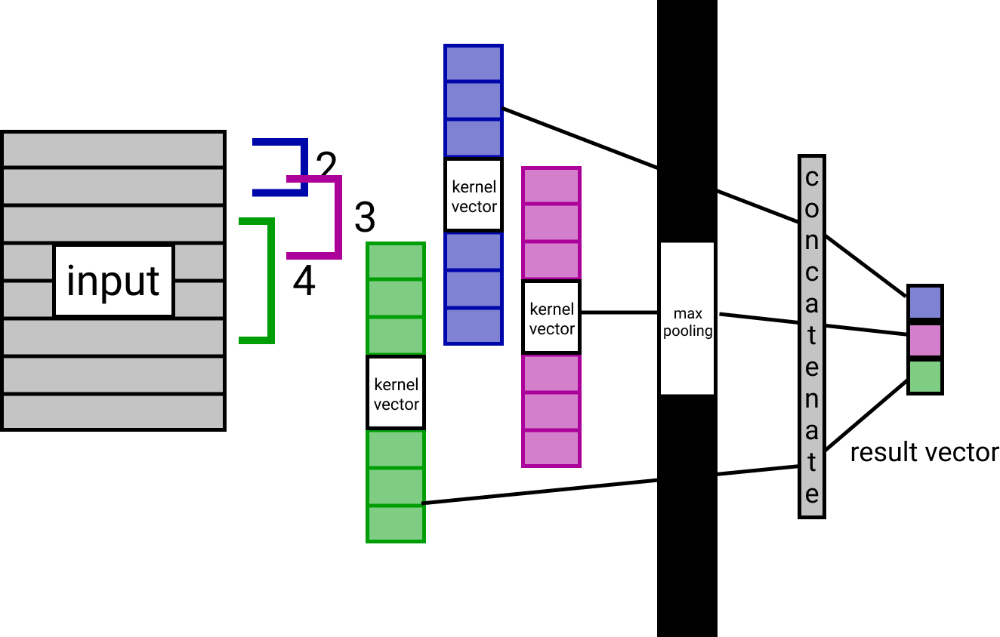

# CNN
***  
- 1D CNN : 자연어 처리에 활용되는 합성곱. 특히 분류가 적합. 각 단어가 벡터로 변환된 문장 행렬(DTM)을 입력으로 받음. padding, stride size(필터가 움직일 정도)등의 하이퍼퍼라미터를 받음.
- 1D CNN 커널 : 커널은 너비를 임베딩벡터 차원과 동일하게 설정하고, 높이만 따로 설정해 커널의 사이즈라고 함. 높이 방향으로만 움직임.
- wide/narrow convolution : zero padding을 적용 한/하지않은 것. 필터의 크기가 input에 비해 크다면 wide가 필요.   
- 풀링 : 합성곱층 이후에 주로 적용. 일반적으로 maxpooling(최대값을 꺼냄). 고정된 크기의 출력을 만들고, 크기를 줄여도 중요 정보를 보존한다는 효과가 있음.
- 채널 : 컬러이미지의 경우 RGB, NLP에선 임베딩 방법(W2V,GloVe), 언어 등이 채널이 될 수 있음.  
- 학습 방법 : 사이즈가 같거나 다른 커널 여러개를 사용해 벡터를 여러개 얻고, 
  거기에 풀링을 거쳐 스칼라화 한 다음, 그것들을 모두 연결해 하나의 벡터로 만듦. 
  이를 출력층에 연결해 텍스트 분류를 실행.
- Conv1D : 합성곱층 커널 생성. 

