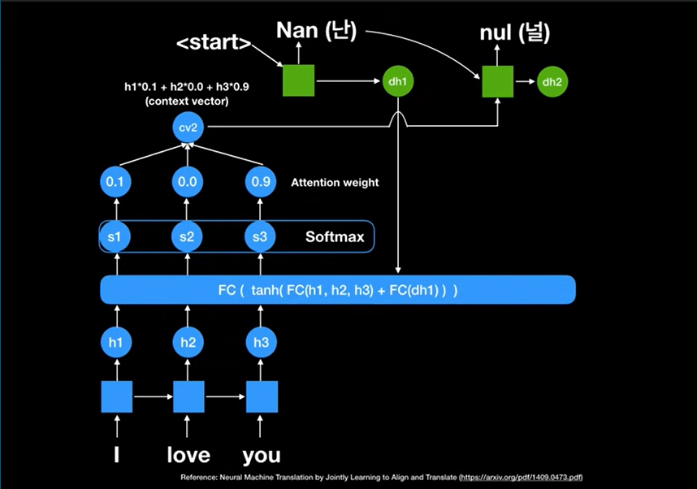

# Attention
***
- 어텐션 메커니즘 : 신경망(RNN, S2S)의 성능증가(기울기소실 보정)을 위한 매커니즘. 트랜스포머의 기반이 됨.
  디코더에서 매 시점마다 인코더의 모든 은닉상태를 활용해 컨텍스트 벡터를 다이나믹하게(각 상태별로)만들어 고정된 사이즈의 문맥벡터에서 오는 정보 소실과 중요한 정보에만 집중할 수 있게 함.
- 어텐션값 : 주어진 Q(쿼리)에 대해 모든 K(키)와의 유사도를 각각 구한 뒤 각각의 V(값)에 반영하고, V를 모두 더한 값.
- 표현 : Attention(Q, K, V) = Attention Value(a(t)) | Q = 현시점의 디코더 은닉상태 | K = V = 모든시점 인코더 은닉상태 | e_ij = w^T tanh(W_s_(i-1) + Vh_j + b)

- 시점t에서 필요한 디코더의 입력은 이전시점의 은닉상태, 이전시점의(교사강요시 레이블)출력값 과 어텐션값 임.
- 현시점 디코더 은닉상태와, 인코더 각 시점 은닉상태간의 어텐션스코어(유사도)를 모두 구해 모으고(어텐션 스코어), 
  여기에 softmax를 적용해 어텐션 분포(각 값은 어텐션가중치)를 얻고, 이를 인코더 각 은닉상태와 곱한 후 모두 더함(가중합, 어텐션값)
  
- a(t) = sum(softmax(\[score(s(t), h(0)) . . .  score(s(t), h(max))]) * h(0 . . . max))  | 어텐션 스코어(score) > 어텐션 분포(softmax) > 어텐션값(가중합)
- v(t) = \[a(t);s(t)](결합) | v(t)와 s(t-1)을 메모리셀(LSTM, RNN)의 입력으로 사용해 s(t)를 얻고, 이는 출력층으로 전달되 현시점의 예측값을 구하게 됨.

## order
- 인코더와 디코더의 은닉상태 크기가 같다고 가정.
- s(t) : 현시점 디코더 은닉상태(Q) | h(i) : i번째 인코더 은닉상태(K(i)) | score(s(t), h(i)) : 현시점과 i번째 인코더 은닉상태간 어텐션스코어(유사도) |
- Dot-Product Attention (dot, Luong)  : score(s(t), h(i)) = s(t).T * h(i)
- scaled dot            (Vaswani)     : score(s(t), h(i)) = s(t).T * h(i) / √(n)                      | 주로 Q = s(t), K = h. V = K+어텐션(Normalized Weights). 초기값은 V와 K가 동일.
- general               (Luong)       : score(s(t), h(i)) = s(t).T * W(a) * h(i)                      | W(a): 학습가능한 가중치 행렬
- concat                (Bahadanau)   : score(s(t-1), h(i)) = W(a).T * tanh(W(b)*s(t-1) + W(c)*h(i))  | W(b,c): 학습가능한 가중치 행렬. 병렬화를 위해 h(i)대신 H(h 모두 모음)을 사용.
- location-base         (Luong)       : score(s(t), h(i)) = X | a(t) = softmax(W(a) * s(t))           | 어텐션값 산출시 s(t)만 사용하는 방법

## self attention
- 셀프 어텐션 : 쿼리, 키, 벨류가 입력문장의 모든 단어벡터들로 동일. 인코더(Encoder) 혹은 디코더에서(Masked decoder) 이뤄짐. 
  입력문장내 단어들끼리 유사도를 구해 단어의 의미(it 등이 무엇을 뜻하는지)를 찾아냄.
- 셀프 어텐션 실행 : 각 단어벡터들에 가중치행렬(단어벡터차원*(단어벡터차원/num_heads)의 크기를 지님)을 곱해 일정크기(단어벡터차원/num_heads)의 쿼리, 키, 벨류 벡터를 얻음.
  이를 이용해 스코어(q*k/√(k벡터 차원), 트랜스포머는 Scaled dot-product Attention을 사용)를 구한 뒤 softmax를 지나 어텐션 분포를 구하고, 이를 가중합해 어텐션값을 구함.
- 셀프 어텐션 행렬연산 : 위 과정은 벡터 연산이 아닌 행렬연산을 사용하면 일괄계산이 가능해 행렬연산으로 구현됨. 헤드의 수만큼 병렬을 수행함.
- 셀프 어텐션 행렬연산 과정 : 문장행렬에 가중치행렬을 곱해 Q,K,V 행렬을 구하고, Q와 K를 내적곱(Q*K^t)하고 (q\*k/√(k벡터 차원))로 나눠 어텐션스코어를 얻으며,
  여기에 softmax를 지나게 하고(어텐션 분포) V행렬을 곱해 어텐션값 행렬을 만들 수 있음.
 

